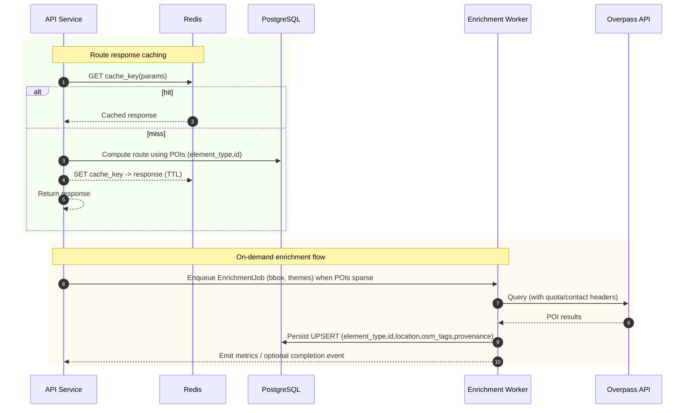
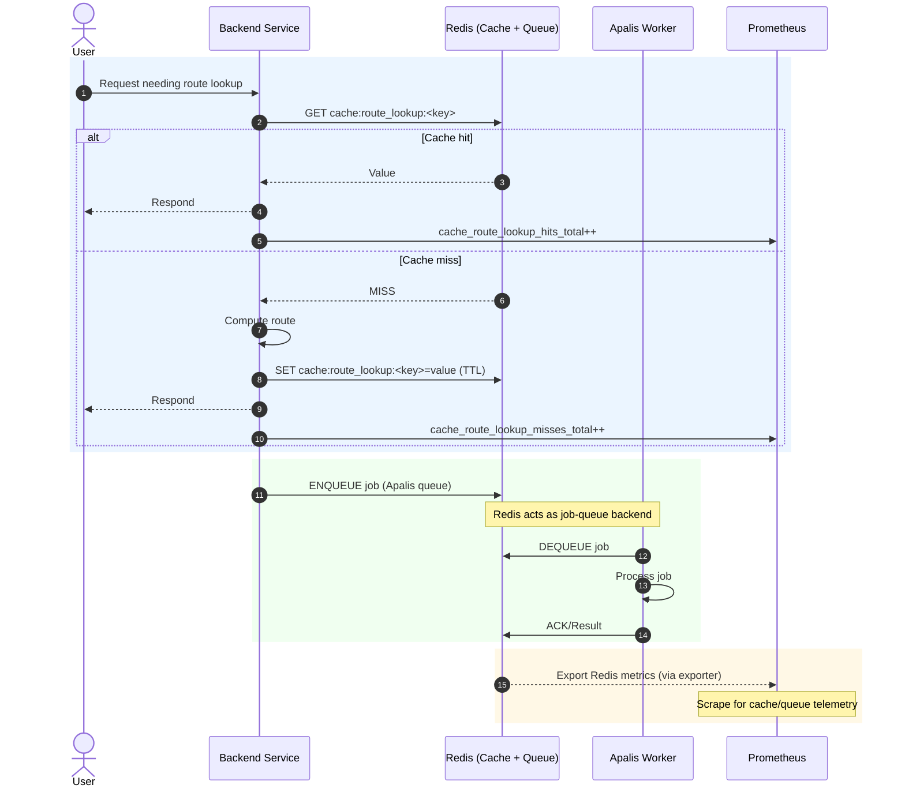

# Wildside Backend MVP Architecture and Observability

## Monolithic Backend with Modular Design

For the Wildside MVP, a **monolithic Rust backend** is the recommended
approach[^1].
 This means all core server functionality (API, WebSockets, business logic,
etc.) runs in a single codebase/binary for simplicity, but with clear internal
module
boundaries[^1].
 The code can be organized into domains (e.g. user accounts, POI data, routing
engine) within one project (as a “modular monolith”). This yields fast
development and easier debugging during early stages, avoiding the complexity of
microservices[^1].
 As load and features grow, these modules could be split out into services if
needed, but initially everything is contained in one deployable unit. The only
exception is **background task workers**, which will run as separate
process(es) for heavy or asynchronous jobs, as discussed later. This design
keeps the starting point lightweight while leaving room to grow into a
distributed architecture in the future.

## Web API Layer (Actix Web & WebSockets)

**Actix Web** will serve as the HTTP API framework for Wildside. Actix is a
mature, high-performance asynchronous web framework in
Rust[^1].
 It uses an actor model under the hood, enabling excellent concurrency for
handling many simultaneous
requests[^1].
 The backend will expose RESTful endpoints for core features (e.g. generating a
walking route, retrieving points of interest, user profile actions). These
endpoints are defined in Actix Web and can be documented via OpenAPI (using
tools like `utoipa` as noted in the
repo)[^2].
 Each request is handled swiftly and safely thanks to Rust’s memory safety and
Actix’s
efficiency[^1].

Alongside HTTP, **Actix WS** (WebSockets) enables real-time bidirectional
communication. Clients upgrade the connection via `GET /ws`, authenticate with
the same bearer token used for HTTP requests (for example, via the
`Sec-WebSocket-Protocol` header or a cookie; avoid query parameters), and
subscribe to `route_generation_status` events for a `request_id`.
The server pushes updates asynchronously, which is useful for
long-running processes and live features. For example, when a user requests a
personalised route, the server immediately acknowledges the request, then
pushes progress or completion events via WebSocket once the route is computed.
Similarly, if a user is actively walking, the client can send location updates
and the server can push contextual tips or next-step guidance in real time.
Actix’s actor system is well-suited for managing these concurrent WebSocket
sessions.

*Observability:* The web layer is instrumented for visibility. An Actix
middleware tracks **HTTP request metrics** (counts, latency, error rates) and
exposes them to Prometheus. Each API endpoint hit increments a counter (e.g.
`http_requests_total{path,method,status}`) and records the response time
histogram. A Prometheus scrape endpoint (e.g. `GET /metrics`) is provided on
the Actix server to collect these metrics[^2]. WebSocket events are also
monitored – for example, tracking active connection counts and messages sent or
received. Additionally, hooks in request handlers log important events (such as
“route generation requested”) to **PostHog** for product analytics. The backend
sends custom events to PostHog’s API (or the frontend can send them) to record
user actions (e.g. “RouteGenerated”, “POIClicked”), which helps understand
feature usage. In summary, the API layer provides robust logging and metrics:
Prometheus for low-level performance and error monitoring, and PostHog for
high-level user behaviour tracking.

## Martin tile server

To deliver map tiles without burdening the core API, Wildside deploys the
**Martin** tile server as a distinct service. Martin connects to the same
PostGIS database as the main backend and exposes TileJSON and vector tiles under
the `/tiles` base path[^1]. Running it separately allows independent scaling,
caching, and availability controls. Requests such as
`/tiles/{source}/{z}/{x}/{y}.pbf` are served directly from PostGIS (with sources
auto-discovered), and TileJSON is available at `/tiles/{source}.json`[^2],
enabling clients to fetch map data while the monolith focuses on business
logic.

Operational notes:

- Use a read-only Postgres role limited to `SELECT` on the schemas and tables
  Martin serves, and supply a separate connection string.
- Set a distinct ingress route to forward `/tiles/*` to the Martin service,
  bypassing Actix handlers.
- Configure `--base-path /tiles`, connection pool size, worker processes, and
  in-memory cache size; enable Brotli or gzip compression.
- Ensure geometries are stored in EPSG:3857 (Web Mercator) or set Martin’s
  `default_srid` to match to avoid empty tiles.
- Enforce CORS for tile endpoints, and apply rate limits or CDN caching at the
  edge.

## Route Generation Engine Integration

At the heart of Wildside is the **route recommendation engine**, provided by
the `wildside-engine` library. This engine is responsible for computing the
“most interesting” walking tour given user preferences, time constraints, and
current location. In the backend architecture, the Wildside engine is used as a
**library crate** – the Actix web handlers will call into it to generate
routes. The engine handles heavy data processing: parsing geospatial data,
scoring points of interest (POIs), and solving the optimal route (an NP-hard
Orienteering
Problem)[^1].
 Because this computation can be intensive, the design must ensure it doesn’t
block the responsive handling of requests.

For the MVP, route generation runs in a worker rather than on the Actix runtime.
When a client POSTs to `/api/v1/routes`, the handler validates input, enqueues a
`GenerateRouteJob`, and returns a `request_id` straight away. `spawn_blocking`
is suitable only for short, bounded CPU-bound work and must not be used for
long-running route generation. Instead, offload unbounded work to a dedicated
background worker using an enqueue/worker pattern. This prevents CPU-heavy
computation from stalling the Actix event loop.

The HTTP handler enforces both a request timeout and a job-level timeout before
returning. The worker honours its own execution timeout, cancels and cleans up
on timeout or client cancellation, and reports progress, timeout, or failure via
`route_generation_status` WebSocket messages. When the worker finishes, it
stores the route in PostgreSQL for up to 24 hours. A scheduled cleanup task
removes expired records and their associated `request_id`s to prevent
unbounded growth.

### `/api/v1/routes` API contract

- **Method:** `POST`
- **Authentication:** Bearer token required.
- **Idempotency:** Optional `Idempotency-Key` header honoured for 24 hours by
  default. Repeated requests with the same key and identical payload return the
  original `request_id` and stored response. Submitting a different payload with
  the same key within the window results in `409 Conflict` with an explicit
  `Idempotency key conflict` error. The TTL is configurable and keys persist in
  PostgreSQL to survive restarts.
- **Rate limits:** Subject to per-user quota (for example, 60 requests per
  minute).

#### Request body

```json
{
  "start": {"lat": 53.3498, "lng": -6.2603},
  "duration_minutes": 90,
  "preferences": ["history", "nature"]
}
```

#### Responses

- `202 Accepted` — `{ "request_id": "uuid" }`
- Headers: `Location: /api/v1/routes/{request_id}` (optional)
- Errors: `400 Bad Request`, `401 Unauthorized`, `429 Too Many Requests`,
  `500 Internal Server Error`, `504 Gateway Timeout`.

#### Retrieve result

- `GET /api/v1/routes/{request_id}`:
  - returns `202 Accepted` with `Retry-After: <seconds>` while pending,
  - returns the final route on completion:

```json
{
  "request_id": "uuid",
  "status": "succeeded",
  "route": {
    "points": [{"lat": 53.3498, "lng": -6.2603, "name": "Trinity"}],
    "distance_m": 1200
  }
}
```

#### WebSocket status messages

Clients subscribe to `route_generation_status` updates for a `request_id`.
Messages conform to this JSON schema:

```json
{
  "type": "object",
  "required": ["type", "request_id", "status", "progress"],
  "properties": {
    "type": {"type": "string", "const": "route_generation_status"},
    "request_id": {"type": "string", "format": "uuid"},
    "status": {
      "type": "string",
      "enum": ["queued", "running", "succeeded", "failed"]
    },
    "progress": {"type": "integer", "minimum": 0, "maximum": 100},
    "error": {"type": "string"},
    "timestamp": {"type": "string", "format": "date-time"}
  }
}
```

Example message:

```json
{
  "type": "route_generation_status",
  "request_id": "uuid",
  "status": "queued",
  "progress": 0
}
```

Allowed transitions:

- `queued` → `running` → `succeeded`
- `running` → `failed` (with `"error": "string"`)

On timeout the worker emits `failed` with `"error": "timeout"`. `progress`
represents completion from 0 to 100.

The engine will rely on **OpenStreetMap (OSM) data and Wikidata** for rich POI
info[^1].
 Likely, an offline data pipeline will ingest OSM PBF files (using the `osmpbf`
crate as per engine
design[^3])
 into a database or efficient data structure. The backend can then query this
data via Diesel (or the engine may handle it internally if it uses its own data
store). For MVP simplicity, storing POIs in PostgreSQL with PostGIS is ideal,
so the engine can fetch nearby POIs or graph data via SQL and then perform
scoring/routing in Rust. The design document indeed suggests using PostgreSQL
with PostGIS for geospatial queries and JSONB for OSM
tags[^1]
 – the engine can leverage that through Diesel models.

*Observability:* The route engine component is instrumented to measure its
performance and correctness. Metrics such as **route computation duration**,
number of POIs considered, and success/failure counts are tracked. For example,
a custom Prometheus histogram `wildside_engine_route_duration_seconds` records
how long the algorithm runs for each request. If an external routing service or
solver (like Valhalla) is used under the hood, those calls are monitored as
well. The system sets a safe time limit on route calculations[^1]; if the engine
exceeds it, it aborts or returns a partial result. Such timeouts and any errors
are logged (and potentially sent to an alerting system). Moreover, high-level
events can be sent to PostHog, e.g. an event “RouteGenerated” with properties
like route length, number of POIs, etc. This helps analyse what kinds of routes
users generate most and how long it takes on average – valuable feedback for
tuning the engine.

## Data Persistence with PostgreSQL and Diesel

All persistent data for Wildside will be stored in **PostgreSQL**, using the
Diesel ORM for access. Postgres is a reliable choice for both standard
application data and geospatial data. The database will include tables for
users, their saved preferences or past routes, and the geospatial dataset of
POIs/roads. Leveraging **PostGIS**, the Postgres DB can store location
coordinates and enable spatial queries (e.g. find POIs within X
meters)[^1].
 This is crucial for filtering and querying the map data efficiently. Each OSM
feature’s tags (descriptive attributes) can be stored in a JSONB column, giving
flexible schema-less ability to query things like `amenity=cafe` or
`historic=yes` without a fixed schema for every
tag[^1].
 The design uses JSONB to accommodate OSM’s extensible tagging system while
still benefiting from indexes and relational integrity.

**Diesel** integrates with Actix to provide type-safe, compile-time-checked
database queries. Diesel was chosen for its compile-time guarantees – it will
catch SQL errors (wrong column names, type mismatches) during compilation,
reducing runtime
errors[^1].
 Using Diesel, the backend defines Rust structs for each table and uses them to
execute queries. This ensures that as the schema evolves, the code won’t
compile if it’s out of sync, which adds robustness to our data layer. Diesel
also supports connection pooling (via r2d2 or similar), which the Actix server
will use to manage a pool of Postgres connections for efficiency.

In this architecture, **Postgres serves multiple purposes**: it holds the
business data (users, etc.) and also possibly the preprocessed map data (POIs,
graph edges). This keeps the stack simpler (one primary database) and
transactionally updates user-specific info. Heavy geospatial reads can be
isolated by using read replicas or a separate schema, but the MVP can start
with a single database instance for everything.

*Observability:* The database and ORM layer are monitored to ensure healthy
performance. Postgres metrics collection is enabled (for example, running a
**Postgres exporter** or using CloudNativePG’s built-in metrics if deployed in
K8s([4](https://github.com/leynos/wildside/blob/663a1cb6ca7dd0af1b43276b65de6a2ae68f8da6/docs/cloud-native-ephemeral-previews.md#L1505-L1513))).
Key metrics include `pg_stat_activity`-derived gauges (connections in use),
`pg_stat_database_blks_hit/blks_read` (cache hit rate), and slow query counts.
From the application side, enable Diesel’s query logging and instrument
timings for critical queries (for instance, wrap certain calls to measure their
duration). The Prometheus operator will scrape database metrics (if using an
operator or a managed DB with metrics). In Grafana, dashboards will plot DB
metrics like CPU, I/O, number of queries per second, etc., as recommended by
the deployment guide. Example alert:

- `pg_connections{db="app"} / pg_max_connections > 0.8` for 5m → page SRE.

  Note: metric names are exporter‑dependent; adjust to your exporter.

If any query regularly takes too long (impacting route generation latency),
alert and optimize that part (adding indexes or caching results). On the
analytics side, database operations themselves aren’t directly in PostHog, but
PostHog may track high-level outcomes (e.g. “UserSavedRoute” event when a user
saves a generated route to the DB).

## Data seeding, enrichment, and route caching

- Initial OSM seeding: A Rust ingestion tool uses the `osmpbf` crate to parse
  `.osm.pbf` extracts and load nodes, ways, and relations into PostgreSQL. This
  bootstraps the POI dataset before the API is exposed, ensuring the backend
  operates on consistent local data.
  - Convert ways/relations that represent POIs to point features via
    point-on-surface (`GEOGRAPHY(Point, 4326)`) before insert to avoid geometry
    mismatches.
  - Idempotency: Use `ON CONFLICT (element_type, id) DO UPDATE` to avoid
    duplicates.
  - Batching: Commit 5k–20k features per transaction to bound locks and WAL.
  - Verification: Report inserted/updated counts and elapsed time at exit.
- On-demand enrichment: When a requested area lacks sufficient nearby POIs, a
  background `EnrichmentJob` queries the Overpass API for additional amenities.
  Newly found items are inserted into the database so subsequent requests
  benefit from richer coverage.
- Route output caching: Completed route responses are stored in Redis using a
  hash of the request parameters as the cache key. If a later request hashes to
  the same value, the cached route is returned immediately, reducing
  computation and latency.

Figure: Route response caching and on-demand enrichment sequence.



Operational details:

- **Overpass quotas:**
  - Send a descriptive `User-Agent` and `Contact` header (email or URL);
    include a per-tenant token in the `User-Agent` for tracing abuse; expose
    both via config.
  - Enforce rate limits (≤ 10 000 requests/day; transfer < 1 GB/day; as of
    2025-09-08), default timeout 180 s, and `maxsize` 512 MiB.
  - Cap concurrent Overpass requests with a global semaphore or worker pool
    (default ≤ 2, configurable).
  - Retry HTTP 429 responses with jittered backoff.
  - Guard with a circuit breaker that tracks failures/timeouts and opens for a
    configurable cooldown before probing again; fall back to mirrored or
    self-hosted endpoints while open.
  - Surface metrics and logs for requests, failures, and breaker state with
    knobs for headers, concurrency, thresholds, and cooldown.
  ([dev.overpass-api.de](https://dev.overpass-api.de/overpass-doc/en/preface/commons.html),
  [osm-queries.ldodds.com](https://osm-queries.ldodds.com/tutorial/26-timeouts-and-endpoints.osm.html))
  - **Cache keys:** Canonicalise request parameters before hashing:
    - Stable JSON (UTF-8, sorted keys, no whitespace).
    - Coordinates rounded to 5 decimal places (~1.1 m); themes sorted.
    - Hash: lowercase hex SHA-256 of the canonical payload.
    - Key: `route:v1:<sha256>` (optionally truncate to first 32 hex chars;
      document truncation).
    - **TTLs:** Set a default TTL (24 h) for anonymous route results; apply a
      jitter of ±10% to avoid stampedes; skip TTL for saved routes. Invalidate
      on schema/engine version bumps by rotating namespace suffix (e.g. `v2`).
    - **Eviction:** Configure `maxmemory` and `maxmemory-policy allkeys-lfu`;
      set per-namespace memory budgets and alert on `evicted_keys` > 0.
    - **Attribution & provenance:** Store enrichment provenance (source URL,
      timestamp, bbox) and enforce OSM attribution requirements in UI/docs.

## Caching Layer (Redis/Memcached)

To further improve responsiveness and reduce load, a caching layer will be
introduced, backed by **Redis**. Redis will serve as both the cache and the
job-queue backend via [Apalis](https://docs.rs/apalis). When used as a queue,
configure Redis for durability (enable AOF) to avoid job loss on restarts. The
cache serves a few purposes in the Wildside backend:

- **API Response Caching:** For expensive requests with identical inputs, the
  system can cache the results. For example, if two users request a walking
  tour of the **same area with the exact same parameters**, the first
  computation’s result could be stored in cache so the second can be served
  instantly from
  cache[^1].
   This is particularly useful if route generation is computationally heavy –
  caching common routes (or common subpaths) avoids recomputation,
  significantly speeding up responses in those cases.

- **Data Caching:** The application might cache frequently accessed reference
  data, such as a list of popular POIs or map tile fragments. Rather than
  hitting the database or file store repeatedly, these can reside in memory.
  For instance, if certain base map data or precomputed graph data is needed
  for every route, the backend can load it at startup or cache it on first use
  for quick reuse.

- **Session Caching (if needed):** Although the plan is to use signed cookies
  for session info (see below), storing session state server-side (e.g. to
  track active sessions or more data per session) can leverage Redis. This
  keeps session lookups fast and avoids hitting the primary database for
  ephemeral session reads. The design aims to keep the server stateless by not
  requiring server-side session storage, but Redis remains an option for any
  transient data that doesn’t warrant a database write.

- enable AOF for durability (e.g., `appendonly yes; appendfsync everysec`);
- if sharing one instance, set an eviction policy safe for queues (e.g., prefer
  `noeviction`) and bound cache keys with TTLs; or run separate instances/DBs;
- set an explicit Apalis key prefix/namespace (e.g., `apalis:`) to avoid key
  collisions with cache keys;
- expose metrics via the Redis exporter, and enable the `prometheus` feature
  for the Apalis Redis integration to export queue metrics.

When using the Bitnami Redis Helm chart, enable the Prometheus exporter and
alerting:

values.yaml

```yaml
metrics:
  enabled: true
  serviceMonitor:
    enabled: true
  prometheusRule:
    enabled: true
```

The cost analysis for MVP even budgets a small Redis Cloud instance for
caching([1](https://github.com/leynos/wildside/blob/663a1cb6ca7dd0af1b43276b65de6a2ae68f8da6/docs/wildside-high-level-design.md#L2-L5)),
underlining its role as both cache and queue.

*Observability:* The caching layer is monitored to ensure it’s effectively
improving performance. **Cache hit rates and misses** for critical caches are
tracked. For instance, a Prometheus metric `cache_route_lookup_hits_total` vs
`cache_route_lookup_misses_total` measures how often a route result was served
from cache versus recomputed. Redis itself provides stats like memory usage,
eviction counts, and connections, which can be exposed via a Redis exporter and
scraped by Prometheus. Grafana includes panels for cache performance (high miss
rates might indicate optimisation strategy changes). From an analytics
perspective, caching is transparent to users, so not directly relevant to
PostHog events, but a successful cache hit indirectly improves user experience
(faster response) which could reflect in user retention metrics over time.

### Cache and job queue flow

The sequence below illustrates how a route lookup is cached, how jobs move
through Redis as the Apalis queue, and how Prometheus gathers telemetry.



For implementation, several **Rust-based job frameworks** are available and no
strict preference has been chosen yet. Options include:

- **Apalis:** A Rust library for background job processing that supports
  multiple backends (memory, Redis, PostgreSQL, etc.). It allows defining job
  types and provides features like retries, scheduling (cron jobs), and
  concurrency limits. Apalis would run inside the project (perhaps as a
  separate binary or part of the main binary launched in “worker mode”) and
  could use Postgres or Redis to store job state. This fits well with the stack
  since those systems are already in use[^5][^6].
- **Underway:** A simpler job framework that uses Postgres as a durable store
  for tasks (using SQL for coordination). This approach avoids introducing
  another service; jobs are recorded in the existing Postgres, and workers poll
  the DB. Underway supports multi-step workflows and scheduling via the
  database (essentially acting like a built-in task table)[^7][^8]. This keeps
  everything in Rust+Postgres without needing Redis or external brokers.
- **Faktory:** An external job server (by ContribSys, creator of Sidekiq) that
  allows multi-language workers. Jobs can be pushed to a Faktory queue; Rust
  workers (via a Faktory client crate) or even other language workers could
  handle them. Faktory is proven technology, but it introduces another service
  to run and maintain. Given the MVP’s focus on minimal components, Faktory may
  be more than needed unless other languages for workers are anticipated.
- **NATS:** A lightweight message broker that can be used for a pub/sub or work
  queue (with NATS Streaming or JetStream). Using NATS means each worker
  subscribes to a subject (topic) and receives tasks. NATS is extremely fast and
  scalable, but it doesn’t inherently provide persistence or retries unless
  using its JetStream persistence layer. Some Rust ecosystems use NATS for
  event-driven architectures. If chosen, a NATS server (possibly in the
  cluster) would run and the Actix app would publish messages while a worker
  subscribes.

Certain operations in Wildside are best handled asynchronously by
background workers rather than directly in the web request/response
cycle. Examples include generating a complex route (if fully offloaded),
preprocessing map data, sending email or push notifications, and periodic
maintenance tasks such as refreshing the POI database or pruning old
data. The architecture therefore includes a task queue and worker
component. The main backend enqueues jobs, and one or more worker
processes dequeue and execute them in the background. This decouples
heavy lifting from user-facing request latency.

For implementation, Wildside uses Apalis backed by Redis. Apalis supports
retries, cron-like scheduling, and concurrency limits. Workers can run as
a separate binary or as part of the main binary launched in worker mode.
Redis durability and metrics considerations from the caching section also
apply to the queue configuration. Workers process jobs from
named queues to separate concerns: use `route_generation` for
CPU-intensive path-planning jobs and `enrichment` for fetching
supplementary point-of-interest data and other periodic enrichments.
With `apalis-redis`, each queue uses a distinct namespace; configure
separate prefixes for `route_generation` and `enrichment`. Prefer a
dedicated Redis instance for queues, or at least different database
indices and key prefixes, rather than sharing the application cache to
avoid head-of-line blocking and key collisions. Example configuration:

```rust
use apalis_redis::{Config, RedisStorage};
use redis::Client;

fn setup_queues(redis: Client) {
    // Route generation queue
    let rg_cfg = Config::default().set_namespace("apalis:route_generation");
    let rg_storage = RedisStorage::new_with_config(redis.clone(), rg_cfg);
    // Enrichment queue
    let en_cfg = Config::default().set_namespace("apalis:enrichment");
    let en_storage = RedisStorage::new_with_config(redis, en_cfg);
}
```

Define a clear reliability policy:

- use bounded exponential backoff with a maximum retry count.
- route exhausted jobs to a dead-letter queue (DLQ) for inspection.
- require idempotency per job type (for example, a deduplication key) so
  retries do not duplicate work.

```rust
use std::time::Duration;
use apalis::{prelude::*, layers::retry::{RetryLayer, RetryPolicy}};
// Worker with bounded immediate retries
let worker = WorkerBuilder::new("route_generation")
    .layer(RetryLayer::new(RetryPolicy::retries(3))) // cap attempts
    .build(rg_storage.clone(), route_generation_handler);

// Inside the handler, on failure, reschedule with backoff (persisting attempts):
async fn route_generation_handler(job: GenerateRouteJob, ctx: JobContext) -> Result<(), anyhow::Error> {
    if let Err(err) = do_work(job.clone()).await {
        let attempt = ctx.attempt().unwrap_or(1);
        let delay = Duration::from_secs((2_u64).saturating_pow(attempt.min(5)) * 5); // bounded exponential
        if attempt >= 5 {
            // send to DLQ
            ctx.storage().send_to("apalis:dlq:route_generation", job).await?;
        } else {
            ctx.storage().reschedule(job, delay).await?;
        }
        return Err(err);
    }
    Ok(())
}
```

With Apalis, the Actix Web server produces tasks and worker(s) consume
them. Delivery is at least once, so each handler must be idempotent.
Workers persist job status—result, error, and progress—and do not write
directly to WebSockets; the API layer observes this state and notifies
clients when it changes. For example, when a user requests a route, the
server enqueues a `GenerateRouteJob (user_id, start_point, prefs, etc)`
on the `route_generation` queue. A worker running the same codebase (but
started in worker mode) will pick it up, execute the wildside-engine to
compute the route, then store the result in the database or cache. The
user is then notified (perhaps the web server checks the DB or the worker
triggers a WebSocket message when done). Similarly, scheduled tasks like
refreshing OSM data nightly are queued on `enrichment` and triggered on a
schedule.

`GenerateRouteJob` is the primary task on `route_generation`. Suggested
schema:

- `request_id` (UUID) – correlates logs for a single request.
- `idempotency_key` (string) – deduplicates retries.
- `user_id` (UUID) – identifies the requester.
- `start_point` (GeoPoint) – origin coordinates.
- `prefs` (RoutePrefs) – routing preferences.

```rust
use serde::{Deserialize, Serialize};
use uuid::Uuid;

#[derive(Debug, Clone, PartialEq, Eq, Serialize, Deserialize)]
struct GeoPoint {
    lat: f64,
    lon: f64,
}

#[derive(Debug, Clone, PartialEq, Eq, Serialize, Deserialize)]
struct RoutePrefs {
    // add fields as needed, for example: max_duration_minutes, themes, avoid_hills
}

#[derive(Debug, Clone, PartialEq, Eq, Serialize, Deserialize)]
struct GenerateRouteJob {
    // trace correlation
    request_id: Uuid,
    // dedup across retries
    idempotency_key: String,
    user_id: Uuid,
    start_point: GeoPoint,
    prefs: RoutePrefs,
}
```

// Validate GeoPoint with -90.0 ≤ lat ≤ 90.0 and
// -180.0 < lon ≤ 180.0 at enqueue time.

Scheduled jobs, such as refreshing OpenStreetMap data, run on
`enrichment` under the same at-least-once, idempotent, retry-with-backoff,
and DLQ semantics.

*Observability:* Instrument the task worker system to ensure smooth
operation. Track the **queue length** (pending jobs), throughput, and
success/failure counts. When using Apalis or similar, hook into their
events to increment Prometheus counters (for example,
`jobs_success_total`, `jobs_failed_total`) and gauge how many jobs are
in‑flight. Measure **job execution time** per job type to identify
consistently slow tasks. In Kubernetes, expose a `/metrics` endpoint on
worker pods so Prometheus can scrape worker‑specific stats. Log
exceptions and failed tasks with enough context for diagnosis (and feed
an error tracker if available). Background jobs are internal, but their
outcomes affect user experience; emit analytics for notable outcomes
(for example, a “RouteGenerationFailed” event) to understand frequency
and impact. Overall, keep workers transparent to users but closely
monitored via metrics and logs.

## Session Management and Security

Wildside manages user sessions with `actix-session`’s `SessionMiddleware`
using `CookieSessionStore`. Session state lives entirely in the cookie,
allowing any backend instance to validate requests without a central store.
The middleware signs and encrypts the cookie with an `actix_web::cookie::Key`
loaded at startup from a secret file mounted into the container (for example
`/run/secrets/session.key`). The file holds a single base64‑encoded 64‑byte key;
`SessionMiddleware` accepts only one key, so any extra entries are ignored.
Rotating the key requires replacing the file and restarting the pods, which
invalidates all existing cookies because `actix-session` does not check older
keys.

```rust
use actix_session::{SessionMiddleware, storage::CookieSessionStore, config::CookieContentSecurity};
use actix_web::cookie::{Key, SameSite};

let key_bytes = {
    let raw = std::fs::read_to_string("/run/secrets/session.key")?;
    let bytes = base64::decode(raw.trim_end())?;
    if bytes.len() != 64 {
        return Err(std::io::Error::new(
            std::io::ErrorKind::InvalidData,
            "session key must be 64 bytes",
        ));
    }
    bytes
};
let key = Key::from(&key_bytes);

let middleware = SessionMiddleware::builder(CookieSessionStore::default(), key)
    .cookie_name("session")
    .cookie_content_security(CookieContentSecurity::Private) // encrypt + sign
    .cookie_secure(true)
    .cookie_http_only(true)
    .cookie_same_site(SameSite::Lax)
    .build();
```

On login, the server sets a cookie named `session`, such as `session=<payload>`,
and `actix-session` handles serialization and integrity checks automatically.
Cookies are marked `HttpOnly`, `Secure`, and use `SameSite=Lax` unless a
cross-site flow is required. To rotate the key, generate a new value, replace
the secret file, and restart the pods; the framework cannot validate cookies
issued with a previous key, so all existing sessions are dropped. This keeps the
session layer self-contained without any server-side cache or database lookup.

**Security considerations:** Browser cookies are limited to 4 KiB, so the
serialized session payload must stay within that bound. For non‑persistent
usage, rely on the browser session; for persistence, configure
`PersistentSession` with an explicit TTL (for example, seven days). If a
rolling expiry is required, issue a fresh cookie on write or implement a policy
that renews the TTL explicitly. Sensitive actions benefit from short TTLs,
whereas a longer TTL (for example, seven days) improves convenience when paired
with token rotation. Because the session is stateless, logging out cannot
invalidate an existing cookie on the server; the client is simply told to
delete it. Immediate revocation would require a denylist or short‑lived tokens,
but for the MVP this approach is acceptable.

*Observability:* Session management itself doesn’t produce a lot of metrics,
but metrics like **active user count** or login frequency can be tracked. For
example, a Prometheus gauge for active sessions is possible (though with
cookies, session expiry may not be observed immediately). PostHog can track
user sign-ins, sign-outs, and usage patterns (e.g. “SessionStarted” events).
Relying on cookies simplifies the architecture and reduces points of failure –
there’s no session store to monitor – while still providing insight into user
activity.

## Observability and Instrumentation

A cornerstone of the Wildside backend design is **observability** – the MVP is
instrumented from the start to gather insights and ensure reliability.
The architecture integrates observability at multiple levels, primarily using
**Prometheus** for operational metrics and **PostHog** for product analytics.
Here’s how these tools work with the application components:

- **Prometheus Metrics & Grafana Dashboards:** The backend exposes a `/metrics`
  endpoint (in Prometheus text format) that aggregates metrics from all parts
  of the
  application[^2].
   In Kubernetes, a ServiceMonitor (via Prometheus Operator) will be set up to
  scrape this endpoint
  periodically[^2].
   Metrics include request rates, error counts (e.g. HTTP 500s), database query
  timings, cache hits, job queue depths, and system resource
  usage. The Kubernetes cluster itself will also be monitored (Traefik ingress,
  Postgres operator,
  etc.)[^4],
   but focusing on the app, Grafana dashboards visualise
  KPIs such as average route generation time, 95th percentile API latency,
  WebSocket connected clients, and memory/CPU usage per pod. The design doc
  explicitly recommends monitoring request latency, error rates, DB pool usage,
  etc., via
  Prom/Grafana[^4].
   Additionally, Alertmanager can be configured to trigger alerts (email/Slack)
  on certain conditions – for instance, if error rate spikes or if route
  latency exceeds a threshold
  consistently[^4].
   This approach provides feedback loops to catch issues early.

- **Tracing and Logging:** While not explicitly asked, as part of observability
  it’s worth noting that structured logging and possibly distributed tracing
  will be employed. Actix Web requests can be given a request ID or trace ID.
  Incorporating an OpenTelemetry tracer could trace a request from the HTTP
  layer through the database queries and even into the background task if it’s
  synchronous. This might be introduced as the system grows, but even at MVP,
  ensuring logs contain context (like user ID, request path, job id) aids
  debugging. These logs can be shipped from Kubernetes (e.g. via
  FluentBit/Elasticsearch or any cloud logging service).

- **PostHog Analytics:** PostHog complements Prometheus by tracking
  **user-centric events and funnels**. The PWA embeds PostHog’s snippet to
  capture events like “TourStarted”, “POIViewed”, and “CompletedTour”. The
  backend also sends events for actions not directly triggered in the UI. For
  example, when the route engine finishes computing a route, it sends an event
  “RouteComputed” with properties (length, number of POIs, themes) to PostHog.
  This data helps the team understand user behaviour: which features are used,
  how often users complete tours, etc. PostHog, being an open-source product
  analytics platform, fits the ethos of self-hosting and can be deployed in the
  cluster if desired (or use PostHog Cloud). No sensitive PII is sent in events
  – mostly IDs or hashes if needed. Over time, this analytic data guides UX
  improvements and identifies drop-off points (for instance, if many users
  start route generation but fail to complete it).

- **Integration of O11y with Components:** Each major component is wired with
  observability:

- *Actix Web:* Middleware captures metrics and logs for each HTTP request
  (including route, status, duration). We might use existing crates or custom
  code to instrument this. Also, Actix’s internal metrics (like workers alive,
  threads busy) could be exposed.

- *Actix WS:* We can add counters for opened/closed connections and maybe track
  messages sent. If using AsyncAPI for documentation, the events could also be
  logged when emitted.

- *Diesel/Postgres:* Use Postgres’s statistics (possibly via a `/metrics` in
  the Postgres operator) to get query stats. Also instrument application-level
  DB calls as noted.

- *Background Workers:* Each worker process can either push metrics to a
  centralized aggregator or expose its own endpoint. If using the same
  codebase, the main Actix server could gather metrics from the job system
  (depending on integration). At the least, each worker logs job executions and
  failures, and those logs get collected.

- *Cache:* Redis is monitored if used (hits, misses, resource use).

- *External Services:* If the engine uses external APIs (e.g. a cloud LLM for
  narration or an external routing engine), calls to those are instrumented,
  counting usage and latencies. Caching layers mitigate cost, and monitoring
  ensures the frequency of external API calls is known (to control costs as
  mentioned in design
  plans[^1]).

In summary, the MVP backend is not only designed to perform well but also to be
**transparent about its performance and usage**. By baking in observability
from day one, deployments to Kubernetes and real users can measure what’s
happening internally (system metrics via Prometheus) and how users are
interacting with the product (events via PostHog). This dual visibility is
crucial for both reliability engineering and product iteration.

## Kubernetes Deployment and Scalability

The Wildside backend (monolith + workers) is containerised and deployed on
Kubernetes, following the cloud-native approach outlined in the project’s
design docs. In practice, there are at least two deployable components: the
**Actix Web API server** container and the **Background Worker** container
(which might be the same image launched with a different command or environment
flag). Initially, these could even be the same binary with a CLI flag
(`--mode=worker` vs `--mode=server`) to keep things simple and ensure both share
code. In Kubernetes, they are separate Deployments so that they can scale
independently – for example, two replicas of the web server for high
availability and a couple of worker pods for throughput, adjusting as needed.

Kubernetes best practices are used, such as a **Traefik Ingress** (as per the
repo’s manifests) to route external traffic to the Actix Web service[^2],
configured with TLS (Let’s Encrypt via cert-manager). The static frontend
(PWA) can be served via a CDN or object storage, as indicated by the design
(the sequence diagram shows the browser fetching assets from CDN and API calls
hitting the backend)[^2]. The backend containers will mount config (like
database DSN and secrets for cookie signing and API keys) via K8s Secrets and
ConfigMaps. We’ll also include readiness and liveness probes for the Actix Web
app (e.g. endpoints `/health/ready` and `/health/live`) so Kubernetes can
detect if a pod is unresponsive and restart it.

Database options include a managed Postgres (e.g. DigitalOcean Managed DB) or
running a cluster via an operator like **CloudNativePG**. The design documents
lean toward using a managed database for MVP to reduce ops burden[^1], which
allows the app to connect via a secure connection string. If self-hosting
Postgres in K8s (less likely for MVP), CloudNativePG or Bitnami charts would be
used with persistent volume storage, etc. In either case, the **PostGIS
extension** is enabled on the database to support spatial queries.

The deployment strategy follows a GitOps model (as described in the
cloud-native architecture doc) – meaning our Kubernetes manifests (for
deployments, services, etc.) are in a repo and an operator (FluxCD) applies
them to the
cluster[^4].
 This allows us to have **ephemeral preview environments** for each feature
branch: a temporary deployment of the whole stack on a subdomain for
testing[^4].
 In those ephemeral envs, the same architecture applies, just spun up
on-demand. This gives confidence that our k8s configs and observability scale
to multiple instances. Each preview would have its own isolated DB, etc., as
noted in the design doc (possibly using separate schemas per
environment)[^4].

For **scalability**, even though the architecture is monolithic, the app is
 designed to
handle concurrent loads. Actix is highly concurrent, and Rust’s performance
means the system utilises CPU efficiently. If traffic grows, the web
Deployment horizontally (add more pods). Thanks to stateless design (sessions
in cookies, etc.), requests can go to any pod. The background workers can also
be scaled out if the queue of tasks grows – they’ll all compete for jobs from
the queue. Resource requests/limits should be set on these pods based on
profiling (the design doc suggests adhering to resource management best
practices in
k8s)[^4].
 In the future, if certain components become bottlenecks, they might be split
off (for instance, a dedicated microservice for the route engine if needed).
But for MVP, this single backend should suffice, and the infrastructure is
ready to support growth.

Finally, all observability components will run in K8s as well: the **Prometheus
Operator and Grafana** will be installed (the design explicitly calls for
deploying them via
HelmRelease)[^4].
 Prometheus will be configured to scrape our pods’ metrics; Grafana will have
dashboards for our app. **Alertmanager** integrated with Prom Operator will
handle alerting on
thresholds[^4].
 If self-hosting PostHog, it runs in the cluster too (PostHog provides a chart
 or Docker compose). Otherwise, PostHog Cloud is used and events are sent over
 the internet. Logging can be handled by the cluster’s logging stack (if any) or
 simply by Cloud provider logs.

In summary, the Kubernetes deployment ties all pieces together: our Rust
backend (API + WS) and worker processes run in containers, leveraging Postgres
and Redis services, all observable through Prometheus/Grafana. The **MVP
remains a monolithic app** (plus a worker) for
simplicity[^1],
 but the entire setup is built with **cloud-native principles** –
infrastructure as code, declarative config, and robust monitoring – so the team
can confidently develop, deploy, and scale Wildside.

## Conclusion and Future Evolution

The above design provides a detailed blueprint for Wildside’s backend MVP: a
Rust/Actix web application augmented by background workers, a PostGIS-enabled
PostgreSQL database, and supportive infrastructure like the Redis cache and job
queue, alongside comprehensive observability. It favours a simple, monolithic
core[^1]
 that is easier to build and iterate on quickly, while applying modular design
internally for
clarity[^1].
 This foundation is **lightweight to start** yet prepared for growth – for
instance, by adding more workers, enabling caching for heavy computations, and
eventually splitting out services if needed. Instrumentation with Prometheus
and PostHog ensures that from day one the team has eyes on system health and user
engagement, which de-risks the development and helps guide future product
decisions. By following this architecture and the DevOps practices (GitOps
deployments, managed services for critical components, etc.), the Wildside team
can deliver a polished MVP that not only provides a unique “serendipity engine”
for urban explorers, but also is stable, scalable, and well-monitored in
production.

**Sources:** The design is informed by the Wildside project’s high-level design

documents and repository guides, which emphasise a Rust Actix backend,
Postgres/PostGIS data store, and monolithic MVP approach[^1][^2]. Observability
and cloud deployment strategies follow the cloud-native architecture
recommendations[^4]. Caching and optimisation considerations derive from the
technical risk analysis[^1]. All these pieces coalesce into the architecture
detailed above, setting the stage for Wildside’s successful implementation and
growth.

[^1]: <https://github.com/leynos/wildside/blob/663a1cb6ca7dd0af1b43276b65de6a2ae68f8da6/docs/wildside-high-level-design.md>
[^2]: <https://github.com/leynos/wildside/blob/663a1cb6ca7dd0af1b43276b65de6a2ae68f8da6/docs/repository-structure.md>
[^3]: <https://github.com/leynos/wildside-engine/blob/5f30edbcb69bd5dd7f99eaeefccfb60abb9871c4/docs/wildside-engine-design.md>
[^4]: <https://github.com/leynos/wildside/blob/663a1cb6ca7dd0af1b43276b65de6a2ae68f8da6/docs/cloud-native-ephemeral-previews.md>
[^5]: <https://www.reddit.com/r/rust/comments/1jjebum/introducing_apalis_v07/#:~:text=I%20used%20this%20for%20a,ended%20up%20using%20NATS%20instead>
[^6]: <https://www.reddit.com/r/rust/comments/1jjebum/introducing_apalis_v07/#:~:text=,Many%20more%20features>
[^7]: <https://docs.rs/underway#:~:text=Underway%20provides%20durable%20background%20jobs,scheduling%20and%20atomic%20task%20management>
[^8]: <https://github.com/maxcountryman/underway#:~:text=maxcountryman%2Funderway%3A%20Durable%20step%20functions%20via,of%20the%20previous%20step>
documents and repository guides, which emphasize a Rust Actix backend,
Postgres/PostGIS data store, and monolithic MVP
approach([1](https://github.com/leynos/wildside/blob/663a1cb6ca7dd0af1b43276b65de6a2ae68f8da6/docs/wildside-high-level-design.md#L637-L645))([1](https://github.com/leynos/wildside/blob/663a1cb6ca7dd0af1b43276b65de6a2ae68f8da6/docs/wildside-high-level-design.md#L655-L663))([1](https://github.com/leynos/wildside/blob/663a1cb6ca7dd0af1b43276b65de6a2ae68f8da6/docs/wildside-high-level-design.md#L671-L680))([1](https://github.com/leynos/wildside/blob/663a1cb6ca7dd0af1b43276b65de6a2ae68f8da6/docs/wildside-high-level-design.md#L682-L690)).
 Observability and cloud deployment strategies are aligned with the provided
cloud-native architecture
recommendations([4](https://github.com/leynos/wildside/blob/663a1cb6ca7dd0af1b43276b65de6a2ae68f8da6/docs/cloud-native-ephemeral-previews.md#L1505-L1513))([2](https://github.com/leynos/wildside/blob/663a1cb6ca7dd0af1b43276b65de6a2ae68f8da6/docs/repository-structure.md#L2-L5))
 and caching and optimisation considerations from the technical risk
analysis([1](https://github.com/leynos/wildside/blob/663a1cb6ca7dd0af1b43276b65de6a2ae68f8da6/docs/wildside-high-level-design.md#L8-L16))([1](https://github.com/leynos/wildside/blob/663a1cb6ca7dd0af1b43276b65de6a2ae68f8da6/docs/wildside-high-level-design.md#L14-L17)).
 All these pieces coalesce into the architecture detailed above, setting the
stage for Wildside’s successful implementation and growth.
documents and repository guides, which emphasize a Rust Actix backend,
Postgres/PostGIS data store, and monolithic MVP
approach([1](https://github.com/leynos/wildside/blob/663a1cb6ca7dd0af1b43276b65de6a2ae68f8da6/docs/wildside-high-level-design.md#L637-L645))([1](https://github.com/leynos/wildside/blob/663a1cb6ca7dd0af1b43276b65de6a2ae68f8da6/docs/wildside-high-level-design.md#L655-L663))([1](https://github.com/leynos/wildside/blob/663a1cb6ca7dd0af1b43276b65de6a2ae68f8da6/docs/wildside-high-level-design.md#L671-L680))([1](https://github.com/leynos/wildside/blob/663a1cb6ca7dd0af1b43276b65de6a2ae68f8da6/docs/wildside-high-level-design.md#L682-L690)).
 Observability and cloud deployment strategies are aligned with the provided
cloud-native architecture
recommendations([4](https://github.com/leynos/wildside/blob/663a1cb6ca7dd0af1b43276b65de6a2ae68f8da6/docs/cloud-native-ephemeral-previews.md#L1505-L1513))([2](https://github.com/leynos/wildside/blob/663a1cb6ca7dd0af1b43276b65de6a2ae68f8da6/docs/repository-structure.md#L2-L5))
and caching and optimization considerations from the technical risk
analysis([1](https://github.com/leynos/wildside/blob/663a1cb6ca7dd0af1b43276b65de6a2ae68f8da6/docs/wildside-high-level-design.md#L8-L16))([1](https://github.com/leynos/wildside/blob/663a1cb6ca7dd0af1b43276b65de6a2ae68f8da6/docs/wildside-high-level-design.md#L14-L17)).
 All these pieces coalesce into the architecture detailed above, setting the
stage for Wildside’s successful implementation and growth.
