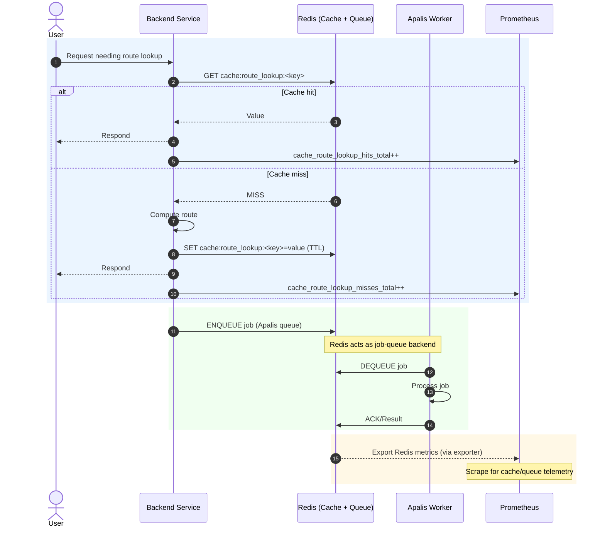

# Wildside Backend MVP Architecture and Observability

## Monolithic Backend with Modular Design

For the Wildside MVP, a **monolithic Rust backend** is the recommended
approach([1](https://github.com/leynos/wildside/blob/663a1cb6ca7dd0af1b43276b65de6a2ae68f8da6/docs/wildside-high-level-design.md#L65-L70)).
 This means all core server functionality (API, WebSockets, business logic,
etc.) runs in a single codebase/binary for simplicity, but with clear internal
module
boundaries([1](https://github.com/leynos/wildside/blob/663a1cb6ca7dd0af1b43276b65de6a2ae68f8da6/docs/wildside-high-level-design.md#L620-L628)).
 The code can be organized into domains (e.g. user accounts, POI data, routing
engine) within one project (as a “modular monolith”). This yields fast
development and easier debugging during early stages, avoiding the complexity
of
microservices([1](https://github.com/leynos/wildside/blob/663a1cb6ca7dd0af1b43276b65de6a2ae68f8da6/docs/wildside-high-level-design.md#L65-L70))([1](https://github.com/leynos/wildside/blob/663a1cb6ca7dd0af1b43276b65de6a2ae68f8da6/docs/wildside-high-level-design.md#L2-L6)).
 As load and features grow, these modules could be split out into services if
needed, but initially everything is contained in one deployable unit. The only
exception is **background task workers**, which will run as separate
process(es) for heavy or asynchronous jobs, as discussed later. This design
keeps the starting point lightweight while leaving room to grow into a
distributed architecture in the future.

## Web API Layer (Actix Web & WebSockets)

**Actix Web** will serve as the HTTP API framework for Wildside. Actix is a
mature, high-performance asynchronous web framework in
Rust([1](https://github.com/leynos/wildside/blob/663a1cb6ca7dd0af1b43276b65de6a2ae68f8da6/docs/wildside-high-level-design.md#L8-L12)).
 It uses an actor model under the hood, enabling excellent concurrency for
handling many simultaneous
requests([1](https://github.com/leynos/wildside/blob/663a1cb6ca7dd0af1b43276b65de6a2ae68f8da6/docs/wildside-high-level-design.md#L648-L655)).
 The backend will expose RESTful endpoints for core features (e.g. generating a
walking route, retrieving points of interest, user profile actions). These
endpoints are defined in Actix Web and can be documented via OpenAPI (using
tools like `utoipa` as noted in the
repo)([2](https://github.com/leynos/wildside/blob/663a1cb6ca7dd0af1b43276b65de6a2ae68f8da6/docs/repository-structure.md#L124-L133)).
 Each request is handled swiftly and safely thanks to Rust’s memory safety and
Actix’s
efficiency([1](https://github.com/leynos/wildside/blob/663a1cb6ca7dd0af1b43276b65de6a2ae68f8da6/docs/wildside-high-level-design.md#L639-L647))([1](https://github.com/leynos/wildside/blob/663a1cb6ca7dd0af1b43276b65de6a2ae68f8da6/docs/wildside-high-level-design.md#L648-L655)).

Alongside HTTP, **Actix WS** (WebSockets) will enable real-time bidirectional
communication. The backend can upgrade connections (e.g. on a path like `/ws`)
to
WebSockets([2](https://github.com/leynos/wildside/blob/663a1cb6ca7dd0af1b43276b65de6a2ae68f8da6/docs/repository-structure.md#L38-L46)),
 allowing the server to push updates to clients asynchronously. This is useful
for long-running processes and live features. For example, when a user requests
a personalized route, the server might immediately acknowledge the request,
then **push progress or completion events via WebSocket** once the route is
computed. Similarly, if a user is actively walking, the client could send
location updates and the server could push contextual tips or next-step
guidance in real time. Actix’s actor system is well-suited for managing these
concurrent websocket sessions.

*Observability:* The web layer will be instrumented for visibility. An Actix
middleware can track **HTTP request metrics** (counts, latency, error rates)
and expose them to Prometheus. For instance, every API endpoint hit will
increment a counter (e.g. `http_requests_total{path,method,status}`) and
measure the response time histogram. A Prometheus scrape endpoint (e.g.
`GET /metrics`) will be provided on the Actix server to collect these
metrics([2](https://github.com/leynos/wildside/blob/663a1cb6ca7dd0af1b43276b65de6a2ae68f8da6/docs/repository-structure.md#L2-L5)).
 The WebSocket events can also be monitored – e.g. track active connection
count and messages sent/received. Additionally, hooks in request handlers can
log important events (like a “route generation requested” event) to **PostHog**
for product analytics. The backend can send custom events to PostHog’s API (or
the frontend could send them) to record user actions (e.g. “RouteGenerated”,
“POIClicked”), which helps understand feature usage. In summary, the API layer
will have robust logging and metrics: Prometheus for low-level performance and
error monitoring, and PostHog for high-level user behavior tracking.

## Route Generation Engine Integration

At the heart of Wildside is the **route recommendation engine**, provided by
the `wildside-engine` library. This engine is responsible for computing the
“most interesting” walking tour given user preferences, time constraints, and
current location. In the backend architecture, the Wildside engine is used as a
**library crate** – the Actix web handlers will call into it to generate
routes. The engine handles heavy data processing: parsing geospatial data,
scoring points of interest (POIs), and solving the optimal route (an NP-hard
Orienteering
Problem)([1](https://github.com/leynos/wildside/blob/663a1cb6ca7dd0af1b43276b65de6a2ae68f8da6/docs/wildside-high-level-design.md#L2-L5)).
 Because this computation can be intensive, the design must ensure it doesn’t
block the responsive handling of requests.

For the MVP, a simple approach is to perform route generation within a separate
worker thread or via a background task job, rather than on the main async
thread. For example, when an HTTP request to `/api/generate_route` comes in,
the handler can quickly validate input and then enqueue a **background job** to
compute the route. The client could either poll for the result or receive it
via WebSocket when ready. This prevents long CPU-bound work from stalling the
Actix event loop. If the computation is fast enough for MVP, it could also be
done synchronously with careful use of `spawn_blocking`, but the architecture
anticipates heavier loads where a true background job is safer. Once the engine
produces a route (an ordered list of POIs with a path), the result can be
stored (e.g. in Postgres or an in-memory cache) and returned to the user.

The engine will rely on **OpenStreetMap (OSM) data and Wikidata** for rich POI
info([1](https://github.com/leynos/wildside/blob/663a1cb6ca7dd0af1b43276b65de6a2ae68f8da6/docs/wildside-high-level-design.md#L58-L67)).
 Likely, an offline data pipeline will ingest OSM PBF files (using the `osmpbf`
crate as per engine
design([3](https://github.com/leynos/wildside-engine/blob/5f30edbcb69bd5dd7f99eaeefccfb60abb9871c4/docs/wildside-engine-design.md#L74-L83))([3](https://github.com/leynos/wildside-engine/blob/5f30edbcb69bd5dd7f99eaeefccfb60abb9871c4/docs/wildside-engine-design.md#L78-L86)))
 into a database or efficient data structure. The backend can then query this
data via Diesel (or the engine may handle it internally if it uses its own data
store). For MVP simplicity, storing POIs in PostgreSQL with PostGIS is ideal,
so the engine can fetch nearby POIs or graph data via SQL and then perform
scoring/routing in Rust. The design document indeed suggests using PostgreSQL
with PostGIS for geospatial queries and JSONB for OSM
tags([1](https://github.com/leynos/wildside/blob/663a1cb6ca7dd0af1b43276b65de6a2ae68f8da6/docs/wildside-high-level-design.md#L655-L663))([1](https://github.com/leynos/wildside/blob/663a1cb6ca7dd0af1b43276b65de6a2ae68f8da6/docs/wildside-high-level-design.md#L671-L680))
 – the engine can leverage that through Diesel models.

*Observability:* The route engine component will be instrumented to measure its
performance and correctness. We will track metrics like **route computation
duration**, number of POIs considered, and success/failure counts. For example,
a custom Prometheus histogram `wildside_engine_route_duration_seconds` can
record how long the algorithm runs for each request. If an external routing
service or solver (like Valhalla) is used under the hood, we monitor those
calls as well. The system should set a safe time limit on route
calculations([1](https://github.com/leynos/wildside/blob/663a1cb6ca7dd0af1b43276b65de6a2ae68f8da6/docs/wildside-high-level-design.md#L14-L17));
 if the engine exceeds, it aborts or returns a partial result. Such timeouts
and any errors will be logged (and potentially sent to an alerting system).
Moreover, high-level events can be sent to PostHog, e.g. an event
“RouteGenerated” with properties like route length, number of POIs, etc. This
helps analyze what kinds of routes users generate most and how long it takes on
average – valuable feedback for tuning the engine.

## Data Persistence with PostgreSQL and Diesel

All persistent data for Wildside will be stored in **PostgreSQL**, using the
Diesel ORM for access. Postgres is a reliable choice for both standard
application data and geospatial data. The database will include tables for
users, their saved preferences or past routes, and the geospatial dataset of
POIs/roads. Leveraging **PostGIS**, the Postgres DB can store location
coordinates and enable spatial queries (e.g. find POIs within X
meters)([1](https://github.com/leynos/wildside/blob/663a1cb6ca7dd0af1b43276b65de6a2ae68f8da6/docs/wildside-high-level-design.md#L655-L663)).
 This is crucial for filtering and querying the map data efficiently. Each OSM
feature’s tags (descriptive attributes) can be stored in a JSONB column, giving
flexible schema-less ability to query things like `amenity=cafe` or
`historic=yes` without a fixed schema for every
tag([1](https://github.com/leynos/wildside/blob/663a1cb6ca7dd0af1b43276b65de6a2ae68f8da6/docs/wildside-high-level-design.md#L671-L680)).
 The design uses JSONB to accommodate OSM’s extensible tagging system while
still benefiting from indexes and relational integrity.

**Diesel** integrates with Actix to provide type-safe, compile-time-checked
database queries. Diesel was chosen for its compile-time guarantees – it will
catch SQL errors (wrong column names, type mismatches) during compilation,
reducing runtime
errors([1](https://github.com/leynos/wildside/blob/663a1cb6ca7dd0af1b43276b65de6a2ae68f8da6/docs/wildside-high-level-design.md#L682-L690)).
 Using Diesel, the backend defines Rust structs for each table and uses them to
execute queries. This ensures that as the schema evolves, the code won’t
compile if it’s out of sync, which adds robustness to our data layer. Diesel
also supports connection pooling (via r2d2 or similar), which the Actix server
will use to manage a pool of Postgres connections for efficiency.

In this architecture, **Postgres serves multiple purposes**: it holds the
business data (users, etc.) and also possibly the preprocessed map data (POIs,
graph edges). This keeps the stack simpler (one primary database) and
transactionally updates user-specific info. If needed, we can isolate the heavy
geospatial reads by using read replicas or a separate schema, but MVP can start
with a single database instance for everything.

*Observability:* The database and ORM layer will be monitored to ensure healthy
performance. We will enable Postgres metrics collection (for example, running a
**Postgres exporter** or using CloudNativePG’s built-in metrics if deployed in
K8s([4](https://github.com/leynos/wildside/blob/663a1cb6ca7dd0af1b43276b65de6a2ae68f8da6/docs/cloud-native-ephemeral-previews.md#L1505-L1513))).
 Key metrics include query throughput, slow query counts, connections in use,
and cache hit rates. From the application side, we can use Diesel’s query
logging to detect slow queries and instrument timings for critical queries (for
instance, wrap certain calls to measure their duration). The Prometheus
operator will scrape database metrics (if using an operator or a managed DB
with
metrics)([4](https://github.com/leynos/wildside/blob/663a1cb6ca7dd0af1b43276b65de6a2ae68f8da6/docs/cloud-native-ephemeral-previews.md#L1505-L1513)).
 In Grafana, dashboards will plot DB metrics like CPU, I/O, number of queries
per second, etc., as recommended by the deployment
guide([4](https://github.com/leynos/wildside/blob/663a1cb6ca7dd0af1b43276b65de6a2ae68f8da6/docs/cloud-native-ephemeral-previews.md#L1505-L1513)).
 If any query regularly takes too long (impacting route generation latency),
we’ll get alerted and can optimize that part (adding indexes or caching
results). On the analytics side, database operations themselves aren’t directly
in PostHog, but we might use PostHog to track high-level outcomes (e.g.
“UserSavedRoute” event when a user saves a generated route to the DB).

## Caching and job queue layer (Redis)

To further improve responsiveness and reduce load, a caching layer will be
introduced, backed by **Redis**. Redis will serve as both the cache and the
job-queue backend via [Apalis](https://docs.rs/apalis). When used as a queue,
configure Redis for durability (enable AOF) to avoid job loss on restarts. The
cache serves a few purposes in the Wildside backend:

- **API Response Caching:** For expensive requests with identical inputs, the
  system can cache the results. For example, if two users request a walking
  tour of the **same area with the exact same parameters**, the first
  computation’s result could be stored in cache so the second can be served
  instantly from
  cache([1](https://github.com/leynos/wildside/blob/663a1cb6ca7dd0af1b43276b65de6a2ae68f8da6/docs/wildside-high-level-design.md#L8-L16)).
   This is particularly useful if route generation is computationally heavy –
  caching common routes (or common subpaths) avoids recomputation,
  significantly speeding up responses in those cases.

- **Data Caching:** The application might cache frequently accessed reference
  data, such as a list of popular POIs or map tile fragments. Rather than
  hitting the database or file store repeatedly, these can reside in memory.
  For instance, if certain base map data or precomputed graph data is needed
  for every route, the backend can load it at startup or cache it on first use
  for quick reuse.

- **Session Caching (if needed):** Although we plan to use signed cookies for
  session info (see below), if we needed to store session state server-side
  (e.g. to track active sessions or more data per session), a cache like Redis
  could be used. This would keep session lookups fast and avoid hitting the
  primary database for ephemeral session reads. In our design, we try to keep
  the server stateless by not requiring server-side session storage. But Redis
  remains an option for any transient data that doesn’t warrant a database
  write.

In a Kubernetes deployment, Redis can be run as an in-cluster service or as a
managed offering. For a lightweight start, a single small Redis instance (or
even using an in-memory cache within the app process for non-critical data)
can suffice for cache-only use. Do not replace Redis with an in-process cache
if it is also the queue backend. When Redis serves both cache and queue:

- enable AOF for durability (e.g., `appendonly yes; appendfsync everysec`);
- if sharing one instance, set an eviction policy safe for queues (e.g., prefer
  `noeviction`) and bound cache keys with TTLs; or run separate instances/DBs;
- set an explicit Apalis key prefix/namespace (e.g., `apalis:`) to avoid key
  collisions with cache keys;
- expose metrics via the Redis exporter, and enable the `prometheus` feature
  for the Apalis Redis integration to export queue metrics.

When using the Bitnami Redis Helm chart, enable the Prometheus exporter and
alerting:

values.yaml

```yaml
metrics:
  enabled: true
  serviceMonitor:
    enabled: true
  prometheusRule:
    enabled: true
```

The cost analysis for MVP even budgets a small Redis Cloud instance for
caching([1](https://github.com/leynos/wildside/blob/663a1cb6ca7dd0af1b43276b65de6a2ae68f8da6/docs/wildside-high-level-design.md#L2-L5)),
underlining its role as both cache and queue.

*Observability:* The caching layer will be monitored to ensure it’s effectively
improving performance. We’ll track **cache hit rates and misses** for critical
caches. For instance, a Prometheus metric `cache_route_lookup_hits_total` vs
`cache_route_lookup_misses_total` can be recorded to measure how often a route
result was served from cache versus had to be recomputed. Redis itself provides
stats like memory usage, eviction counts, connections, which can be exposed via
a Redis exporter and scraped by Prometheus. In Grafana, we’d include panels for
cache performance (high miss rates might indicate we can optimize caching
strategy). From an analytics perspective, caching is transparent to users, so
not directly relevant to PostHog events, but a successful cache hit does
indirectly improve user experience (faster response) which could reflect in
user retention metrics over time.

### Cache and job queue flow

The sequence below illustrates how a route lookup is cached, how jobs move
through Redis as the Apalis queue, and how Prometheus gathers telemetry.



## Background task workers

Certain operations in Wildside are best handled asynchronously by **background
workers** rather than directly in the web request/response cycle. Examples
include: generating a complex route (if we choose to fully offload it),
pre-processing map data, sending notification emails or push messages, and
periodic maintenance tasks (like refreshing the POI database or pruning old
data). To facilitate this, the architecture includes a **task queue and
worker** component. The main backend enqueues jobs, and one or more worker
processes dequeue and execute them in the background. This decouples heavy
lifting from user-facing request latency.

For implementation, Wildside will use
[Apalis](https://docs.rs/apalis) backed by Redis. Apalis supports retries,
scheduling (cron jobs) and concurrency limits. Workers can run as a separate
binary or as part of the main binary launched in "worker mode". Redis
durability and metrics considerations from the caching section also apply to
the queue configuration. Workers process jobs from named queues to separate
concerns: use `route_generation` for CPU-intensive path-planning jobs and
`enrichment` for fetching supplementary point-of-interest data and other
periodic enrichments. Apalis’s cron-like scheduling triggers regular
maintenance tasks without adding extra services. Define a clear reliability
policy:

- use bounded exponential backoff with a maximum retry count;
- route exhausted jobs to a dead-letter queue for inspection;
- require idempotency per job type (e.g., a deduplication key) so retries do
  not duplicate work.

With Apalis, the **Actix Web server produces tasks** and **worker(s) consume
them**. For example, when a user requests a route, the server enqueues a
`GenerateRouteJob(user_id, start_point, prefs, etc)` on the
`route_generation` queue. A worker running the same codebase (but started in
worker mode) will pick it up, execute the wildside-engine to compute the
route, then store the result in the database or cache. The user is then
notified (perhaps the web server checks the DB or the worker triggers a
WebSocket message when done). Scheduled tasks like refreshing OSM data nightly
are queued on `enrichment` and triggered on a schedule (Apalis supports
cron-like scheduling).

*Observability:* The task worker system will be instrumented so we can ensure
it’s running smoothly. Key metrics include the **queue length** (number of
pending jobs), job throughput, and job success/failure counts. If using Apalis
or similar, we can often hook into their events to increment Prometheus
counters (e.g. `jobs_success_total`, `jobs_failed_total`) and gauge how many
jobs are in-flight. We’ll also measure **job execution time** per job type, to
detect if certain tasks are consistently slow. In K8s, if the workers are
separate pods, each can also expose a `/metrics` endpoint so Prometheus can
scrape worker-specific stats. Additionally, any exceptions or failed tasks
should be logged with details (and possibly sent to an error tracking system).
From the user analytics side, we might not directly track background jobs in
PostHog (since those are internal), but their outcomes affect user experience.
For instance, if a route generation job fails, the user might receive an error
– that could trigger a PostHog event like “RouteGenerationFailed” for analysis
of how often and where it happens. Overall, the background workers will be
transparent to the user but carefully monitored by the devops team via metrics
and logs.

## Session Management and Security

Wildside will manage user sessions using **secure signed cookies**, inspired by
the Python itsdangerous approach. Rather than storing session state on the
server, the server will issue the client a cookie that contains the session
data (for example, a user identifier and maybe a timestamp or some
preferences), along with a cryptographic signature. The signature (HMAC-SHA256
or similar, using a secret key) ensures the cookie’s integrity – the client
cannot tamper with it without invalidating the signature. When the browser
sends the cookie back on each request, the Actix backend will verify the
signature and decode the session info. This approach keeps the backend
**stateless** with respect to sessions: no in-memory or database session lookup
is needed for each request, which simplifies scaling (any instance can validate
the cookie on its own). It also reduces latency, since checking an HMAC is fast
compared to a database hit.

In practice, on login or session creation, the server will generate a cookie
like `session=<base64_payload>.<signature>`. The payload might be minimal (e.g.
just a user ID and expiration time). The signature is computed using a secret
key known only to the backend (we’ll store this in a Kubernetes Secret or
Vault). Actix Web has support for cookie values and we can implement signing
using a crate (there are Rust crates for JWT or for itsdangerous-like tokens,
or we can manually use HMAC). By including an expiry timestamp in the payload
and in the signature, we can also ensure sessions expire.

**Security considerations:** The cookie will be marked HttpOnly and Secure (and
SameSite as appropriate) so that it’s not accessible to JS and not sent in
cross-site contexts. This helps prevent XSS and CSRF issues. Because the
session is stateless, if a user logs out, we cannot “kill” the cookie on the
server side – we just instruct the client to delete it. If we needed immediate
revocation (e.g. for a compromised account), we might maintain a server-side
denylist of session IDs or use short-lived tokens. For MVP, this simple
approach is likely sufficient.

*Observability:* Session management itself doesn’t produce a lot of metrics,
but we can track things like **active user count** or login frequency. For
example, we might have a Prometheus gauge for active sessions (though since we
aren’t centrally tracking sessions, this could be approximated by recent
activity). More directly, we can leverage PostHog to track user sign-ins,
sign-ups, and sign-outs as events. This will tell us how many users are
returning (which correlates to how many valid session cookies are in use) and
if anyone encounters errors in session validation (e.g. an invalid signature
attempt, which could indicate tampering). Any such validation failures would be
logged as warnings and possibly counted. Overall, by keeping sessions in
cookies, we simplify the architecture and reduce points of failure – there’s no
session store to monitor – while still ensuring we know when users are active
through analytics events.

## Observability and Instrumentation

A cornerstone of the Wildside backend design is **observability** – we want to
instrument the MVP from the start to gather insights and ensure reliability.
The architecture integrates observability at multiple levels, primarily using
**Prometheus** for operational metrics and **PostHog** for product analytics.
Here’s how these tools work with the application components:

- **Prometheus Metrics & Grafana Dashboards:** The backend exposes a `/metrics`
  endpoint (in Prometheus text format) that aggregates metrics from all parts
  of the
  application([2](https://github.com/leynos/wildside/blob/663a1cb6ca7dd0af1b43276b65de6a2ae68f8da6/docs/repository-structure.md#L2-L5)).
   In Kubernetes, a ServiceMonitor (via Prometheus Operator) will be set up to
  scrape this endpoint
  periodically([2](https://github.com/leynos/wildside/blob/663a1cb6ca7dd0af1b43276b65de6a2ae68f8da6/docs/repository-structure.md#L2-L5)).
   We will capture metrics like: request rates, error counts (e.g. HTTP 500s),
  database query timings, cache hits, job queue depths, and system resource
  usage. The Kubernetes cluster itself will also be monitored (Traefik ingress,
  Postgres operator,
  etc.)([4](https://github.com/leynos/wildside/blob/663a1cb6ca7dd0af1b43276b65de6a2ae68f8da6/docs/cloud-native-ephemeral-previews.md#L1505-L1513)),
   but focusing on the app, we’ll build **Grafana dashboards** to visualize
  KPIs such as average route generation time, 95th percentile API latency,
  WebSocket connected clients, and memory/CPU usage per pod. The design doc
  explicitly recommends monitoring request latency, error rates, DB pool usage,
  etc., via
  Prom/Grafana([4](https://github.com/leynos/wildside/blob/663a1cb6ca7dd0af1b43276b65de6a2ae68f8da6/docs/cloud-native-ephemeral-previews.md#L1505-L1513)).
   Additionally, Alertmanager can be configured to trigger alerts (email/Slack)
  on certain conditions – for instance, if error rate spikes or if route
  latency exceeds a threshold
  consistently([4](https://github.com/leynos/wildside/blob/663a1cb6ca7dd0af1b43276b65de6a2ae68f8da6/docs/cloud-native-ephemeral-previews.md#L1505-L1513)).
   This way, even in MVP stage, we have feedback loops to catch issues early.

- **Tracing and Logging:** While not explicitly asked, as part of observability
  it’s worth noting that structured logging and possibly distributed tracing
  will be employed. Actix Web requests can be given a request ID or trace ID.
  If we incorporate an OpenTelemetry tracer, we could trace a request from the
  HTTP layer through the database queries and even into the background task if
  it’s synchronous. This might be something to introduce as the system grows,
  but even at MVP, ensuring logs contain context (like user ID, request path,
  job id) will aid debugging. These logs can be shipped from Kubernetes (e.g.
  via FluentBit/Elasticsearch or any cloud logging service).

- **PostHog Analytics:** PostHog will complement Prometheus by tracking
  **user-centric events and funnels**. We’ll embed PostHog’s snippet in the PWA
  frontend to capture events like “TourStarted”, “POIViewed”, “CompletedTour”.
  The backend can also send events for actions not directly triggered in the
  UI. For example, when the route engine finishes computing a route, the
  backend might send an event “RouteComputed” with properties (length, number
  of POIs, themes) to PostHog. This data helps the team understand user
  behavior: which features are used, how often users complete tours, etc.
  PostHog being an open-source product analytics platform fits the ethos of
  self-hosting and can be deployed in our cluster if desired (or use PostHog
  Cloud). We will ensure no sensitive PII is sent in events – mostly IDs or
  hashes if needed. Over time, this analytic data guides UX improvements and
  identifies drop-off points (for instance, if many users start route
  generation but few finish, that’s a red flag to investigate).

- **Integration of O11y with Components:** Each major component is wired with
  observability:

- *Actix Web:* Middleware captures metrics and logs for each HTTP request
  (including route, status, duration). We might use existing crates or custom
  code to instrument this. Also, Actix’s internal metrics (like workers alive,
  threads busy) could be exposed.

- *Actix WS:* We can add counters for opened/closed connections and maybe track
  messages sent. If using AsyncAPI for documentation, the events could also be
  logged when emitted.

- *Diesel/Postgres:* Use Postgres’s statistics (possibly via a `/metrics` in
  the Postgres operator) to get query stats. Also instrument application-level
  DB calls as noted.

- *Background Workers:* Each worker process can either push metrics to a
  centralized aggregator or expose its own endpoint. If using the same
  codebase, we could even have the main Actix server gather some metrics from
  the job system (depending on integration). At the least, each worker will log
  job executions and failures, and those logs get collected.

- *Cache:* We’ll monitor Redis if used (hits, misses, resource use).

- *External Services:* If the engine uses external APIs (e.g. a cloud LLM for
  narration or an external routing engine), we will instrument calls to those
  as well, counting usage and latencies. Caching layers will mitigate cost
  here, and monitoring ensures we know how often we hit external APIs (to
  control costs as mentioned in design
  plans([1](https://github.com/leynos/wildside/blob/663a1cb6ca7dd0af1b43276b65de6a2ae68f8da6/docs/wildside-high-level-design.md#L14-L17))).

In summary, the MVP backend is not only designed to perform well but also to be
**transparent about its performance and usage**. By baking in observability
from day one, we ensure that as we deploy to Kubernetes and get real users, we
can measure what’s happening internally (system metrics via Prometheus) and how
users are interacting with the product (events via PostHog). This dual
visibility is crucial for both reliability engineering and product iteration.

## Kubernetes Deployment and Scalability

The Wildside backend (monolith + workers) will be containerized and deployed on
Kubernetes, following the cloud-native approach outlined in the project’s
design docs. In practice, we will have at least two deployable components: the
**Actix Web API server** container and the **Background Worker** container
(which might be the same image launched with a different command or environment
flag). Initially, these could even be the same binary with a CLI flag
(`--mode=worker` vs `--mode=server`), to keep things simple and ensure both
share code. In Kubernetes, they would be separate Deployments so that they can
scale independently – e.g. we might run 2 replicas of the web server for high
availability, and a couple of worker pods for throughput, adjusting as needed.

We will use Kubernetes best practices such as: a **Traefik Ingress** (as per
the repo’s manifests) to route external traffic to the Actix Web
service([2](https://github.com/leynos/wildside/blob/663a1cb6ca7dd0af1b43276b65de6a2ae68f8da6/docs/repository-structure.md#L100-L108)),
 configured with TLS (Let’s Encrypt via cert-manager). The static frontend
(PWA) can be served via a CDN or object storage, as indicated by the design
(the sequence diagram shows the browser fetching assets from CDN and API calls
hitting
backend)([2](https://github.com/leynos/wildside/blob/663a1cb6ca7dd0af1b43276b65de6a2ae68f8da6/docs/repository-structure.md#L26-L34)).
 The backend containers will mount config (like database DSN, secrets for
cookie signing, API keys) via K8s Secrets and ConfigMaps. We’ll also include
readiness/liveness probes for the Actix Web app (e.g. an endpoint `/healthz`)
so Kubernetes can detect if a pod is unresponsive and restart it.

For the database, we have options: a managed Postgres (e.g. DigitalOcean
Managed DB) or running our own via an operator like **CloudNativePG**. The
design documents lean toward using a managed database for MVP to reduce ops
burden([1](https://github.com/leynos/wildside/blob/663a1cb6ca7dd0af1b43276b65de6a2ae68f8da6/docs/wildside-high-level-design.md#L110-L119)),
 which is wise – the app can simply connect to that DB via a secure connection
string. If we self-host Postgres in K8s (less likely for MVP), we’d use
CloudNativePG or Bitnami charts and ensure persistent volume storage, etc. In
either case, the **PostGIS extension** will be enabled on the database to
support spatial queries.

The deployment strategy follows a GitOps model (as described in the
cloud-native architecture doc) – meaning our Kubernetes manifests (for
deployments, services, etc.) are in a repo and an operator (FluxCD) applies
them to the
cluster([4](https://github.com/leynos/wildside/blob/663a1cb6ca7dd0af1b43276b65de6a2ae68f8da6/docs/cloud-native-ephemeral-previews.md#L23-L32))([4](https://github.com/leynos/wildside/blob/663a1cb6ca7dd0af1b43276b65de6a2ae68f8da6/docs/cloud-native-ephemeral-previews.md#L34-L42)).
 This allows us to have **ephemeral preview environments** for each feature
branch: a temporary deployment of the whole stack on a subdomain for
testing([4](https://github.com/leynos/wildside/blob/663a1cb6ca7dd0af1b43276b65de6a2ae68f8da6/docs/cloud-native-ephemeral-previews.md#L43-L51)).
 In those ephemeral envs, the same architecture applies, just spun up
on-demand. This gives confidence that our k8s configs and observability scale
to multiple instances. Each preview would have its own isolated DB, etc., as
noted in the design doc (possibly using separate schemas per
environment)([4](https://github.com/leynos/wildside/blob/663a1cb6ca7dd0af1b43276b65de6a2ae68f8da6/docs/cloud-native-ephemeral-previews.md#L1539-L1547)).

For **scalability**, even though we are monolithic, the app is designed to
handle concurrent loads. Actix is highly concurrent, and Rust’s performance
means we can utilize CPU efficiently. If traffic grows, we scale the web
Deployment horizontally (add more pods). Thanks to stateless design (sessions
in cookies, etc.), requests can go to any pod. The background workers can also
be scaled out if the queue of tasks grows – they’ll all compete for jobs from
the queue. We should set resource requests/limits on these pods based on
profiling (the design doc suggests adhering to resource management best
practices in
k8s)([4](https://github.com/leynos/wildside/blob/663a1cb6ca7dd0af1b43276b65de6a2ae68f8da6/docs/cloud-native-ephemeral-previews.md#L1514-L1522)).
 In the future, if certain components become bottlenecks, we might split them
off (for instance, a dedicated microservice for the route engine if needed).
But for MVP, this single backend should suffice, and the infrastructure is
ready to support growth.

Finally, all observability components will run in K8s as well: the **Prometheus
Operator and Grafana** will be installed (the design explicitly calls for
deploying them via
HelmRelease)([4](https://github.com/leynos/wildside/blob/663a1cb6ca7dd0af1b43276b65de6a2ae68f8da6/docs/cloud-native-ephemeral-previews.md#L1505-L1513)).
 Prometheus will be configured to scrape our pods’ metrics; Grafana will have
dashboards for our app. **Alertmanager** integrated with Prom Operator will
handle alerting on
thresholds([4](https://github.com/leynos/wildside/blob/663a1cb6ca7dd0af1b43276b65de6a2ae68f8da6/docs/cloud-native-ephemeral-previews.md#L1505-L1513)).
 If we host PostHog ourselves, it would run in the cluster too (PostHog
provides a chart or Docker compose). If not, we might use PostHog Cloud and
just send events over the internet. Logging can be handled by the cluster’s
logging stack (if any) or simply by Cloud provider logs.

In summary, the Kubernetes deployment ties all pieces together: our Rust
backend (API + WS) and worker processes run in containers, leveraging Postgres
and Redis services, all observable through Prometheus/Grafana. The **MVP
remains a monolithic app** (plus a worker) for
simplicity([1](https://github.com/leynos/wildside/blob/663a1cb6ca7dd0af1b43276b65de6a2ae68f8da6/docs/wildside-high-level-design.md#L65-L70)),
 but the entire setup is built with **cloud-native principles** –
infrastructure as code, declarative config, and robust monitoring – to ensure
we can confidently develop, deploy, and scale Wildside.

## Conclusion and Future Evolution

The above design provides a detailed blueprint for Wildside’s backend MVP: a
Rust/Actix web application augmented by background workers, a PostGIS-enabled
PostgreSQL database, and supportive infrastructure like the Redis cache and job
queue, alongside comprehensive observability. It favours a simple, monolithic
core([1](https://github.com/leynos/wildside/blob/663a1cb6ca7dd0af1b43276b65de6a2ae68f8da6/docs/wildside-high-level-design.md#L65-L70))
 that is easier to build and iterate on quickly, while applying modular design
internally for
clarity([1](https://github.com/leynos/wildside/blob/663a1cb6ca7dd0af1b43276b65de6a2ae68f8da6/docs/wildside-high-level-design.md#L620-L628)).
 This foundation is **lightweight to start** yet prepared for growth – for
instance, by adding more workers, enabling caching for heavy computations, and
eventually splitting out services if needed. Instrumentation with Prometheus
and PostHog ensures that from day one we have eyes on system health and user
engagement, which de-risks the development and helps guide future product
decisions. By following this architecture and the DevOps practices (GitOps
deployments, managed services for critical components, etc.), the Wildside team
can deliver a polished MVP that not only provides a unique “serendipity engine”
for urban explorers, but also is stable, scalable, and well-monitored in
production.

**Sources:** The design is informed by the Wildside project’s high-level design
documents and repository guides, which emphasize a Rust Actix backend,
Postgres/PostGIS data store, and monolithic MVP
approach([1](https://github.com/leynos/wildside/blob/663a1cb6ca7dd0af1b43276b65de6a2ae68f8da6/docs/wildside-high-level-design.md#L637-L645))([1](https://github.com/leynos/wildside/blob/663a1cb6ca7dd0af1b43276b65de6a2ae68f8da6/docs/wildside-high-level-design.md#L655-L663))([1](https://github.com/leynos/wildside/blob/663a1cb6ca7dd0af1b43276b65de6a2ae68f8da6/docs/wildside-high-level-design.md#L671-L680))([1](https://github.com/leynos/wildside/blob/663a1cb6ca7dd0af1b43276b65de6a2ae68f8da6/docs/wildside-high-level-design.md#L682-L690)).
 Observability and cloud deployment strategies are aligned with the provided
cloud-native architecture
recommendations([4](https://github.com/leynos/wildside/blob/663a1cb6ca7dd0af1b43276b65de6a2ae68f8da6/docs/cloud-native-ephemeral-previews.md#L1505-L1513))([2](https://github.com/leynos/wildside/blob/663a1cb6ca7dd0af1b43276b65de6a2ae68f8da6/docs/repository-structure.md#L2-L5))
 and caching and optimization considerations from the technical risk
analysis([1](https://github.com/leynos/wildside/blob/663a1cb6ca7dd0af1b43276b65de6a2ae68f8da6/docs/wildside-high-level-design.md#L8-L16))([1](https://github.com/leynos/wildside/blob/663a1cb6ca7dd0af1b43276b65de6a2ae68f8da6/docs/wildside-high-level-design.md#L14-L17)).
 All these pieces coalesce into the architecture detailed above, setting the
stage for Wildside’s successful implementation and growth.
