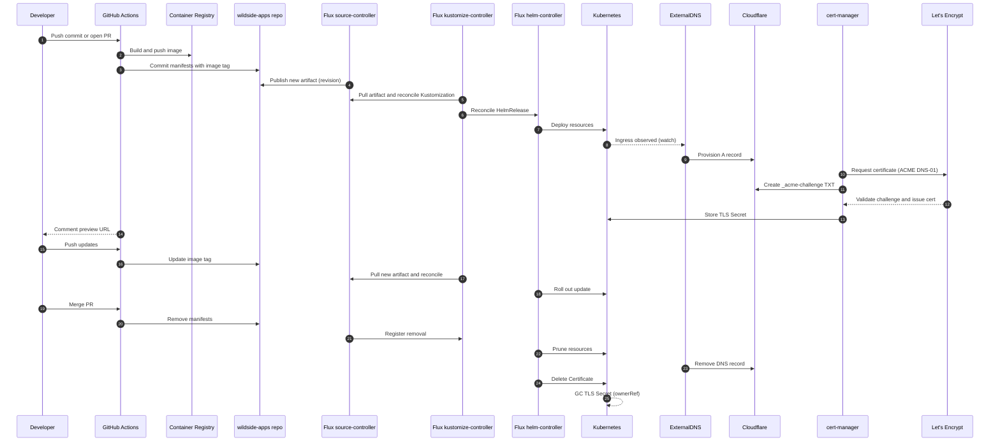

# A cloud-native architecture for on-demand ephemeral preview environments

## Executive summary: the GitOps-driven ephemeral environment architecture

This report presents a comprehensive technical blueprint for a fully automated,
cloud-native platform designed to host the "Project Wildside" web application.
The architecture's central purpose is to provision and manage on-demand,
ephemeral preview environments for each feature branch, a practice that
significantly accelerates development cycles, improves quality assurance, and
fosters more confident collaboration. The design is founded on a declarative,
GitOps-centric methodology, ensuring that every component of the infrastructure
and application lifecycle is reproducible, auditable, and secure.

The architecture is built upon four key pillars that work in concert to deliver
a robust and scalable system:

- **Declarative Infrastructure:** All foundational cloud resources, including
  the Kubernetes cluster and its networking, are defined as code using
  OpenTofu.[^1] This Infrastructure as Code (IaC) approach eliminates manual
  configuration, prevents environmental drift, and provides a
  version-controlled, auditable record of the entire platform's desired state.

- **Git as the Single Source of Truth:** The system's operational heart is a
  GitOps workflow orchestrated by FluxCD.[^2] Flux acts as an in-cluster agent,
  continuously monitoring a dedicated Git repository and reconciling the
  cluster's live state to match the manifests defined in that repository. This
  paradigm shifts the operational model from imperative commands (

  `kubectl apply`) to declarative commits (`git push`). All changes, from
  platform component upgrades to new application deployments, are initiated,
  reviewed, and approved through standard Git processes.

- **Separation of Concerns:** A crucial architectural decision is the strict
  separation of the Continuous Integration (CI) process, which is responsible
  for building and testing artifacts, from the Continuous Delivery (CD)
  process, which handles deployment. GitHub Actions is tasked with building the
  application's container image and preparing deployment manifests, but it
  never directly interacts with the Kubernetes API. Instead, its final action
  is to commit updated manifests to the GitOps repository. FluxCD then detects
  this change and securely pulls the configuration into the cluster. This model
  enhances security by minimizing the credentials and access required by the CI
  system and aligns with modern GitOps best practices.[^3]

- **End-to-End Automation:** The complete lifecycle of a feature branch
  environment is automated. Upon the creation of a pull request, the system
  automatically provisions a new, isolated environment on a unique, TLS-secured
  subdomain. This environment is continuously updated with subsequent commits
  to the branch. When the pull request is merged or closed, the system
  automatically decommissions all associated resources, ensuring a clean and
  cost-effective state.

Two reusable GitHub Actions encode these idempotent operations. Each action is
implemented as a convergent workflow that reshapes its target GitOps repository
before handing control back to Flux:

- `wildside-infra-k8s` provisions Kubernetes clusters and shared fixtures from
  the OpenTofu modules in this repository, writing the desired state into the
  `wildside-infra` GitOps repository that FluxCD watches. Every execution
  performs the following steps idempotently:

  - Ensure the repository presents the expected GitOps layout, including the
    `clusters`, `modules`, and `platform` directories with
    `platform/sources`, `platform/traefik`, `platform/cert-manager`,
    `platform/external-dns`, and `platform/vault` subdirectories.
  - Materialise the OpenTofu configuration for the requested cluster and
    fixtures, applying modules safely and capturing the resulting state in Git
    so Flux can drive Helm-based platform services from the repository.
  - Commit any drift back to the repository while sourcing secrets from
    HashiCorp Vault for both OpenTofu execution and the rendered manifests.

- `wildside-app` deploys an isolated application instance on an existing
  cluster. It commits manifests to the `wildside-apps` repository—FluxCD's
  source of truth for application state—by performing these idempotent steps:

  - Guarantee the repository hosts the canonical `base` HelmRelease alongside
    an `overlays` tree containing long-lived environments (`production`,
    `staging`) and an `overlays/ephemeral/` directory for dynamically generated
    overlays.
  - Generate or update the Kustomize overlays for the target environment,
    including ephemeral patches produced for each pull request.
  - Persist changes through commits so Flux can converge the cluster while
    retrieving application secrets from the shared Vault instance.

Both actions can be run repeatedly without introducing drift because each run
records the desired state through a commit while drawing sensitive material
from the central HashiCorp Vault deployment.

The synergy between the selected technologies—OpenTofu, DigitalOcean Kubernetes
(DOKS), FluxCD, Helm, GitHub Actions, and Cloudflare—creates a seamless and
powerful control loop. This loop begins with a developer's `git push` and
culminates, without human intervention, in a fully functional, publicly
accessible ephemeral preview environment. This document provides the detailed
configurations, code examples, and operational guidance necessary to implement
this state-of-the-art platform.

## Foundational infrastructure: provisioning the DOKS cluster with OpenTofu

The foundation of the platform is a DigitalOcean Kubernetes (DOKS) cluster,
provisioned declaratively using OpenTofu. This approach ensures that the
cluster's configuration is version-controlled, repeatable, and can be easily
modified or recreated. The following sections detail the OpenTofu configuration
for creating a production-grade DOKS cluster tailored for this architecture.

### OpenTofu provider configuration

The first step is to define the necessary OpenTofu providers. This
configuration specifies the plugins required to interact with the APIs of
DigitalOcean, Kubernetes, and Helm.

Terraform

```hcl
# providers.tf

terraform {
  required_providers {
    digitalocean = {
      source  = "opentofu/digitalocean"
      version = "~> 2.36" # Pin to a specific minor version for stability
    }
    kubernetes = {
      source  = "opentofu/kubernetes"
      version = "~> 2.21"
    }
    helm = {
      source  = "opentofu/helm"
      version = "~> 2.11"
    }
  }
}

# Configure the DigitalOcean Provider
# The token is sourced from an environment variable for security
variable "do_token" {
  description = "DigitalOcean API token"
  type        = string
  sensitive   = true
}

provider "digitalocean" {
  token = var.do_token
}
```

This configuration establishes the required providers and sets up the
DigitalOcean provider.[^4] The DigitalOcean API token is defined as a sensitive
variable, with the expectation that its value will be supplied via an
environment variable (

`TF_VAR_do_token`) during execution. This practice is critical for security, as
it prevents credentials from being hardcoded in version control.[^5]

### VPC and network design

For production environments, isolating the cluster within a Virtual Private
Cloud (VPC) is a fundamental security best practice. A `digitalocean_vpc`
resource creates a private network space for the cluster's nodes and associated
resources, such as internal load balancers and databases.[^6]

Terraform

```hcl
# network.tf

resource "digitalocean_vpc" "wildside_vpc" {
  name     = "wildside-vpc"
  region   = "nyc3"
  ip_range = "10.244.0.0/16"
}
```

### DOKS cluster resource (`digitalocean_kubernetes_cluster`)

The core of the infrastructure is the DOKS cluster itself. The configuration
below defines a resilient, auto-updating cluster that adheres to DigitalOcean's
operational best practices.[^7]

Terraform

```hcl
# cluster.tf

# Data source to get the latest supported patch version for a specific minor release
data "digitalocean_kubernetes_versions" "latest_stable" {
  version_prefix = "1.28." # Pin to a minor version to avoid breaking changes
}

resource "digitalocean_kubernetes_cluster" "wildside_cluster" {
  name    = "wildside-prod-cluster"
  region  = "nyc3"
  vpc_uuid = digitalocean_vpc.wildside_vpc.id
  version = data.digitalocean_kubernetes_versions.latest_stable.latest_version

  # Configure maintenance and auto-upgrades for security and stability
  auto_upgrade   = true
  surge_upgrade  = true
  maintenance_policy {
    day        = "saturday"
    start_time = "04:00" # UTC time for maintenance window
  }

  # Initial node pool configuration will be defined separately
  # to allow for more granular control. We define a minimal one here
  # that will be replaced by dedicated digitalocean_kubernetes_node_pool resources.
  node_pool {
    name       = "initial-pool"
    size       = "s-2vcpu-2gb"
    node_count = 1
  }
}
```

This configuration implements several key strategies. It uses a data source to
dynamically fetch the latest supported patch release for a specific minor
version (e.g., `1.28.x`).[^6] This ensures the cluster receives security
patches automatically while preventing unexpected, potentially breaking, major
version upgrades. The

DigitalOcean provisions a highly available control plane by default, which is
essential for production workloads.[^8] Furthermore,

`auto_upgrade` and `surge_upgrade` are enabled to automate the update process
for nodes, minimizing disruption and manual toil.[^7] The cluster is explicitly
associated with the previously defined VPC.

### Node pool architecture

A multi-node-pool strategy is employed to isolate different workload types,
improve security, and optimize costs. This is achieved using the
`digitalocean_kubernetes_node_pool` resource.

Terraform

```hcl
# node_pools.tf

# 1. Core Services Node Pool
# For critical cluster services like ingress, cert-manager, flux, etc.
resource "digitalocean_kubernetes_node_pool" "core_services_pool" {
  cluster_id = digitalocean_kubernetes_cluster.wildside_cluster.id
  name       = "core-services-pool"
  size       = "s-4vcpu-8gb" # Sized for platform services
  node_count = 3             # 3 nodes for high availability
  tags       = ["core-services"]

  # Use taints to prevent general application workloads from being scheduled here
  taint {
    key    = "CriticalAddonsOnly"
    value  = "true"
    effect = "NoSchedule"
  }
}

# 2. Application Node Pool
# For the main production and staging application workloads
resource "digitalocean_kubernetes_node_pool" "app_workloads_pool" {
  cluster_id = digitalocean_kubernetes_cluster.wildside_cluster.id
  name       = "app-workloads-pool"
  size       = "s-4vcpu-8gb"
  tags       = ["app-workloads"]

  # Enable autoscaling to handle variable load
  auto_scale = true
  min_nodes  = 2
  max_nodes  = 10
}

# 3. Ephemeral Node Pool
# For on-demand feature branch environments. Can scale to zero.
resource "digitalocean_kubernetes_node_pool" "ephemeral_pool" {
  cluster_id = digitalocean_kubernetes_cluster.wildside_cluster.id
  name       = "ephemeral-pool"
  size       = "s-2vcpu-4gb" # Potentially smaller, more cost-effective nodes
  tags       = ["ephemeral"]

  auto_scale = true
  min_nodes  = 0 # Allows scaling down to zero to save costs
  max_nodes  = 15
}
```

This configuration creates three distinct pools:

- **Core Services:** A fixed-size, 3-node pool for high availability of
  essential platform services. It is "tainted" to ensure only pods with a
  corresponding "toleration" (like the ingress controller) can run here,
  protecting them from noisy application neighbors.

- **Application:** An auto-scaling pool for the primary `production` and
  `staging` instances of the Wildside application.

- **Ephemeral:** A dedicated auto-scaling pool for the feature branch
  environments. Critically, its `min_nodes` is set to 0, allowing the cluster
  to scale this pool down completely when no preview environments are active,
  providing significant cost savings.

### Connecting OpenTofu to the new cluster

To manage Kubernetes resources declaratively, the OpenTofu `kubernetes` and
`helm` providers must be authenticated to the newly created cluster. This is
achieved by sourcing the connection details directly from the
`digitalocean_kubernetes_cluster` resource output, creating a seamless
dependency chain.[^9]

Terraform

```hcl
# providers.tf (continued)

# Configure the Kubernetes provider to connect to the new DOKS cluster
provider "kubernetes" {
  host  = digitalocean_kubernetes_cluster.wildside_cluster.endpoint
  token = digitalocean_kubernetes_cluster.wildside_cluster.kube_config.token
  cluster_ca_certificate = base64decode(
    digitalocean_kubernetes_cluster.wildside_cluster.kube_config.cluster_ca_certificate
  )
}

# Configure the Helm provider similarly
provider "helm" {
  kubernetes {
    host  = digitalocean_kubernetes_cluster.wildside_cluster.endpoint
    token = digitalocean_kubernetes_cluster.wildside_cluster.kube_config.token
    cluster_ca_certificate = base64decode(
      digitalocean_kubernetes_cluster.wildside_cluster.kube_config.cluster_ca_certificate
    )
  }
}

# Output the raw kubeconfig for manual access if needed
output "kubeconfig" {
  value     = digitalocean_kubernetes_cluster.wildside_cluster.kube_config.raw_config
  sensitive = true
}
```

This configuration ensures that after `tofu apply` provisions the DOKS cluster,
the same run can immediately proceed to install Helm charts and other
Kubernetes resources onto it. The `kubeconfig` is exported as a sensitive
output for use by cluster administrators.[^5]

## The GitOps control plane: installing and configuring FluxCD

With the foundational infrastructure in place, the next step is to establish
the GitOps control plane. FluxCD is the engine that will automate all
deployments, ensuring the cluster's state consistently mirrors the
configuration defined in Git.

### The dual-repository strategy for separation of concerns

A single Git repository containing both platform configurations (like the
ingress controller) and application manifests creates a tightly coupled system
where an application developer could inadvertently break critical cluster
infrastructure. Furthermore, platform components and applications have
different release cadences, security requirements, and ownership. A more robust
and secure architecture separates these concerns into two distinct
repositories.[^10] This approach is a cornerstone of scalable, multi-team
GitOps.

- `wildside-infra` **Repository:** This repository serves as the source of
  truth for the *platform*. It is managed by the platform or DevOps team and
  contains the declarative state for all shared, cluster-wide services. This
  includes the ingress controller, cert-manager, monitoring tools, and database
  operators.

- `wildside-apps` **Repository:** This repository contains the definitions for
  the *applications* that run on the platform, in this case, the Wildside
  application. It will house the application's base Helm chart and the
  Kustomize overlays that define the `production`, `staging`, and ephemeral
  feature branch environments.

This separation allows for distinct access controls and review processes. A
platform engineer reviews changes to `wildside-infra`, while application
developers can merge changes to `wildside-apps` without risking the stability
of the underlying platform.

### Bootstrapping FluxCD

The installation of FluxCD is performed using the `flux bootstrap` command.
This command not only installs the Flux controllers onto the DOKS cluster but
also configures them to synchronize with a specified Git repository,
immediately establishing the GitOps loop.[^2]

The bootstrap process will target the `wildside-infra` repository, making it
the primary source of truth for the cluster's platform state.

Bash

```bash
# Set environment variables for GitHub credentials and repository details
export GITHUB_TOKEN="<your-personal-access-token>"
export GITHUB_USER="<your-github-username>"

# Bootstrap Flux, pointing it to the wildside-infra repository
flux bootstrap github \
  --owner=$GITHUB_USER \
  --repository=wildside-infra \
  --branch=main \
  --path=./clusters/production \
  --personal
```

This command performs several critical actions 14:

1. Creates the `wildside-infra` repository on GitHub if it doesn't exist.

2. Adds the manifests for the FluxCD components (e.g., `source-controller`,
   `kustomize-controller`) to the repository under the
   `clusters/production/flux-system/` path.

3. Deploys these components into the `flux-system` namespace on the DOKS
   cluster.

4. Creates a deploy key in the GitHub repository and configures Flux to use it
   for read-only access.

5. Creates a root `GitRepository` and `Kustomization` object in the cluster
   that tells Flux to monitor the `clusters/production` path in the
   `wildside-infra` repository.

### Structuring the GitOps repositories

A well-defined repository structure is essential for managing the complexity of
the system and ensuring maintainability. The reusable GitHub Actions introduced
earlier enforce the following layouts on every run so that Flux always finds
the expected manifests.

#### Table 1: GitOps repository structure

| Repository | Path | Purpose |
| --- | --- | --- |
| wildside-infra | / | Defines the desired state of the cluster's shared platform infrastructure. |
|  | `clusters/<cluster>/` | Root directory for a cluster's Flux configuration (e.g., `clusters/dev`, `clusters/prod`). |
|  | modules/ | Houses reusable OpenTofu modules (DOKS, FluxCD, External Secrets, etc.) consumed by `wildside-infra-k8s`. |
|  | platform/sources/ | GitRepository and HelmRepository definitions for all external sources Flux may pull from (Bitnami Helm repo, wildside-apps Git repo, etc.). |
|  | platform/traefik/ | HelmRelease and supporting manifests for the Traefik ingress controller. |
|  | platform/cert-manager/ | HelmRelease and issuers for cert-manager-driven TLS automation. |
|  | platform/external-dns/ | HelmRelease and configuration for ExternalDNS. |
|  | platform/vault/ | HelmReleases plus External Secrets Operator resources for secrets replication from Vault. |
|  | platform/databases/ | Operators and HelmReleases for shared data services such as CloudNativePG and Redis. |
| wildside-apps | / | Defines the desired state of the Wildside application across all environments. |
|  | base/ | Canonical, environment-agnostic HelmRelease manifest for the Wildside application. |
|  | overlays/production/ | Kustomize overlay with production-specific patches (hostnames, scaling, resources). |
|  | overlays/staging/ | Kustomize overlay with staging configuration. |
|  | overlays/ephemeral/ | Directory of dynamically generated overlays for each pull request (e.g., `pr-123/`). |

This structure provides a clear separation of concerns and a logical hierarchy
for defining the cluster's state while keeping the repositories ready for the
idempotent actions to commit updates.[^11]

### Declaring cluster-wide sources

Within the `wildside-infra` repository, `HelmRepository` resources are created
to tell Flux where to find the Helm charts for the platform components.

YAML

```yaml
# platform/sources/traefik-repo.yaml
apiVersion: source.toolkit.fluxcd.io/v1
kind: HelmRepository
metadata:
  name: bitnami
  namespace: flux-system
spec:
  interval: 1h
  url: https://charts.bitnami.com/bitnami
---
apiVersion: source.toolkit.fluxcd.io/v1
kind: HelmRepository
metadata:
  name: jetstack
  namespace: flux-system
spec:
  interval: 1h
  url: https://charts.jetstack.io
---
apiVersion: source.toolkit.fluxcd.io/v1
kind: HelmRepository
metadata:
  name: cloudnative-pg
  namespace: flux-system
spec:
  interval: 1h
  url: https://cloudnative-pg.github.io/charts
```

Similarly, a `GitRepository` resource is created to make the `wildside-apps`
repository available as a source within the cluster. This cross-repository
reference is what enables the platform to deploy applications defined
elsewhere.[^12]

YAML

```yaml
# platform/sources/git-repositories.yaml
apiVersion: source.toolkit.fluxcd.io/v1
kind: GitRepository
metadata:
  name: wildside-apps
  namespace: flux-system
spec:
  interval: 1m
  url: https://github.com/<your-github-username>/wildside-apps
  ref:
    branch: main
```

These source definitions, once committed to `wildside-infra`, will be
reconciled by Flux, making the specified Helm and Git repositories available
for use by `HelmRelease` and `Kustomization` objects throughout the cluster.

## Core cluster services: the supporting platform

With the GitOps control plane established, the next step is to deploy the core
services that provide essential functionality to the cluster, such as ingress,
DNS, TLS, and data persistence. These services are all deployed declaratively
via FluxCD, with their manifests stored in the `wildside-infra` repository. The
`wildside-infra-k8s` action renders and commits these manifests as part of its
idempotent run, guaranteeing the required `platform/*` directories exist before
Flux reconciles the changes.

### Ingress controller: Traefik

The Traefik Ingress Controller manages external access to services within the
cluster. Acting as a reverse proxy and load balancer, it routes HTTP/S traffic
to the appropriate application based on hostnames and paths. It is deployed
using its official Helm chart in a dedicated `traefik` namespace. The values
below disable the dashboard by default; exposing it on a public `LoadBalancer`
without authentication or allowlisting is unsafe.

YAML

```yaml
# platform/traefik/helmrelease.yaml
apiVersion: helm.toolkit.fluxcd.io/v2
kind: HelmRelease
metadata:
  name: traefik
  namespace: traefik
spec:
  interval: 30m
  install:
    remediation:
      retries: 3
  upgrade:
    remediation:
      retries: 3
  chart:
    spec:
      chart: traefik
      sourceRef:
        kind: HelmRepository
        name: traefik
        namespace: flux-system
      version: "25.0.3"
  values:
    ingressClass:
      enabled: true
      isDefaultClass: false
      name: traefik
    service:
      type: LoadBalancer
      annotations: {} # Add cloud-specific load balancer annotations
      spec:
        externalTrafficPolicy: Local # Preserve client source IPs
    dashboard:
      enabled: false
      # If enabling, secure access:
      # - Expose only internally or behind an authenticated IngressRoute
      # - Restrict by source ranges or network policy
    ports:
      web:
        redirectTo:
          port: websecure
    metrics:
      prometheus:
        enabled: true
        service:
          enabled: true
        serviceMonitor:
          enabled: true # Requires Prometheus Operator CRDs
    tolerations:
      - key: "CriticalAddonsOnly"
        operator: "Exists"
        effect: "NoSchedule"
```

This `HelmRelease` manifest instructs Flux to install the `traefik` chart. The
configuration exposes Traefik via a `LoadBalancer` service and enables a
dedicated `IngressClass`. The dashboard remains off by default. To expose it,
create an `IngressRoute` that targets `api@internal` and attach authentication
middleware or IP allowlisting.

YAML

```yaml
# platform/traefik/dashboard.yaml
apiVersion: traefik.io/v1alpha1
kind: IngressRoute
metadata:
  name: traefik-dashboard
  namespace: traefik
  annotations:
    traefik.ingress.kubernetes.io/router.middlewares: traefik-basicauth@kubernetescrd
spec:
  entryPoints:
    - web
  routes:
    - match: Host(`dashboard.example.com`)
      kind: Rule
      services:
        - name: api@internal
          kind: TraefikService
```

The `traefik-basicauth` middleware supplies credentials; substitute an OIDC
middleware if preferred.

### Automated DNS: ExternalDNS

ExternalDNS automates the management of DNS records. It monitors Kubernetes
Ingress and Service resources and automatically creates, updates, and deletes
records in a configured DNS provider, such as Cloudflare. This eliminates the
manual step of pointing a subdomain to the load balancer's IP address.[^13]

YAML

```yaml
# platform/external-dns/helmrelease.yaml
apiVersion: helm.toolkit.fluxcd.io/v2
kind: HelmRelease
metadata:
  name: external-dns
  namespace: kube-system
spec:
  interval: 30m
  chart:
    spec:
      chart: external-dns
      sourceRef:
        kind: HelmRepository
        name: bitnami # ExternalDNS chart is available in the Bitnami repo
        namespace: flux-system
      version: "6.x.x"
  values:
    provider: cloudflare
    # The Cloudflare API token will be sourced from a Kubernetes Secret
    env:
      - name: CF_API_TOKEN
        valueFrom:
          secretKeyRef:
            name: cloudflare-api-token # This secret will be managed by External Secrets Operator
            key: token
    # Filter to only manage records for the specified domain
    domainFilters: [ "your-domain.com" ]
    policy: sync # Allows ExternalDNS to create and delete records
    tolerations:
      - key: "CriticalAddonsOnly"
        operator: "Exists"
        effect: "NoSchedule"
```

This configuration deploys `external-dns` and configures it to use Cloudflare
as the provider.[^14] Critically, the

`CF_API_TOKEN` is not hardcoded but is referenced from a Kubernetes `Secret`
named `cloudflare-api-token`. The management of this secret is handled by the
External Secrets Operator, as detailed below.

### Automated TLS: cert-manager

`cert-manager` automates the management of TLS certificates in Kubernetes. It
can obtain certificates from various issuing authorities, like Let's Encrypt,
and ensures they remain valid and are renewed before expiration. For this
architecture, it will be configured to use the DNS-01 challenge, which is
necessary for issuing wildcard certificates required for the ephemeral
subdomains.[^15]

First, the `HelmRelease` for `cert-manager` itself:

YAML

```yaml
# platform/cert-manager/helmrelease.yaml
apiVersion: helm.toolkit.fluxcd.io/v2
kind: HelmRelease
metadata:
  name: cert-manager
  namespace: cert-manager
spec:
  interval: 30m
  chart:
    spec:
      chart: cert-manager
      sourceRef:
        kind: HelmRepository
        name: jetstack
        namespace: flux-system
      version: "v1.15.x"
  install:
    crds: Create # Instructs Helm to install the necessary CRDs
  values:
    tolerations:
      - key: "CriticalAddonsOnly"
        operator: "Exists"
        effect: "NoSchedule"
```

Next, a `ClusterIssuer` resource is created. This is a cluster-wide resource
that defines how `cert-manager` should obtain certificates.

YAML

```yaml
# platform/cert-manager/cluster-issuer.yaml
apiVersion: cert-manager.io/v1
kind: ClusterIssuer
metadata:
  name: letsencrypt-prod
spec:
  acme:
    server: https://acme-v02.api.letsencrypt.org/directory
    email: your-email@your-domain.com
    privateKeySecretRef:
      name: letsencrypt-prod-account-key
    solvers:
    - dns01:
        cloudflare:
          apiTokenSecretRef:
            name: cloudflare-api-token
            key: token
```

This `ClusterIssuer` configures the DNS-01 challenge with Cloudflare.[^16] Like
ExternalDNS, it references the

`cloudflare-api-token` secret for authentication. This single secret, managed
securely, provides credentials for both DNS and TLS automation.

### Centralised, secure credentials with External Secrets Operator (ESO) and Vault

Storing sensitive credentials like the Cloudflare API token directly in a Git
repository, even a private one, poses a significant security risk. DigitalOcean
does not currently offer a native, managed secrets management service analogous
to AWS Secrets Manager or Google Secret Manager.[^17] Therefore, for a
production-grade system, deploying a dedicated secrets management solution is a
critical architectural requirement. HashiCorp Vault is the industry standard
for this purpose.

The External Secrets Operator (ESO) serves as the secure bridge between Vault
and Kubernetes.[^18] It allows Kubernetes applications and controllers to
consume secrets stored in Vault as if they were native Kubernetes

`Secret` objects. ESO periodically fetches secrets from Vault and synchronizes
them into the cluster. This design means that the master Vault token is never
exposed in Git or to most components of the cluster; only ESO has the
credentials needed to communicate with Vault.[^19]

### Vault appliance design on DigitalOcean

To keep secrets outside the Kubernetes control plane we operate Vault on a
hardened DigitalOcean Droplet rather than as an in-cluster deployment. The
appliance is treated as first-class infrastructure with three building blocks:

1. **OpenTofu module (`infra/modules/vault_appliance`)** provisions the Droplet,
   its firewall, and attached block storage. The module outputs the floating IP,
   private IP, rendered cloud-init template, and recovery data so downstream
   automation can fetch them deterministically. Terraform locals drive tagging
   so observability and backup tooling can discover the node.

2. **Python bootstrap helper (`scripts/bootstrap_vault_appliance.py`)** follows
   the [scripting standards](scripting-standards.md). It uses `plumbum` to run
   `ssh`, `vault`, and `doctl` commands, initialises Vault if required, stores
   generated unseal keys in a secure secrets store, and enables the KV v2 engine
   plus the AppRole required by the DOKS deployment workflow. The helper is
   idempotent—re-running it simply verifies that the appliance state matches the
   desired configuration.

3. **Reusable GitHub Action (`bootstrap-vault-appliance`)** wraps the helper so
   both the manual DOKS deploy workflow and automated preview pipelines can call
   it. Inputs include DigitalOcean credentials, the targeted environment, and a
   reference to where seal keys are stored (for example, 1Password or an S3
   bucket). The action exposes outputs for the Vault address, CA bundle, and
   AppRole credentials that the DOKS workflow consumes.

Operational safeguards include:

- **Network isolation:** the Droplet permits ingress only from the CI runners'
  egress IPs and from the DOKS cluster's node CIDRs. All Vault operations occur
  over TLS 1.3 with certificates issued via DNS-01 challenges.
- **Backups:** a nightly DigitalOcean backup captures the encrypted data
  volume. Operators also configure periodic snapshots with restic to Object
  Storage for defence in depth.
- **Auditing:** Vault audit devices stream JSON logs to Loki, giving platform
  engineers a tamper-evident history of secret access.
- **Disaster recovery:** recovery keys are split between platform leads and
  stored in sealed hardware tokens. The bootstrap helper can reseal or unseal
  the appliance during incidents without rebuilding the Droplet from scratch.

This architecture keeps Vault authoritative for secrets even when clusters are
recycled. The GitHub Action participates in the same GitOps cycle as other
infrastructure so operators can recreate environments confidently while
preserving secret hygiene.

The implementation involves a three-step process:

1. **Deploy Vault and ESO:** Both Vault (in a development mode for this
   example) and the External Secrets Operator are deployed to the cluster using
   their respective Helm charts via Flux `HelmRelease` manifests stored in
   `wildside-infra/platform/vault/`.

2. **Configure a** `ClusterSecretStore`**:** This custom resource tells ESO how
   to connect to and authenticate with the Vault instance. Authentication can
   be configured using the Kubernetes service account token of the ESO pod
   itself, which is a secure, credential-less method.[^20]

   YAML

   ```yaml
   # platform/vault/cluster-secret-store.yaml
   apiVersion: external-secrets.io/v1beta1
   kind: ClusterSecretStore
   metadata:
     name: vault-backend
   spec:
     provider:
       vault:
         server: "http://vault.vault.svc.cluster.local:8200" # Internal service address for Vault
         path: "secret" # KVv2 secrets engine path
         version: "v2"
         auth:
           # Use Kubernetes Service Account authentication
           kubernetes:
             mountPath: "kubernetes" # The path where the Kubernetes auth method is enabled in Vault
             role: "external-secrets" # The Vault role bound to the ESO service account
             serviceAccountRef:
               name: external-secrets # The SA of the ESO pod
               namespace: external-secrets
   
   ```

3. **Manage Platform Secrets with** `ExternalSecret`**:** With the store
   configured, an `ExternalSecret` resource can be created to sync the
   Cloudflare token from Vault into the required namespaces.

   YAML

   ```yaml
   # platform/vault/cloudflare-token-secret.yaml
   apiVersion: external-secrets.io/v1beta1
   kind: ExternalSecret
   metadata:
     name: cloudflare-api-token
     # This secret needs to exist in multiple namespaces for different controllers
     namespace: kube-system # For external-dns
   spec:
     refreshInterval: 1h
     secretStoreRef:
       name: vault-backend
       kind: ClusterSecretStore
     target:
       name: cloudflare-api-token # Name of the K8s Secret to be created
       creationPolicy: Owner
     data:
     - secretKey: token
       remoteRef:
         key: platform/cloudflare # Path to the secret in Vault
         property: api_token      # Key within the Vault secret
   
   ```

   A similar `ExternalSecret` would be created in the `cert-manager` namespace.
   This declarative approach ensures that critical credentials are managed
   centrally and securely in Vault, with their distribution into the cluster
   being fully automated and auditable.

### Stateful services for "Project Wildside"

The "Project Wildside" application has specific stateful dependencies: a
PostGIS-enabled database and a Redis cache.[^21] These are also deployed as
shared platform services.

#### PostGIS with CloudNativePG

CloudNativePG is a Kubernetes operator that automates the entire lifecycle of a
PostgreSQL cluster, providing high availability, backup, and recovery.[^22] It
is particularly well-suited for this project due to its first-class support for
PostGIS.[^23]

First, the operator is deployed via a `HelmRelease`:

YAML

```yaml
# platform/databases/cnpg-operator.yaml
apiVersion: helm.toolkit.fluxcd.io/v2
kind: HelmRelease
metadata:
  name: cloudnative-pg
  namespace: cnpg-system
spec:
  interval: 30m
  chart:
    spec:
      chart: cloudnative-pg
      sourceRef:
        kind: HelmRepository
        name: cloudnative-pg
        namespace: flux-system
      version: "0.21.x"
```

Then, a `Cluster` custom resource is created to provision the actual database
cluster.

YAML

```yaml
# platform/databases/wildside-postgres-cluster.yaml
apiVersion: postgresql.cnpg.io/v1
kind: Cluster
metadata:
  name: wildside-pg-main
  namespace: databases
spec:
  instances: 3 # 1 primary, 2 replicas for High Availability
  # Use a container image that includes PostGIS
  imageName: ghcr.io/cloudnative-pg/postgis:16-3.4

  # Define storage requirements
  storage:
    size: 50Gi
    storageClass: "do-block-storage"

  # Bootstrap the cluster and automatically create the required extensions
  bootstrap:
    initdb:
      database: wildside_prod
      owner: wildside_user
      postInitTemplateSQL:
        - CREATE EXTENSION postgis;
        - CREATE EXTENSION postgis_topology;
```

This manifest defines a 3-node HA PostgreSQL cluster. The `imageName` is
explicitly set to a version that includes PostGIS[^23]. The
`postInitTemplateSQL` block is a powerful feature that runs the specified SQL
commands after the cluster is initialised, automatically creating the necessary
PostGIS extensions in the `template1` database so they are available to all
databases created in the cluster.

#### Redis cache

For caching, a Redis cluster is deployed using the highly configurable and
well-maintained Bitnami Helm chart.[^24] The configuration will differ for
production/staging versus the ephemeral environments. For the shared production
cache, persistence might be desirable, but for ephemeral caches, it should be
disabled to reduce cost and complexity.

YAML

```yaml
# platform/redis/helmrelease.yaml
apiVersion: helm.toolkit.fluxcd.io/v2
kind: HelmRelease
metadata:
  name: wildside-redis-prod
  namespace: databases
spec:
  interval: 30m
  chart:
    spec:
      chart: redis
      sourceRef:
        kind: HelmRepository
        name: bitnami
        namespace: flux-system
      version: "19.x.x"
  values:
    # Configuration for a production-grade cache
    architecture: replication # Master-replica architecture
    replica:
      replicaCount: 2
    auth:
      enabled: true
      # The password will be sourced from a secret managed by ESO
      existingSecret: "redis-prod-password"
      existingSecretPasswordKey: "password"
    persistence:
      enabled: true
      size: 10Gi
```

This `HelmRelease` sets up a master-replica Redis deployment with persistence
enabled, suitable for the production environment. The password is not stored in
the manifest but is referenced from a Kubernetes `Secret` that, like the
others, would be managed by ESO and Vault.[^25]

## Application delivery strategy: combining Helm and Kustomize

With the platform services in place, the focus shifts to defining a robust and
scalable strategy for deploying the "Wildside" application itself. The goal is
to manage configurations across multiple environments (`production`, `staging`,
and numerous ephemeral preview environments) without excessive duplication or
complexity.

### Helm for templating, Kustomize for patching

While Helm is a powerful packaging manager, relying solely on different
`values.yaml` files for each environment can lead to a sprawling,
hard-to-manage set of configurations. Kustomize, on the other hand, excels at
applying declarative patches to a common set of base manifests. The most
effective and scalable GitOps pattern combines the strengths of both tools.[^26]

1. **Helm for Templating:** The application and all its Kubernetes resources
   (Deployment, Service, Ingress, etc.) are packaged into a single, versioned
   Helm chart. This chart defines all possible configuration options as values.

2. **Kustomize for Patching:** Instead of creating numerous `values.yaml`
   files, a single, common `HelmRelease` manifest is created as a "base".
   Kustomize overlays are then used to apply environment-specific patches
   directly to this base `HelmRelease` object.

This approach keeps environment configurations minimal and focused only on the
differences, making the entire setup more maintainable and declarative.[^27]
This strategy is implemented within the

`wildside-apps` repository.

### Structuring the `wildside-apps` repository

The `wildside-apps` repository is structured to facilitate the
Helm-plus-Kustomize pattern:

```text
wildside-apps/
├── base/
│   ├── helmrelease.yaml    # The base HelmRelease for Wildside
│   └── kustomization.yaml
└── overlays/
    ├── production/
    │   ├── patch-replicas-resources.yaml # Patch for replicas and resource limits
    │   ├── patch-hostname.yaml           # Patch for the production hostname
    │   └── kustomization.yaml
    ├── staging/
    │   ├── patch-hostname.yaml
    │   └── kustomization.yaml
    └── ephemeral/
        └── pr-123/             # <-- Dynamically created by CI
            ├── patch-hostname-image.yaml # Patch for subdomain and image tag
            └── kustomization.yaml
```

### The base `HelmRelease`

The `base/helmrelease.yaml` file defines the canonical deployment of the
"Wildside" application. It contains all the common configuration and references
the application's Helm chart. It uses default values suitable for a
non-production environment.

YAML

```yaml
# wildside-apps/base/helmrelease.yaml
apiVersion: helm.toolkit.fluxcd.io/v2
kind: HelmRelease
metadata:
  name: wildside-app
  namespace: myapp
spec:
  interval: 5m
  chart:
    spec:
      # This assumes the Wildside app's Helm chart is packaged and available
      # in a Helm repository defined in the wildside-infra repo.
      chart: wildside
      sourceRef:
        kind: HelmRepository
        name: wildside-charts
        namespace: flux-system
      version: "0.1.0" # Version of the application chart
  # Default values that will be patched by Kustomize overlays
  values:
    replicaCount: 1
    image:
      repository: your-registry/wildside-app
      tag: "latest" # Placeholder tag
    
    resources:
      requests:
        cpu: "250m"
        memory: "512Mi"
      limits:
        cpu: "500m"
        memory: "1Gi"

    ingress:
      enabled: true
      className: "traefik"
      hostname: "staging.example.com" # Default hostname
      tls:
        - hosts:
            - "staging.example.com"
          secretName: wildside-app-tls # cert-manager will create this

    # Connection details for dependencies
    database:
      host: "wildside-pg-main-rw.databases.svc.cluster.local"
    redis:
      host: "wildside-redis-prod-master.databases.svc.cluster.local"
  ```

Kustomize's `namespace` setting does not affect objects that already declare a
namespace. To deploy this release into another namespace, create a patch that
updates `metadata.namespace` in the overlay.

### Kustomize overlays for environments

Each environment is defined by a Kustomize overlay that points to the `base`
and applies specific patches.

Production Overlay (overlays/production/):

The kustomization.yaml file defines the production environment:

YAML

```yaml
# wildside-apps/overlays/production/kustomization.yaml
apiVersion: kustomize.config.k8s.io/v1beta1
kind: Kustomization
resources:
- ../../base

patches:
- path: patch-namespace.yaml
- path: patch-replicas-resources.yaml
- path: patch-hostname.yaml
```

It applies patches to target the production namespace, increase the replica
count, set production-level resource requests/limits, and update the hostname.

YAML

```yaml
# wildside-apps/overlays/production/patch-namespace.yaml
apiVersion: helm.toolkit.fluxcd.io/v2
kind: HelmRelease
metadata:
  name: wildside-app
  namespace: wildside-production
```

YAML

```yaml
# wildside-apps/overlays/production/patch-replicas-resources.yaml
apiVersion: helm.toolkit.fluxcd.io/v2
kind: HelmRelease
metadata:
  name: wildside-app
spec:
  values:
    replicaCount: 3
    resources:
      requests:
        cpu: "1"
        memory: "2Gi"
      limits:
        cpu: "2"
        memory: "4Gi"
```

Ephemeral Overlay (overlays/ephemeral/pr-123/):

This is the template for a preview environment. The CI pipeline will
dynamically generate these files.

YAML

```yaml
# wildside-apps/overlays/ephemeral/pr-123/kustomization.yaml
apiVersion: kustomize.config.k8s.io/v1beta1
kind: Kustomization
resources:
- ../../base

patches:
- path: patch-namespace.yaml
- path: patch-hostname-image.yaml
```

The namespace patch ensures each preview deploys into an isolated namespace.
The second patch is generated by CI to wire in a unique hostname and image tag
for the pull request.

YAML

```yaml
# wildside-apps/overlays/ephemeral/pr-123/patch-namespace.yaml
apiVersion: helm.toolkit.fluxcd.io/v2
kind: HelmRelease
metadata:
  name: wildside-app
  namespace: pr-123-ns # Dedicated namespace for isolation
```

YAML

```yaml
# wildside-apps/overlays/ephemeral/pr-123/patch-hostname-image.yaml
# THIS FILE IS GENERATED BY CI
apiVersion: helm.toolkit.fluxcd.io/v2
kind: HelmRelease
metadata:
  name: wildside-app
spec:
  values:
    image:
      tag: "sha-a1b2c3d" # Specific commit SHA
    ingress:
      hostname: "pr-123.your-domain.com"
      tls:
        - hosts:
            - "pr-123.your-domain.com"
          secretName: pr-123-tls
```

This powerful combination provides a clean, scalable, and GitOps-native way to
manage application deployments across any number of environments.

## The CI/CD workflow: automating preview environments with GitHub Actions

The GitHub Actions workflow orchestrates two reusable actions,
`wildside-infra-k8s` and `wildside-app`, to connect code changes in the
application repository to deployments in the Kubernetes cluster. By committing
the desired state to the appropriate GitOps repository and sourcing secrets
from Vault, the workflow automates the entire lifecycle of the ephemeral
environments, from creation to destruction.

### Reusable actions

- `wildside-infra-k8s` creates or updates the target cluster and shared
  infrastructure. It commits the infrastructure state to `wildside-infra` and
  lays out the repository with `clusters`, `modules`, and `platform`
  directories (`platform/sources`, `platform/traefik`, `platform/cert-manager`,
  `platform/external-dns`). Credentials are obtained from Vault.

- `wildside-app` generates the overlay for an application instance and commits
  it to `wildside-apps` so FluxCD can reconcile the deployment. It maintains the
  `base` and `overlays` directories (`production`, `staging`, and dynamic
  `ephemeral` overlays). Secrets are likewise sourced from Vault.

These actions are idempotent and can safely be run multiple times to converge on
the specified state.

### Workflow triggers and permissions

The workflow is defined in the application source code repository (e.g.,
`wildside-app-src`) and is triggered by pull request events.

YAML

```yaml
#.github/workflows/preview-environment.yaml
name: Preview Environment

on:
  pull_request:
    types: [opened, synchronize, closed]

permissions:
  contents: write
  pull-requests: write
```

The workflow triggers on `opened` and `synchronize` (new commits pushed to the
PR branch) to create or update the environment, and on `closed` (PR merged or
closed) to tear it down.[^28] It requires permissions to write to a repository
(the

`wildside-apps` repo) and to comment on the pull request.

#### Table 2: GitHub Actions workflow secrets & variables

| Name                 | Scope  | Required | Description                                                                                                |
| -------------------- | ------ | -------- | ---------------------------------------------------------------------------------------------------------- |
| DOCKERHUB_USERNAME   | Secret | Yes      | Username for the container registry.                                                                       |
| DOCKERHUB_TOKEN      | Secret | Yes      | Access token for the container registry.                                                                   |
| APPS_REPO_PAT        | Secret | Yes      | A GitHub Personal Access Token with repo scope for the wildside-apps repository. Used to commit manifests. |
| VAULT_ADDR           | Secret | Yes      | Address of the HashiCorp Vault server.                                                                     |
| VAULT_TOKEN          | Secret | Yes      | Token for authenticating with Vault to store secrets like the Cloudflare API token.                        |
| CLOUDFLARE_API_TOKEN | Secret | Yes      | API Token for Cloudflare, to be stored in Vault.                                                           |

### Job 1: Build and push Docker image

This job runs when a PR is opened or updated. It builds the Rust application
into a container image and pushes it to a registry.

YAML

```yaml
#.github/workflows/preview-environment.yaml (continued)
jobs:
  build-and-push:
    if: github.event.action!= 'closed'
    runs-on: ubuntu-latest
    steps:
      - name: Checkout repository
        uses: actions/checkout@v4

      - name: Login to Docker Hub
        uses: docker/login-action@v3
        with:
          username: ${{ secrets.DOCKERHUB_USERNAME }}
          password: ${{ secrets.DOCKERHUB_TOKEN }}

      - name: Set up Docker Buildx
        uses: docker/setup-buildx-action@v3

        - name: Build and push Docker image
          id: build-and-push
          uses: docker/build-push-action@v5
          with:
            context: .
            file: ./Dockerfile # Path to the application's Dockerfile
            push: true
            tags: your-registry/wildside-app:${{ github.sha }}
            cache-from: type=gha
            cache-to: type=gha,mode=max
```

This job uses official Docker actions to handle login, build, and push
operations.[^29] The image is tagged with the unique Git commit SHA (

`github.sha`) to ensure immutability. A key optimization is the use of GitHub
Actions cache (`type=gha`) for Docker layers. For a Rust application, this
dramatically speeds up subsequent builds by caching the compiled dependencies,
which is crucial for a fast feedback loop.[^30]

### Job 2: Generate and commit manifests

This job, dependent on the successful build, is responsible for creating the
Kustomize overlay in the `wildside-apps` repository.

#### The cross-repository Git operation

The workflow must interact with a repository other than the one it is running
in. This is accomplished by checking out both repositories side-by-side and
using a Personal Access Token (PAT) for authentication to the target
repository.[^31]

YAML

```yaml
#.github/workflows/preview-environment.yaml (continued)
  deploy-preview:
    if: github.event.action!= 'closed'
    needs: build-and-push
    runs-on: ubuntu-latest
    steps:
      - name: Checkout App Repo (Source)
        uses: actions/checkout@v4
        with:
          path: wildside-app-src

      - name: Checkout Manifests Repo (Target)
        uses: actions/checkout@v4
        with:
          repository: <your-github-username>/wildside-apps
          token: ${{ secrets.APPS_REPO_PAT }}
          path: wildside-apps

      #... steps to generate manifests...
```

#### Dynamic manifest generation

A script step uses standard shell commands and `yq` (a command-line YAML
processor pre-installed on GitHub runners) to dynamically create the required
files.[^32] In practice this logic is wrapped inside the reusable
`wildside-app` action so that every workflow invoking the action benefits from
the same idempotent overlay generation and repository commit behaviour.

YAML

```yaml
#.github/workflows/preview-environment.yaml (continued)
      - name: Generate Preview Environment Manifests
        id: generate
        run: |
          PR_NUMBER=${{ github.event.number }}
          IMAGE_TAG=${{ github.sha }}
          MANIFESTS_DIR="wildside-apps/overlays/ephemeral/pr-${PR_NUMBER}"
          SUBDOMAIN="pr-${PR_NUMBER}.your-domain.com"
          NAMESPACE="pr-${PR_NUMBER}-ns"

          mkdir -p ${MANIFESTS_DIR}

          # Create kustomization.yaml
          cat <<EOF > ${MANIFESTS_DIR}/kustomization.yaml
          apiVersion: kustomize.config.k8s.io/v1beta1
          kind: Kustomization
          namespace: ${NAMESPACE}
          resources:
          - ../../base
          patches:
          - path: patch-main.yaml
          EOF

          # Create patch file using yq
          yq e '.metadata.name = "wildside-app"' -i ${MANIFESTS_DIR}/patch-main.yaml
          yq e '.apiVersion = "helm.toolkit.fluxcd.io/v2"' -i ${MANIFESTS_DIR}/patch-main.yaml
          yq e '.kind = "HelmRelease"' -i ${MANIFESTS_DIR}/patch-main.yaml
          yq e ".spec.values.image.tag = \"${IMAGE_TAG}\"" -i ${MANIFESTS_DIR}/patch-main.yaml
          yq e ".spec.values.ingress.hostname = \"${SUBDOMAIN}\"" -i ${MANIFESTS_DIR}/patch-main.yaml
          yq e ".spec.values.ingress.tls.hosts = \"${SUBDOMAIN}\"" -i ${MANIFESTS_DIR}/patch-main.yaml
          yq e ".spec.values.ingress.tls.secretName = \"pr-${PR_NUMBER}-tls\"" -i ${MANIFESTS_DIR}/patch-main.yaml
          
          # Create namespace manifest
          cat <<EOF > ${MANIFESTS_DIR}/namespace.yaml
          apiVersion: v1
          kind: Namespace
          metadata:
            name: ${NAMESPACE}
          EOF
          
          # Add namespace to kustomization resources
          yq e '.resources += ["namespace.yaml"]' -i ${MANIFESTS_DIR}/kustomization.yaml

          echo "SUBDOMAIN=${SUBDOMAIN}" >> $GITHUB_OUTPUT
```

#### Commit and push & feedback loop

The final steps in this job commit the newly generated files to the
`wildside-apps` repository and post a comment back to the pull request with the
preview URL.

YAML

```yaml
#.github/workflows/preview-environment.yaml (continued)
      - name: Commit and Push Manifests
        run: |
          cd wildside-apps
          git config user.name "github-actions[bot]"
          git config user.email "41898282+github-actions[bot]@users.noreply.github.com"
          git add.
          if! git diff --staged --quiet; then
            git commit -m "Deploy preview for PR #${{ github.event.number }} at tag ${{ github.sha }}"
            git push
          else
            echo "No changes to commit."
          fi
          cd..

      - name: Post Preview URL to PR
        uses: actions/github-script@v6
        with:
          script: |
            github.rest.issues.createComment({
              issue_number: context.issue.number,
              owner: context.repo.owner,
              repo: context.repo.repo,
              body: `✅ Preview environment is deploying at: https://${{ steps.generate.outputs.SUBDOMAIN }}`
            })
```

### Job 3: Teardown environment

This job runs only when a pull request is closed. Its sole purpose is to remove
the ephemeral environment's directory from the GitOps repository. FluxCD's
pruning mechanism handles the rest.

YAML

```yaml
#.github/workflows/preview-environment.yaml (continued)
  teardown-preview:
    if: github.event.action == 'closed'
    runs-on: ubuntu-latest
    steps:
      - name: Checkout Manifests Repo
        uses: actions/checkout@v4
        with:
          repository: <your-github-username>/wildside-apps
          token: ${{ secrets.APPS_REPO_PAT }}

      - name: Remove Preview Environment Manifests
        run: |
          PR_NUMBER=${{ github.event.number }}
          MANIFESTS_DIR="overlays/ephemeral/pr-${PR_NUMBER}"
          if; then
            git config user.name "github-actions[bot]"
            git config user.email "41898282+github-actions[bot]@users.noreply.github.com"
            git rm -r ${MANIFESTS_DIR}
            git commit -m "Teardown preview environment for PR #${PR_NUMBER}"
            git push
          else
            echo "Directory ${MANIFESTS_DIR} does not exist. Nothing to tear down."
          fi
```

This automated workflow provides a complete, hands-off system for managing the
lifecycle of preview environments, forming the core of the development feedback
loop.

## Tying it all together: lifecycle of a feature branch

The following narrative illustrates the end-to-end flow of the system,
demonstrating how the individual components interact to create a seamless
automated experience.

1. **Developer Pushes Code:** A developer working on a new feature for
    "Project Wildside" completes a unit of work, pushes the code to a new
    branch (`feature/new-poi-api`), and opens Pull Request #123 on GitHub.

2. **CI Pipeline Triggers:** The `pull_request` event with type `opened`
    instantly triggers the "Preview Environment" GitHub Actions workflow.

3. **Build & Push:** The `build-and-push` job begins. It checks out the source
    code, logs into the container registry, and starts building the Rust
    application's Docker image. Leveraging the Docker layer cache, this build
    is significantly faster after the first run. The resulting image is tagged
    with the unique commit SHA (e.g., `sha-a1b2c3d`) and pushed to the registry.

4. **Manifest Generation:** Upon successful build, the `deploy-preview` job
    starts. It checks out both the application source code and the
    `wildside-apps` GitOps repository. The script step executes, creating a new
    directory `wildside-apps/overlays/ephemeral/pr-123/`. It generates a
    `kustomization.yaml` and a patch file, populating it with the image tag
    `sha-a1b2c3d` and the unique hostname `pr-123.your-domain.com`.

5. **Git Commit:** The workflow commits these new manifest files to the `main`
    branch of the `wildside-apps` repository with a message like "Deploy
    preview for PR #123".

6. **FluxCD Reconciliation:** Within a minute, the Flux `source-controller`
    running in the DOKS cluster detects the new commit in the `wildside-apps`
    repository. It fetches the changes and updates its internal state.

7. **Kustomize Application:** The Flux `kustomize-controller`, which is
    watching the `wildside-apps` repository for application definitions,
    discovers the new `Kustomization` for `pr-123`. It reads this file, applies
    the specified patches to the `base/helmrelease.yaml`, and generates the
    final `HelmRelease` manifest in memory.

8. **Helm Deployment:** The Flux `helm-controller` sees the new `HelmRelease`
    object intended for the `pr-123-ns` namespace. It interprets this as a
    command to install the "Wildside" Helm chart with the values specified in
    the Kustomized manifest.

9. **Service & Ingress Creation:** The Helm installation proceeds, creating
    the Kubernetes Deployment, Service, and Ingress resources for the `pr-123`
    environment within its isolated namespace. The Ingress resource is
    annotated with the hostname `pr-123.your-domain.com`.

10. **DNS & TLS Automation:** The platform's core services now react
    automatically:

    - **ExternalDNS** detects the new Ingress resource. It communicates with
      the Cloudflare API to create a new `A` record for
      `pr-123.your-domain.com`, pointing it to the public IP address of the
      DigitalOcean Load Balancer.

    - **cert-manager** also detects the Ingress. It initiates a DNS-01
      challenge with Let's Encrypt. It securely uses its Cloudflare credentials
      (synced from Vault by ESO) to create a temporary `TXT` record, proving
      domain ownership. Let's Encrypt validates the record and issues a TLS
      certificate. `cert-manager` stores this certificate in a Kubernetes
      `Secret` and configures the Ingress to use it, enabling HTTPS.

11. **Feedback:** The final step of the `deploy-preview` job in GitHub Actions
    executes. It posts a comment back to Pull Request #123: "✅ Preview
    environment is deploying at: <https://pr-123.your-domain.com>". The
    developer and reviewers can now click this link to test the changes live.

12. **Iteration:** The developer receives feedback and pushes a new commit to
    the feature branch. The `pull_request: synchronize` event re-triggers the
    workflow. A new Docker image is built with a new SHA tag. The
    `deploy-preview` job updates the `patch-main.yaml` file in the
    `wildside-apps` repo with the new image tag and commits the change. Flux
    detects this and performs a rolling update on the existing `pr-123`
    deployment, deploying the new code with zero downtime.

13. **Destruction:** The pull request is approved and merged into the main
    branch. The `pull_request: closed` event triggers the `teardown-preview`
    job. This job checks out the `wildside-apps` repository, executes
    `git rm -r overlays/ephemeral/pr-123/`, and commits the deletion. Flux
    detects that the `Kustomization` for `pr-123` has been removed. Because
    `prune: true` is enabled, the `kustomize-controller` deletes the
    corresponding `HelmRelease` object. The `helm-controller` then
    garbage-collects all Kubernetes resources associated with that release
    (Deployment, Service, Ingress, etc.). ExternalDNS sees the Ingress has been
    deleted and removes the DNS record from Cloudflare. The environment and all
    its traces are automatically and completely removed from the system.

### Preview workflow sequence

The sequence below summarizes the lifecycle of an ephemeral preview environment.



The diagram depicts the following high-level steps:

- A developer pushes code, triggering GitHub Actions to build and publish a
  container image.
- Flux controllers reconcile the change, deploy resources, and expose them via
  Kubernetes, ExternalDNS, and cert-manager.
- GitHub comments the preview URL for quick feedback.
- When the pull request is merged, Flux prunes the deployment and supporting
  infrastructure, including DNS records and TLS assets.

## Conclusion and operational recommendations

This report has detailed a robust, secure, and highly automated architecture
for deploying on-demand ephemeral preview environments. By leveraging a modern,
cloud-native toolchain centered around GitOps principles, the proposed system
directly addresses the user's requirements for the "Project Wildside"
application, establishing a state-of-the-art development lifecycle.

### Summary of benefits

The implemented architecture provides numerous strategic advantages:

- **Increased Developer Velocity:** Automation removes the friction and manual
  toil associated with creating and managing testing environments, allowing
  developers to receive feedback on their changes within minutes of pushing
  code.

- **High-Fidelity Testing:** Each preview environment is a complete, isolated
  instance of the application running on production-like infrastructure,
  enabling more accurate testing and reducing the likelihood of "works on my
  machine" issues.

- **Improved Stability and Reproducibility:** The GitOps workflow, with Git as
  the single source of truth, ensures that all environments are provisioned
  consistently and that every change is auditable and reversible.

- **Enhanced Security:** The separation of CI and CD, combined with centralized
  secrets management using Vault and the External Secrets Operator,
  significantly reduces the attack surface and prevents credential sprawl.

- **Cost Efficiency:** The on-demand nature of the environments, coupled with
  an auto-scaling node pool that can scale to zero, ensures that infrastructure
  resources are only consumed when actively needed.

### Operational recommendations

To ensure the long-term health and stability of the platform, the following
operational practices are recommended:

- **Monitoring and Observability:** Deploy the Prometheus Operator and Grafana
  stack via a Flux `HelmRelease`. Configure Prometheus to scrape metrics from
  all key cluster components, including the Traefik Ingress Controller,
  `cert-manager`, CloudNativePG, and the Wildside application pods themselves.
  Create Grafana dashboards to visualize key performance indicators (KPIs) such
  as request latency, error rates, database connection pooling, and resource
  utilization. Configure Alertmanager to send notifications for critical
  events, such as high error rates or failing Flux reconciliations.

- **Cost Management:** While the ephemeral node pool's ability to scale to zero
  is a primary cost-saving measure, it is crucial to enforce resource
  management best practices across all workloads. Define sensible `requests`
  and `limits` for CPU and memory in all Helm charts, as recommended by
  DigitalOcean.[^7] This allows the Kubernetes scheduler to efficiently pack
  pods onto nodes and prevents resource contention or starvation.

- **Security Hardening:** For a production deployment, the development-mode
  Vault instance should be replaced with a hardened, external Vault cluster
  with proper backup and recovery procedures. Regularly audit RBAC permissions
  within the cluster and the access scopes of the GitHub Personal Access Tokens
  used in the CI/CD pipeline.

### Future scalability

The described architecture provides a solid foundation that can evolve with the
project's needs.

- **Multi-Cluster Management:** As the application scales, it may become
  necessary to have separate, dedicated clusters for development, staging, and
  production. The dual-repository GitOps model is perfectly suited for this.
  The `wildside-infra` repository can be extended to define multiple clusters,
  and Flux can manage all of them from the same sources of truth, enabling
  consistent deployments across the entire fleet.[^33]

- **Ephemeral Database Optimization:** For very rapid CI cycles, provisioning a
  full, new PostgreSQL cluster for every PR might introduce a time delay. The
  architecture can be evolved to use a shared database cluster for ephemeral
  environments, with the CI pipeline instead creating a unique database or
  schema for each PR. This would trade complete data isolation for faster
  provisioning speed.

By adhering to the principles and implementing the configurations detailed in
this document, the "Project Wildside" team can build a powerful and efficient
development platform that will serve as a significant competitive advantage,
enabling them to innovate and deliver features more rapidly and reliably.

## Works cited

[^1]: Use Cases - OpenTofu, accessed on August 12, 2025,
   <https://opentofu.org/docs/intro/use-cases/>

[^2]: What is Flux CD & How Does It Work? \[Tutorial\] - Spacelift, accessed on
   August 12, 2025, <https://spacelift.io/blog/fluxcd>

[^3]: Hands-On FluxCD: GitOps for Kubernetes at Scale 🛠️ | by Anvesh Muppeda |
   Medium, accessed on August 12, 2025,
   <https://medium.com/@muppedaanvesh/hands-on-fluxcd-gitops-for-kubernetes-at-scale-%EF%B8%8F-7e3d06ed4c35>

[^4]: Provider: DigitalOcean - OpenTofu Registry, accessed on August 12, 2025,
   <https://search.opentofu.org/provider/opentofu/digitalocean/latest>

[^5]: \[06/52\] Accessible Kubernetes with Terraform and DigitalOcean - DEV
   Community, accessed on August 12, 2025,
   <https://dev.to/tythos/accessible-kubernetes-with-terraform-and-digitalocean-12o>

[^6]: Using Terraform to Set Up a DigitalOcean Kubernetes Cluster ::, accessed
      on August 12, 2025, <https://lstats.blog/posts/terraform-cloud-doks/>

[^7]: Kubernetes Best Practices | DigitalOcean Documentation, accessed on August
   12, 2025,
   <https://docs.digitalocean.com/products/kubernetes/concepts/best-practices/>

[^8]: kroche-co/k8s-cluster/digitalocean - OpenTofu Registry, accessed on August
   12, 2025,
   <https://search.opentofu.org/module/kroche-co/k8s-cluster/digitalocean/latest>

[^9]: Kubernetes Provider - OpenTofu Registry, accessed on August 12, 2025,
    <https://search.opentofu.org/provider/opentofu/kubernetes/latest>

[^10]: How do you structure repos and folders for gitops? : r/kubernetes -
       Reddit, accessed on August 12, 2025,
       <https://www.reddit.com/r/kubernetes/comments/1fvqllb/how_do_you_structure_repos_and_folders_for_gitops/>

[^11]: Flux Documentation, accessed on August 12, 2025,
       <https://fluxcd.io/flux/>

[^12]: Kustomization - Flux, accessed on August 12, 2025,
    <https://fluxcd.io/flux/components/kustomize/kustomizations/>

[^13]: Configure external DNS servers dynamically from Kubernetes resources -
    GitHub, accessed on August 12, 2025,
    <https://github.com/kubernetes-sigs/external-dns>

[^14]: Automate DNS for Your Ingress: Kubernetes + Cloudflare + ExternalDNS,
    accessed on August 12, 2025,
    <https://aws.plainenglish.io/automate-dns-for-your-ingress-kubernetes-cloudflare-externaldns-133772cc46df>

[^15]: DNS Validation - cert-manager Documentation, accessed on August 12, 2025,
    <https://cert-manager.io/v1.2-docs/tutorials/acme/dns-validation/>

[^16]: Cert-manager and Cloudflare demo - ELASTX Documentation, accessed on
       August 12, 2025,
       <https://docs.elastx.cloud/docs/kubernetes/guides/cert-manager/>

[^17]: Connect AWS Secrets Manager and DigitalOcean - StrongDM, accessed on
       August 12, 2025,
       <https://www.strongdm.com/connect/aws-secrets-manager-digitalocean>

[^18]: How to Configure External Secrets Operator with Vault in DOKS -
    DigitalOcean, accessed on August 12, 2025,
    <https://www.digitalocean.com/community/developer-center/how-to-configure-external-secrets-operator-with-vault-in-doks>

[^19]: How To Access Vault Secrets Inside of Kubernetes Using External Secrets
    Operator (ESO), accessed on August 12, 2025,
    <https://www.digitalocean.com/community/tutorials/how-to-access-vault-secrets-inside-of-kubernetes-using-external-secrets-operator-eso>

[^20]: External Secret Operator With Vault | by Topahadzi - Medium, accessed on
    August 12, 2025,
    <https://medium.com/@topahadzi/external-secret-operator-with-vault-a781be1048a1>

[^21]: Wildside App: Design Document Expansion.

[^22]: CloudNativePG is an open source operator designed to manage PostgreSQL
    workloads on any supported Kubernetes cluster running in private, public,
    hybrid, or multi-cloud environments. CloudNativePG adheres to DevOps
    principles and concepts such as declarative configuration and immutable
    infrastructure. Accessed on August 12, 2025,
    <https://cloudnative-pg.io/documentation/1.17/>.

[^23]: PostGIS - CloudNativePG v1.25, accessed on August 12, 2025,
    <https://cloudnative-pg.io/documentation/1.25/postgis/>.

[^24]: Redis Helm Chart - Datree, accessed on August 12, 2025,
    <https://www.datree.io/helm-chart/redis-bitnami>.

[^25]: Bitnami Redis chart values, accessed on August 12, 2025,
    <https://github.com/bitnami/charts/blob/main/bitnami/redis/values.yaml>.

[^26]: Helm + Kustomize in GitOps: Building a Scalable Platform with Crossplane
    Medium, accessed on August 12, 2025,
    <https://medium.com/@nishioriental68/helm-kustomize-in-gitops-building-a-scalable-platform-with-crossplane-60e888a8d000>.

[^27]: Helm chart, Templates or Kustomization file? - Red Hat Learning
    Community, accessed on August 12, 2025,
    <https://learn.redhat.com/t5/Containers-DevOps-OpenShift/Helm-chart-Templates-or-Kustomization-file/td-p/22285>.

[^28]: Workflow syntax for GitHub Actions, accessed on August 12, 2025,
    <https://docs.github.com/actions/reference/workflow-syntax-for-github-actions>.

[^29]: Configure CI/CD for your Rust application - Docker Docs, accessed on
       August 12, 2025, <https://docs.docker.com/guides/rust/configure-ci-cd/>.

[^30]: Optimizing Rust container builds - GitHub Gist, accessed on August 12,
    2025,
    <https://gist.github.com/noelbundick/6922d26667616e2ba5c3aff59f0824cd>.

[^31]: actions/checkout: Action for checking out a repo - GitHub, accessed on
    August 12, 2025, <https://github.com/actions/checkout>.

[^32]: yokawasa/action-setup-kube-tools: GitHub Action that sets up Kubernetes
    tools (kubectl, kustomize, helm, kubeconform, conftest, yq, rancher, tilt,
    skaffold) very fast and caches them on the runner. Please \[Star\] if
    you're using it!, accessed on August 12, 2025,
    <https://github.com/yokawasa/action-setup-kube-tools>.

[^33]: FluxCD Multi-cluster Architecture | by Stefan Prodan - Medium, accessed
       on August 12, 2025,
       <https://medium.com/@stefanprodan/fluxcd-multi-cluster-architecture-e426fb2bca0f>.
