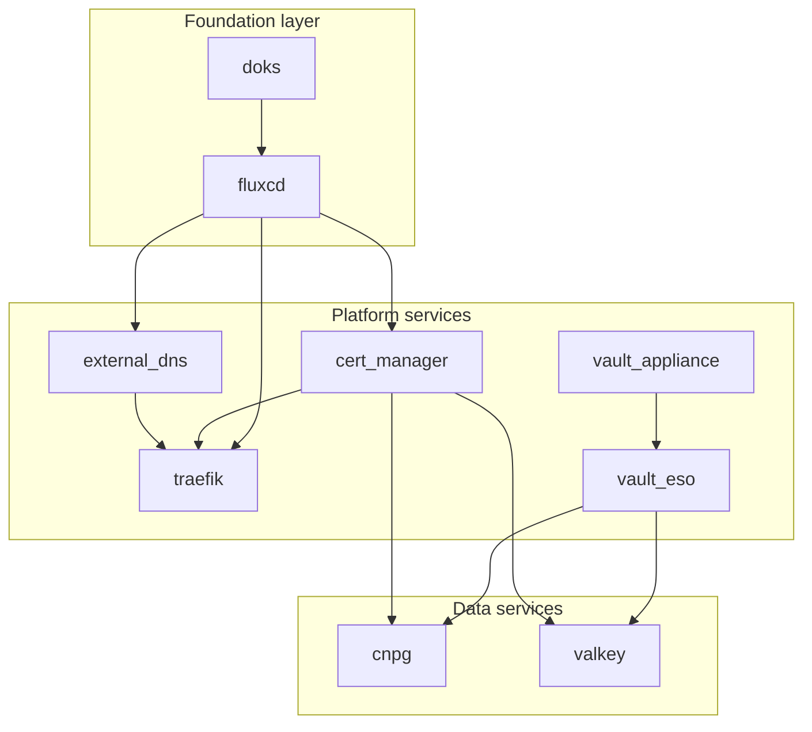

# OpenTofu module interoperability contract

This document defines how the OpenTofu modules in `infra/modules/` interconnect
through shared variables and outputs. It serves as a reference for the
`wildside-infra-k8s` action to thread DNS zones, certificate issuers, and
credential handles between modules.

## Module dependency graph

For screen readers: The following diagram shows module dependencies. Foundation
modules (doks, fluxcd) support platform services (external_dns, cert_manager,
traefik, vault_appliance, vault_eso), which in turn support data services
(cnpg, valkey).



## Render vs apply modes

All modules support two operational modes controlled by the `mode` variable:

### Render mode (default)

```hcl
mode = "render"
```

In render mode, modules do not communicate with a Kubernetes cluster. Instead,
they return a `rendered_manifests` output containing Flux-ready YAML keyed by
the intended GitOps path:

```hcl
output "rendered_manifests" {
  value = {
    "platform/cnpg/helmrelease.yaml"     = "..."
    "platform/cnpg/cluster.yaml"         = "..."
    "platform/cnpg/scheduled-backup.yaml" = "..."
  }
}
```

The `wildside-infra-k8s` action uses render mode to generate manifests that it
commits to the `wildside-infra` repository for FluxCD to reconcile.

### Apply mode

```hcl
mode = "apply"
```

In apply mode, modules create resources directly via the Kubernetes and Helm
providers. This requires a configured `kubeconfig` and is typically used for
local development, testing, or direct provisioning.

## Interoperability patterns

### Pattern 1: sync_policy_contract

Data service modules (`vault_eso`, `cnpg`, `valkey`) expose a
`sync_policy_contract` output that provides a stable interface for downstream
workloads. This structured object contains all information needed to consume
the service without coupling to internal implementation details.

**vault_eso contract:**

```hcl
{
  kv_secret_store = {
    name       = "vault-kv"
    kind       = "ClusterSecretStore"
    mount_path = "secret"
  }
  vault_address         = "https://vault.example.com"
  auth_secret_name      = "vault-approle-credentials"
  auth_secret_namespace = "external-secrets"
}
```

**cnpg contract:**

```hcl
{
  cluster = { name = "...", namespace = "..." }
  endpoints = {
    primary = { host = "...", port = 5432 }
    replica = { host = "...", port = 5432 }
  }
  database    = { name = "...", owner = "..." }
  credentials = {
    superuser_secret = { name = "...", namespace = "..." }
    app_secret       = { name = "...", namespace = "..." }
  }
  backup          = { enabled = true, destination_path = "...", schedule = "..." }
  postgis_enabled = true
}
```

**valkey contract:**

```hcl
{
  cluster   = { name = "...", namespace = "..." }
  endpoints = {
    primary = { host = "...", port = 6379 }
    replica = { host = "...", port = 6379 }
  }
  credentials = { secret_name = "...", secret_key = "...", namespace = "..." }
  tls         = { enabled = true, cert_issuer = "..." }
  persistence = { enabled = true, storage_class = "...", size = "..." }
  replication = { nodes = 1, replicas = 0 }
}
```

### Pattern 2: certificate issuer references

The `cert_manager` module outputs issuer references that other modules can use
to request TLS certificates:

```hcl
output "acme_staging_issuer_ref" {
  value = {
    name  = "letsencrypt-staging"
    kind  = "ClusterIssuer"
    group = "cert-manager.io"
  }
}

output "acme_production_issuer_ref" {
  value = {
    name  = "letsencrypt-production"
    kind  = "ClusterIssuer"
    group = "cert-manager.io"
  }
}

output "vault_issuer_ref" {
  value = {
    name  = "vault-issuer"
    kind  = "ClusterIssuer"
    group = "cert-manager.io"
  }
}
```

The `traefik` module also outputs its configured issuer:

```hcl
output "cluster_issuer_ref" {
  value = {
    name  = "letsencrypt-prod"
    kind  = "ClusterIssuer"
    group = "cert-manager.io"
  }
}
```

These references can be passed to data services for TLS configuration:

```hcl
module "valkey" {
  # ...
  tls_enabled      = true
  cert_issuer_name = module.cert_manager.acme_production_issuer_ref.name
}
```

### Pattern 3: DNS zone mapping

The `external_dns` module outputs managed zone information:

```hcl
output "managed_zones" {
  value = {
    "example.com" = "zone_id_abc123"
    "example.org" = "zone_id_def456"
  }
}

output "domain_filters" {
  value = ["example.com", "example.org"]
}
```

This enables downstream modules (like Traefik dashboard configuration) to
reference the managed domains.

### Pattern 4: secret store references

The `vault_eso` module outputs ClusterSecretStore references that other modules
use to create ExternalSecret resources:

```hcl
output "cluster_secret_store_kv_name" {
  value = "vault-kv"
}

output "cluster_secret_store_kv_ref" {
  value = {
    name = "vault-kv"
    kind = "ClusterSecretStore"
  }
}
```

Data service modules accept this reference to enable ESO-managed credentials:

```hcl
module "cnpg" {
  # ...
  eso_enabled                   = true
  eso_cluster_secret_store_name = module.vault_eso.cluster_secret_store_kv_name
  superuser_credentials_vault_path = "databases/cnpg/superuser"
}
```

## Module output threading examples

### Threading DNS zones to Traefik

```hcl
module "external_dns" {
  source = "./modules/external_dns"

  domain_filters = ["example.com"]
  zone_id_filter = {
    "example.com" = "abc123def456"
  }
}

module "traefik" {
  source = "./modules/traefik"

  # Use one of the managed domains for dashboard
  dashboard_hostname = "traefik.${keys(module.external_dns.managed_zones)[0]}"
}
```

### Threading issuers to data services

```hcl
module "cert_manager" {
  source = "./modules/cert_manager"

  acme_email = "platform@example.com"
}

module "valkey" {
  source = "./modules/valkey"

  tls_enabled      = true
  cert_issuer_name = module.cert_manager.acme_production_issuer_name
  cert_issuer_type = "ClusterIssuer"
}
```

### Threading Vault ESO to workloads

```hcl
module "vault_eso" {
  source = "./modules/vault_eso"

  vault_address       = "https://vault.example.com"
  vault_ca_bundle_pem = file("vault-ca.pem")
  approle_role_id     = var.approle_role_id
  approle_secret_id   = var.approle_secret_id
}

module "cnpg" {
  source = "./modules/cnpg"

  eso_enabled                   = true
  eso_cluster_secret_store_name = module.vault_eso.cluster_secret_store_kv_name

  superuser_credentials_vault_path = "databases/cnpg/superuser"
  app_credentials_vault_path       = "databases/cnpg/app"
}

module "valkey" {
  source = "./modules/valkey"

  eso_enabled                   = true
  eso_cluster_secret_store_name = module.vault_eso.cluster_secret_store_kv_name

  password_vault_path = "databases/valkey/password"
}
```

## Module reference summary

| Module | Key outputs | Consumed by |
|--------|-------------|-------------|
| `doks` | `cluster_id`, `endpoint`, `kubeconfig` | `fluxcd` |
| `fluxcd` | `namespace`, `source_controller_ready` | Platform services |
| `external_dns` | `managed_zones`, `domain_filters` | `traefik` |
| `cert_manager` | `*_issuer_ref`, `*_issuer_name` | `traefik`, `cnpg`, `valkey` |
| `traefik` | `cluster_issuer_ref`, `ingress_class_name` | Applications |
| `vault_appliance` | `vault_address`, `ca_bundle_pem` | `vault_eso` |
| `vault_eso` | `sync_policy_contract`, `cluster_secret_store_kv_*` | `cnpg`, `valkey`, applications |
| `cnpg` | `sync_policy_contract`, `*_endpoint` | Applications |
| `valkey` | `sync_policy_contract`, `*_endpoint` | Applications |

## Testing interoperability

Module tests verify interoperability through:

1. **Validation tests**: Ensure inputs accept expected output formats from
   upstream modules.

2. **Render tests**: Verify rendered manifests reference expected resources
   (secret names, issuer names, etc.).

3. **Documentation accuracy tests**: Verify README inputs/outputs match actual
   HCL definitions (`readme_accuracy_test.go`).

4. **Open Policy Agent (OPA)/Conftest policy tests**: Validate rendered
   manifests against security and configuration policies.

Run module tests with:

```bash
make cnpg-test
make valkey-test
make vault-eso-test
```
