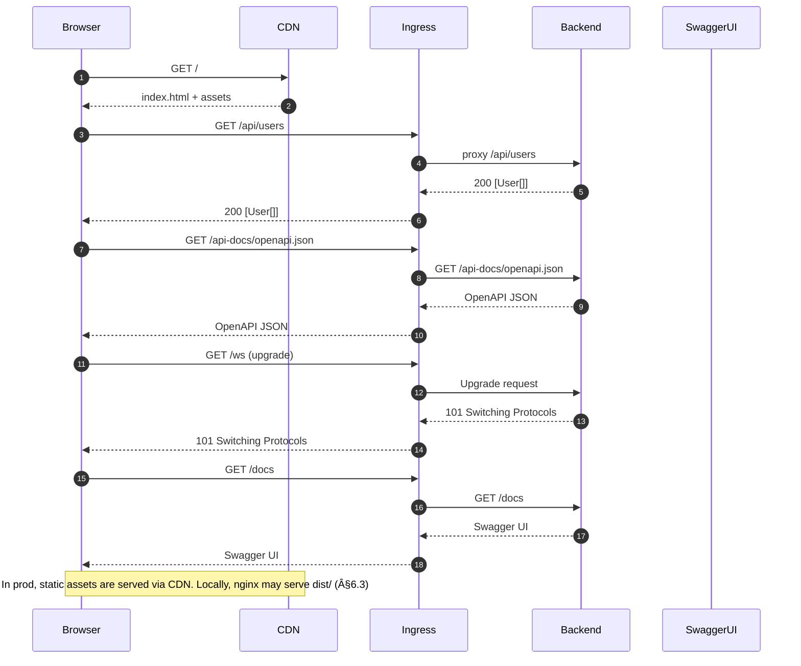
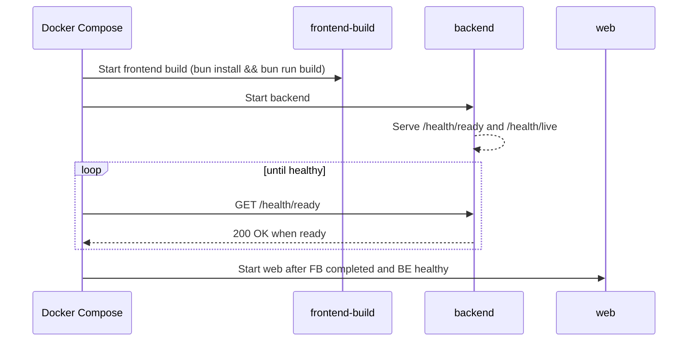
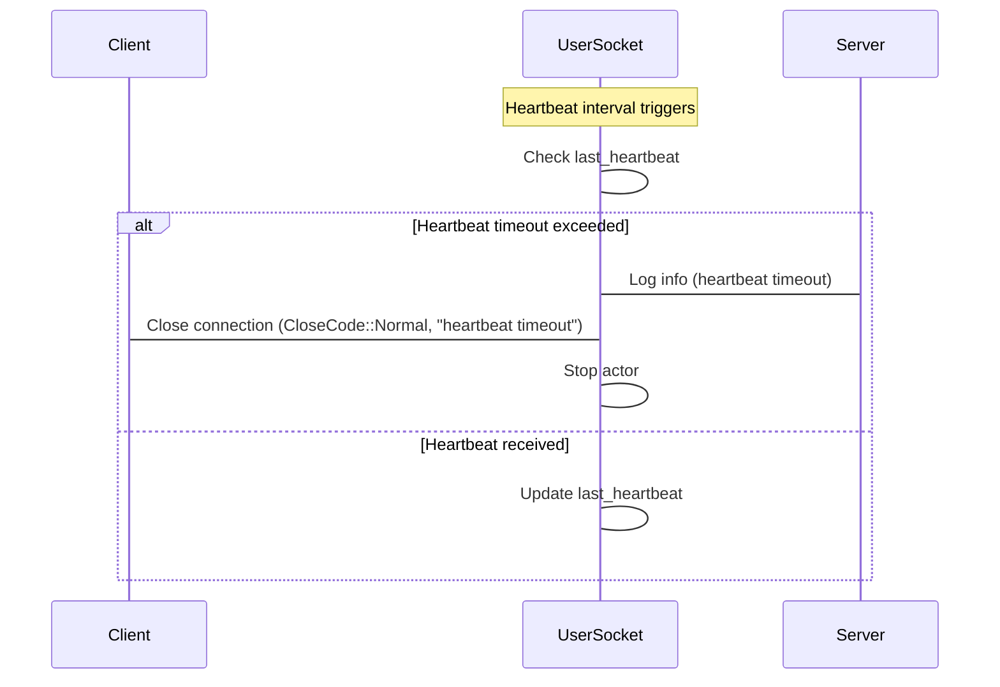

# Repository Design Guide

A practical design for a web application with a Rust/Actix backend and a React \+
Tailwind/daisyUI PWA frontend. The repo supports:

- Tailwind/daisyUI PWA frontend. The repo supports:

- Rust→OpenAPI→TypeScript client generation via **utoipa** + **orval**.
- Actix WebSocket/events→**AsyncAPI** for docs and (optional) client stubs.
- **Design tokens** as a first‑class package powering Tailwind/daisyUI and
  future native shells.
- Docker‑friendly builds (musl where sensible) targeting Kubernetes on DOKS,
  with static assets served from object storage/CDN.
- Bun as the JS runtime/package manager.

A typical request flow is illustrated below:



---

## 1) Monorepo Layout

```text
myapp/
├─ backend/                           # Rust (Actix)
│  ├─ src/
│  │  ├─ main.rs                      # app bootstrap, wiring
│  │  ├─ api/                         # HTTP handlers (REST)
│  │  ├─ ws/                          # WebSocket handlers (events)
│  │  ├─ domain/                      # business rules (no IO)
│  │  ├─ infra/                       # database, caches, adapters
│  │  └─ models/                      # serde types used across layers
│  ├─ build.rs                        # (optional) write OpenAPI on build
│  ├─ Cargo.toml
│  └─ tests/                          # integration tests
│
├─ frontend-pwa/                      # React + Tailwind + daisyUI (Vite)
│  ├─ public/                         # manifest.json, icons, SW shell
│  ├─ src/
│  │  ├─ app/                         # routing, layouts
│  │  ├─ components/                  # daisyUI components
│  │  ├─ features/                    # screens + data hooks
│  │  ├─ api/                         # generated client + fetcher
│  │  ├─ styles/                      # Tailwind layers
│  │  └─ lib/                         # utilities (form, date, etc.)
│  ├─ vite.config.ts
│  ├─ tailwind.config.cjs
│  ├─ orval.config.yaml               # OpenAPI→TS client
│  └─ package.json
│
├─ packages/
│  ├─ tokens/                         # design tokens (source-of-truth)
│  │  ├─ src/tokens.json
│  │  ├─ src/themes/light.json
│  │  ├─ src/themes/dark.json
│  │  └─ build/style-dictionary.js    # emits CSS vars + TW preset + daisy theme
│  ├─ types/                          # optional: shared TS helpers
│  │  └─ src/index.ts
│  └─ utils/                          # shared JS/TS utilities
│
├─ spec/                              # generated & authored API specs
│  ├─ openapi.json                    # generated by backend/CI
│  └─ asyncapi.yaml                   # authored or generated
│
├─ deploy/
│  ├─ docker/                         # Dockerfiles
│  │  ├─ backend.Dockerfile
│  │  └─ frontend.Dockerfile
│  ├─ k8s/                            # manifests and kustomizations
│  │  ├─ backend/                     # Deployment, Service, ConfigMap and Secret generators, PDB, configurable patches
│  │  ├─ ingress/                     # Ingress and cert-manager manifests with namespace/label kustomization
│  │  │  ├─ api.yaml
│  │  │  ├─ certificate.yaml
│  │  │  ├─ cluster-issuer.yaml
│  │  │  └─ kustomization.yaml
│  │  └─ jobs/                        # migrations, one-off tasks
│  └─ scripts/                        # CI/deploy helpers
│
├─ .github/workflows/                 # CI pipelines (lint, build, test, push images)
├─ Makefile                           # local DX (optional, see §6)
├─ package.json                       # bun workspaces + root scripts
└─ README.md
```

---

## 2) Contracts & Code Generation Hand‑offs

### 2.1 Rust/Actix → OpenAPI → TypeScript Client (orval)

- Use **utoipa** and **utoipa-actix-web** to annotate handlers and derive
  schemas from serde models.
- Expose the OpenAPI document at runtime (e.g., `/api-docs/openapi.json`)
  and/or emit a static `spec/openapi.json` via `build.rs` or a small bin.
- Frontend runs **orval** under bun to generate a fetch client and types that
  align with the backend.

**Backend (sketch):**

- `models/` contains structs with
  `#[derive(Serialize, Deserialize, utoipa::ToSchema)]`.
- `api/` handlers carry `#[utoipa::path(...)]` per route.
- `main.rs` derives `#[derive(utoipa::OpenApi)]` and mounts Swagger UI for DX.

**Frontend (sketch):**

- `frontend-pwa/orval.config.yaml` points to `../spec/openapi.json` (or the dev
  URL).
- `bunx orval` writes `src/api/client.ts` with typed functions.
- A small `src/api/fetcher.ts` centralizes base URL, auth, and error handling.
- TanStack Query hooks (handwritten or template‑generated) wrap the client for
  caching and retries.

**Flow:**

```text
Rust types + handlers  →  OpenAPI (utoipa)  →  orval  →  Typed TS client  →  React + TanStack Query
```

### 2.2 Actix WebSocket/Events → AsyncAPI → Consumers

- For evented channels (WS/SSE/Kafka/etc.), describe contracts in **AsyncAPI**.
- Author `spec/asyncapi.yaml` by hand **or** construct it programmatically
  (e.g., using an AsyncAPI crate) and emit YAML/JSON.
- Use the AsyncAPI Generator in CI to produce:
  - Human‑readable HTML docs for events.
  - Optional client/server stubs (WebSocket helpers) as a starting point.

**Flow:**

```text
Rust event payloads (serde + schemars)  →  AsyncAPI (YAML)  →  Docs & stubs  →  Frontend WS client + TanStack Query/SWR
```

> Tip: Reuse the same serde structs for both OpenAPI bodies and AsyncAPI
> message payloads; derive JSON Schema via `schemars` if you want runtime
> validation or to feed generator pipelines.

---

## 3) Design Tokens as a First‑Class Package

**Goals:** single source of truth for colours/spacing/typography/radii; drive
Tailwind/daisyUI and any future native shells.

- `packages/tokens/src/tokens.json`: global primitives (`color.*`, `space.*`,
  `radius.*`, `font.*`).
- `packages/tokens/src/themes/{light,dark}.json`: semantic overrides
  (`semantic.bg.default`, `semantic.fg.default`, `semantic.brand.*`).
- `packages/tokens/build/style-dictionary.js`: exports
  - `dist/css/variables.css` (CSS variables for runtime theming),
  - `dist/tw/preset.cjs` (Tailwind preset mapping spacing/radius/colours),
  - `dist/daisy/theme.cjs` (daisyUI theme object from semantic tokens),
  - optional JS/TS token bundle for RN/NativeWind down the road.
- `packages/tokens/build/validate-contrast.js`: checks theme colours meet
  the `contrastThreshold` (override via `CONTRAST_THRESHOLD` env or
  `packages/tokens/package.json`). Uses the `color` library for WCAG
  contrast.

**Frontend consumption:**

- Tailwind `presets: [require('@app/tokens/dist/tw/preset.cjs')]`.
- daisyUI `daisyui: require('@app/tokens/dist/daisy/theme.cjs')`.
- Import CSS vars once in `main.tsx`.

This keeps the visual system consistent across PWA, desktop (Tauri), and mobile
(Capacitor) shells.

---

## 4) Environment Strategy & Ports/Adapters

- Keep domain logic in `backend/src/domain` (no IO). Define **ports** for
  storage, cache, queues, email, etc., with **adapters** in `infra/`.
- Mirror that concept in the frontend: create thin adapters around fetch (REST)
  and WS (events) so tests can stub them.
- Use `.env` + `env_file` in Docker Compose for local dev and
  ConfigMaps/Secrets in K8s.

---

## 5) Bun‑first Workspace Plumbing

**Root** `package.json` sets bun workspaces and unifies scripts:

```jsonc
{
  "name": "myapp",
  "private": true,
  "workspaces": ["frontend-pwa", "packages/*"],
  "packageManager": "bun@1.1.x",
  "scripts": {
    "dev": "bun run -m 'dev:*'",
    "dev:tokens": "bun --cwd packages/tokens build",
    "dev:pwa": "bun --cwd frontend-pwa dev",
    "gen:openapi": "bunx orval --config frontend-pwa/orval.config.yaml",
    "build": "bun run build:tokens && bun run build:pwa",
    "build:tokens": "bun --cwd packages/tokens build",
    "build:pwa": "bun --cwd frontend-pwa build"
  }
}
```

---

## 6) Docker‑Friendly Build System

### 6.1 Backend (Rust/Actix) — multi‑stage, static (musl) where possible

See [`deploy/docker/backend.Dockerfile`](../deploy/docker/backend.Dockerfile) for
the canonical image build. Key points:

- Dependencies are cached before sources are copied to maximise layer reuse.
- Alpine packages and OpenSSL are version‑pinned for reproducible builds.
- The `HEALTHCHECK_PORT` and `HEALTHCHECK_PATH` build args allow the liveness
  probe to be tailored without editing the file.

> If any dependency prevents musl, switch the target to gnu and use
> `gcr.io/distroless/cc:nonroot` as base; copy any needed CA certs.

### 6.2 Frontend (Vite + Bun) — build once, serve via nginx

The frontend Dockerfile lives at
[`deploy/docker/frontend.Dockerfile`](../deploy/docker/frontend.Dockerfile).
It installs workspace dependencies before copying sources so that builds
benefit from layer caching. The final stage uses `nginx:alpine` to serve the
compiled `dist/` directory.

- Version pins for Bun, Nginx, and Alpine are exposed via `BUN_VERSION`,
  `NGINX_VERSION`, and `ALPINE_VERSION` build arguments.
- Health checks can be tailored using `HEALTHCHECK_PORT`, `HEALTHCHECK_PATH`,
  `HEALTHCHECK_INTERVAL`, `HEALTHCHECK_TIMEOUT`, and `HEALTHCHECK_RETRIES`.

- In CI, extract `/usr/share/nginx/html` and upload to **DOKS Spaces** (object
  storage) behind a CDN.
- The backend serves only the API; static assets come from CDN or the Nginx
  runtime image.
- For local dev, you can still run `vite dev` for HMR.

### 6.3 Docker Compose for Local Dev

```yaml
version: "3.9"
services:
  backend:
    build:
      context: ..
      dockerfile: deploy/docker/backend.Dockerfile
    ports: ["8080:8080"]
    env_file: [".env.local"]
    # volumes for live-reload if using cargo-watch dev image

  # Optional: nginx to serve built frontend locally
  web:
    image: nginx:1.27-alpine
    volumes:
      - ./frontend-pwa/dist:/usr/share/nginx/html:ro
      - ./deploy/nginx/default.conf:/etc/nginx/conf.d/default.conf:ro
    ports: ["3000:80"]
    depends_on: [backend]
```

> For an even faster local loop, run `cargo watch -x run` natively and
> `bun dev` for the PWA; keep Docker for parity and CI.

---

## 7) Kubernetes (DOKS) Deployment Strategy

**Principles:**

- Backend pods are stateless; DB/cache live in managed services (e.g.,
  PostgreSQL, Redis). Migrations run via Job.
- Frontend assets are immutable in Spaces + CDN; deploys are object‑store
  uploads (no pod just to serve files).
- Ingress terminates TLS; backend exposed via HTTP (or gRPC) behind a single
  hostname.

### 7.1 Static Assets on DOKS Spaces

1. CI uploads `frontend-pwa/dist/` to `spaces://my-bucket/app/<git-sha>/` and
   updates a `latest` object (or versioned index).
2. CDN is configured on the bucket; cache‑control headers set during upload
   (`immutable`, long max‑age) with a short TTL for `index.html`.

**Upload script (pseudo):** `deploy/scripts/push_static.sh`

```bash
#!/usr/bin/env bash
set -euo pipefail
DIST=frontend-pwa/dist
PREFIX=${ASSETS_PREFIX:-app/$(git rev-parse --short HEAD)}
# set cache headers; tool could be doctl, rclone, or s3cmd
rclone copy "$DIST" spaces:my-bucket/$PREFIX --s3-acl public-read \
  --metadata Cache-Control:max-age=31536000,immutable
# Update the release alias (optional):
# rclone sync "$DIST" spaces:my-bucket/app/latest --s3-acl public-read \
#   --metadata Cache-Control:no-cache
```

### 7.2 Backend on K8s

**Key objects:** Deployment, Service, ConfigMap generator (non‑secret settings), Secret generator
(tokens/DB urls), HPA, PodDisruptionBudget, NetworkPolicy.

**Deployment (sketch):**

```yaml
apiVersion: apps/v1
kind: Deployment
metadata:
  name: myapp-backend
spec:
  replicas: 3
  selector: { matchLabels: { app: myapp-backend } }
  template:
    metadata: { labels: { app: myapp-backend } }
    spec:
      containers:
      - name: app
        image: ghcr.io/acme/myapp-backend:{{ .Values.imageTag }}
        ports: [{ containerPort: 8080 }]
        envFrom:
          - configMapRef: { name: myapp-config }
          - secretRef: { name: myapp-secrets }
        readinessProbe:
          httpGet: { path: /health/ready, port: 8080 }
        livenessProbe:
          httpGet: { path: /health/live,  port: 8080 }
        resources:
          requests: { cpu: "100m", memory: "128Mi" }
          limits:   { cpu: "1",    memory: "512Mi" }
---
apiVersion: v1
kind: Service
metadata: { name: myapp-backend }
spec:
  selector: { app: myapp-backend }
  ports: [{ port: 80, targetPort: 8080 }]
```

**Ingress** points `/api/*` at the Service. The frontend public hostname points
to the CDN; only `/api` goes to cluster.

**Optional:** use a **Helm chart** or **Kustomize** overlays per environment
(dev/stage/prod) and FluxCD/ArgoCD for GitOps.

### 7.3 CI/CD Outline

1. **Lint & test**: cargo fmt/clippy/test; bun lint/type‑check/unit tests.
2. **Build artifacts**:
   - Build backend image → push to registry.
   - Build frontend dist → upload to Spaces.
   - Emit `spec/openapi.json` and publish as build artifact; run `orval` in a
     “types up‑to‑date” check.
   - (Optional) Generate AsyncAPI HTML docs and publish to an internal docs
     bucket.
3. **Deploy**:
   - Update Helm values with new image tag; commit to a GitOps repo watched by
     FluxCD.
   - Invalidate CDN (only for `index.html`), or rely on cache busting for
     hashed assets.

---

## 8) Local DX (Makefile targets)

```makefile
.PHONY: dev be fe gen openapi asyncapi docker-up docker-down

be:
    cargo run --manifest-path backend/Cargo.toml

fe:
    cd frontend-pwa && bun dev

dev:
    # run both (use tmux or just two terminals)

openapi:
    # write openapi.json to spec/
    cargo run --manifest-path backend/Cargo.toml --bin openapi-dump > spec/openapi.json

gen:
    bunx orval --config frontend-pwa/orval.config.yaml

asyncapi:
    bunx @asyncapi/generator spec/asyncapi.yaml @asyncapi/html-template -o docs/asyncapi

docker-up:
    cd deploy && docker compose up --build -d

docker-down:
        cd deploy && docker compose down
```

### Docker Compose startup sequence



---

## 9) Observability & Operations Hooks

- **Health endpoints**: `/health/live` and `/health/ready` in backend for
   probes.
- **Structured logs** (JSON) with request IDs; propagate over WS too.
- **Prometheus** metrics (expose `/metrics`) and scrape via ServiceMonitor.
- **Feature flags**: sealed behind env/config; surfaced in OpenAPI as headers
   where relevant.

### WebSocket heartbeat sequence



---

## 10) Security & Hardening Notes

- Minimal base images (distroless). Non‑root user.
- SBOMs for backend images (e.g., `syft`); sign images (cosign) and verify in
   cluster (policy‑controller/Kyverno).
- CORS: restrict to CDN/public hostnames. Set HSTS and sensible CSP on static.
- Secrets: mount via K8s Secrets (consider external secret operator for DO
   Secrets Manager).

---

## 11) Summary of Hand‑offs

- **HTTP:** Actix + utoipa → `spec/openapi.json` → orval → typed TS client →
   React + TanStack.
- **Events:** Actix WS (or Kafka, etc.) → `spec/asyncapi.yaml` → generator → WS
   clients/docs.
- **Design:** Tokens JSON → Style Dictionary → CSS vars + Tailwind preset +
   daisyUI theme.
- **Build/Deploy:** Docker multi‑stage (musl where possible) → K8s Deployment →
  CDN‑hosted static from DOKS Spaces; Ingress routes `/api` into cluster.
This structure keeps contracts central, isolates platform concerns, and allows
painless evolution from PWA to native shells without a rewrite.
