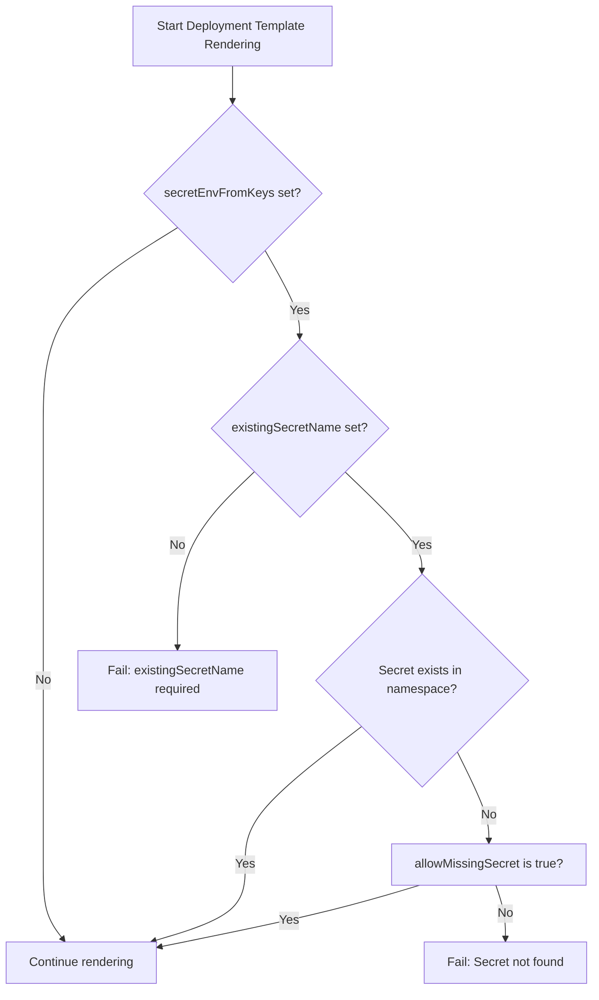
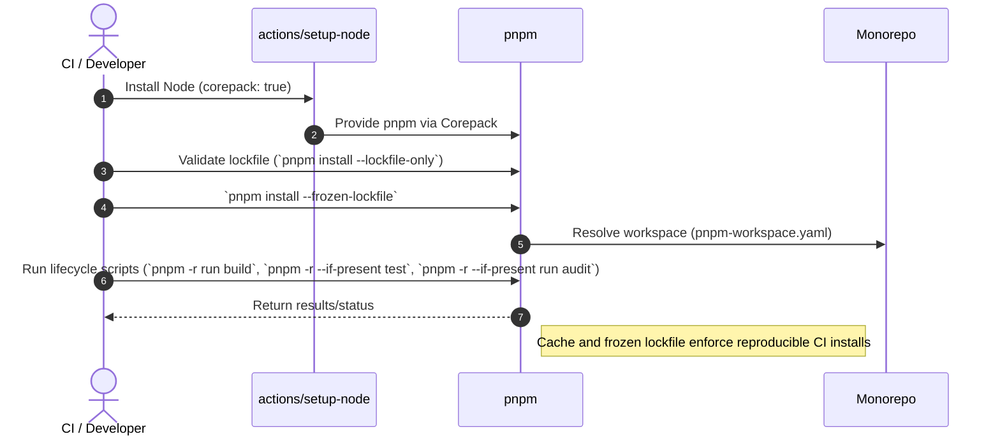
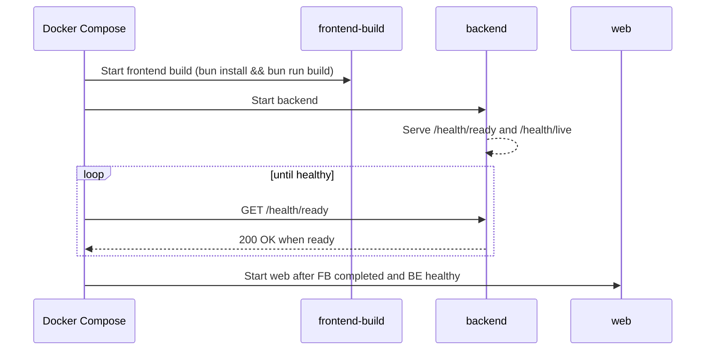
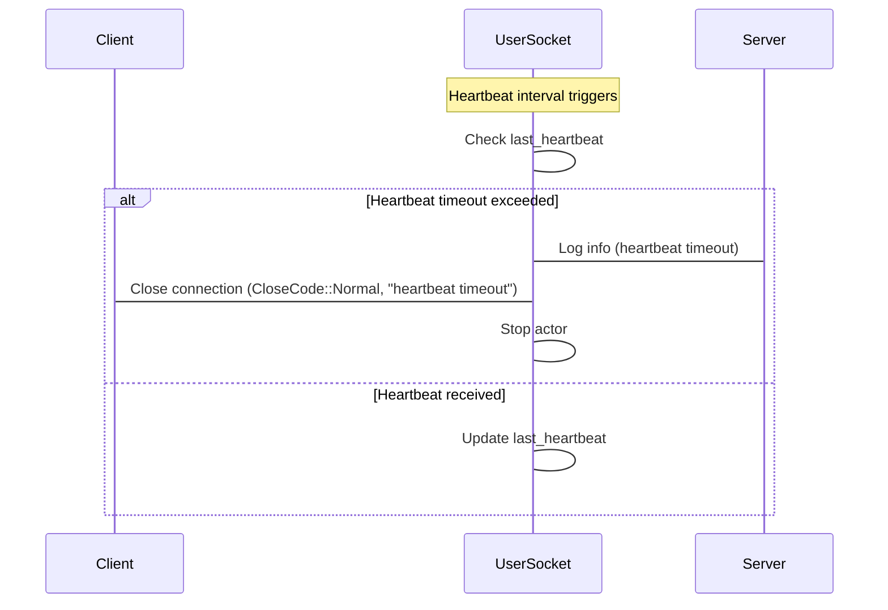

# Repository Design Guide

A practical design for a Rust/Actix backend and a React plus Tailwind/daisyUI
PWA frontend. It supports:

- Rust→OpenAPI→TypeScript client generation via **utoipa** + **orval**.
- Actix WebSocket/events→**AsyncAPI** for docs and (optional) client stubs.
- **Design tokens** as a first‑class package powering Tailwind/daisyUI and
  future native shells.
- Docker‑friendly builds (musl where sensible) targeting Kubernetes on DOKS,
  with static assets served from object storage/CDN.
- Bun as the JS runtime; pnpm as the package manager.

A typical request flow is illustrated below:


______________________________________________________________________

## 1) Monorepo Layout

```text
myapp/
├─ backend/                           # Rust (Actix)
│  ├─ src/
│  │  ├─ main.rs                      # app bootstrap, wiring
│  │  ├─ api/                         # HTTP handlers (REST)
│  │  ├─ ws/                          # WebSocket handlers (events)
│  │  ├─ domain/                      # business rules (no IO)
│  │  ├─ infra/                       # database, caches, adapters
│  │  └─ models/                      # serde types used across layers
│  ├─ build.rs                        # (optional) write OpenAPI on build
│  ├─ Cargo.toml
│  └─ tests/                          # integration tests
│
├─ frontend-pwa/                      # React + Tailwind + daisyUI (Vite)
│  ├─ public/                         # manifest.json, icons, SW shell
│  ├─ src/
│  │  ├─ app/                         # routing, layouts
│  │  ├─ components/                  # daisyUI components
│  │  ├─ features/                    # screens + data hooks
│  │  ├─ api/                         # generated client + fetcher
│  │  ├─ styles/                      # Tailwind layers
│  │  └─ lib/                         # utilities (form, date, etc.)
│  ├─ vite.config.ts
│  ├─ tailwind.config.cjs
│  ├─ orval.config.yaml               # OpenAPI→TS client
│  └─ package.json
│
├─ packages/
│  ├─ tokens/                         # design tokens (source-of-truth)
│  │  ├─ src/tokens.json
│  │  ├─ src/themes/light.json
│  │  ├─ src/themes/dark.json
│  │  └─ build/style-dictionary.js    # emits CSS vars + TW preset + daisy theme
│  ├─ types/                          # optional: shared TS helpers
│  │  └─ src/index.ts
│  └─ utils/                          # shared JS/TS utilities
│
├─ spec/                              # generated & authored API specs
│  ├─ openapi.json                    # generated by backend/CI
│  └─ asyncapi.yaml                   # authored or generated
│
├─ security/                          # dependency audit allowlist
│  ├─ audit-exceptions.json           # time-bound audit exceptions
│  └─ audit-exceptions.schema.json    # JSON Schema for the allowlist
│
├─ deploy/
│  ├─ docker/                         # Dockerfiles
│  │  ├─ backend.Dockerfile
│  │  └─ frontend.Dockerfile
│  ├─ charts/                         # Helm charts for the application
│  │  └─ wildside/                    # reusable chart with templates and values
│  ├─ k8s/                            # HelmReleases and Kustomize overlays
│  │  ├─ base/                        # base HelmRelease
│  │  │  ├─ helmrelease.yaml
│  │  │  └─ kustomization.yaml
│  │  └─ overlays/
│  │     └─ production/               # production overrides
│  │        ├─ patch-helmrelease-values.yaml
│  │        └─ kustomization.yaml
│  ├─ ingress/                        # cert-manager only; app Ingress is templated in the Helm chart
│  │  ├─ certificate.yaml
│  │  ├─ cluster-issuer.yaml
│  │  └─ kustomization.yaml
│  └─ scripts/                        # CI/deploy helpers
│
├─ .github/workflows/                 # CI pipelines + manual DOKS deploy
├─ Makefile                           # local DX (optional, see Section 6)
├─ package.json                       # bun workspaces + root scripts
└─ README.md
```

### Helm chart values structure

The Helm chart values file (`values.yaml`) is organised in the following
hierarchy. See [values-class-diagram.mmd](values-class-diagram.mmd) for a
visual overview. Validation via
[`values.schema.json`](../deploy/charts/wildside/values.schema.json) enforces
cross-field rules (for example, requiring `existingSecretName` when
`secretEnvFromKeys` is set).

> The chart converts keys under `.Values.config` into environment
> variables (see the env block in
> [`deploy/charts/wildside/templates/deployment.yaml`](../deploy/charts/wildside/templates/deployment.yaml)).
> Setting `APP_ENV` in `config` exposes it to the container.
>
> Apply pod-wide security defaults with `podSecurityContext`
> (for example, enabling `seccompProfile` and setting `fsGroup`).
> Container-specific controls remain under `securityContext`.

#### Deployment secret resolution flow

The deployment template uses the following logic to resolve secrets:



______________________________________________________________________

## 2) Contracts & Code Generation Hand‑offs

### 2.1 Rust/Actix → OpenAPI → TypeScript Client (orval)

- Use **utoipa** and **utoipa-actix-web** to annotate handlers and derive
  schemas from serde models.
- Expose the OpenAPI document at runtime (e.g., `/api-docs/openapi.json`)
  and/or emit a static `spec/openapi.json` via `build.rs` or a small bin.
- Frontend runs **orval** under bun to generate a fetch client and types that
  align with the backend.

**Backend (sketch):**

- `models/` contains structs with
  `#[derive(Serialize, Deserialize, utoipa::ToSchema)]`.
- `api/` handlers carry `#[utoipa::path(...)]` per route.
- `main.rs` derives `#[derive(utoipa::OpenApi)]` and mounts Swagger UI for DX.

**Frontend (sketch):**

- `frontend-pwa/orval.config.yaml` points to `../spec/openapi.json` (or the dev
  URL).
- `bunx orval` writes `src/api/client.ts` with typed functions.
- A small `src/api/fetcher.ts` centralizes base URL, auth, and error handling.
- TanStack Query hooks (handwritten or template‑generated) wrap the client for
  caching and retries.

**Flow:**

```text
Rust types + handlers  →  OpenAPI (utoipa)  →  orval  →  Typed TS client  →  React + TanStack Query
```

### 2.2 Actix WebSocket/Events → AsyncAPI → Consumers

- For evented channels (WS/SSE/Kafka/etc.), describe contracts in **AsyncAPI**.
- Author `spec/asyncapi.yaml` by hand **or** construct it programmatically
  (e.g., using an AsyncAPI crate) and emit YAML/JSON.
- Use the AsyncAPI Generator in CI to produce:
  - Human‑readable HTML docs for events.
  - Optional client/server stubs (WebSocket helpers) as a starting point.

**Flow:**

```text
Rust event payloads (serde + schemars)
  → AsyncAPI (YAML)
  → Docs & stubs
  → Frontend WS client + TanStack Query/SWR
```

> Tip: Reuse the same serde structs for both OpenAPI bodies and AsyncAPI
> message payloads; derive JSON Schema via `schemars` if you want runtime
> validation or to feed generator pipelines.

______________________________________________________________________

## 3) Design Tokens as a First‑Class Package

**Goals:** single source of truth for colours/spacing/typography/radii; drive
Tailwind/daisyUI and any future native shells.

- `packages/tokens/src/tokens.json`: global primitives (`color.*`, `space.*`,
  `radius.*`, `font.*`).
- `packages/tokens/src/themes/{light,dark}.json`: semantic overrides
  (`semantic.bg.default`, `semantic.fg.default`, `semantic.brand.*`).
- `packages/tokens/build/style-dictionary.js`: exports
  - `dist/css/variables.css` (CSS variables for runtime theming),
  - `dist/tw/preset.cjs` (Tailwind preset mapping spacing/radius/colours),
  - `dist/daisy/theme.cjs` (daisyUI theme object from semantic tokens),
  - optional JS/TS token bundle for RN/NativeWind down the road.
- `packages/tokens/build/validate-contrast.js`: checks theme colours meet
  the `contrastThreshold` (override via `CONTRAST_THRESHOLD` env or
  `packages/tokens/package.json`). Uses the `color` library for WCAG contrast.

**Frontend consumption:**

- Tailwind `presets: [require('@app/tokens/dist/tw/preset.cjs')]`.
- daisyUI `daisyui: require('@app/tokens/dist/daisy/theme.cjs')`.
- Import CSS vars once in `main.tsx`.

This keeps the visual system consistent across PWA, desktop (Tauri), and mobile
(Capacitor) shells.

______________________________________________________________________

## 4) Environment Strategy & Ports/Adapters

- Keep domain logic in `backend/src/domain` (no IO). Define **ports** for
  storage, cache, queues, email, etc., with **adapters** in `infra/`.
- Mirror that concept in the frontend: create thin adapters around fetch (REST)
  and WS (events) so tests can stub them.
- Use `.env` + `env_file` in Docker Compose for local dev and
  ConfigMaps/Secrets in K8s.

______________________________________________________________________

## 5) Bun‑first Workspace Plumbing

**Root** `package.json` sets bun workspaces and unifies scripts:

```jsonc
{
  "name": "myapp",
  "private": true,
  "workspaces": ["frontend-pwa", "packages/*"],
  "packageManager": "bun@1.1.x",
  "scripts": {
    "dev": "bun run -m 'dev:*'",
    "dev:tokens": "bun --cwd packages/tokens build",
    "dev:pwa": "bun --cwd frontend-pwa dev",
    "gen:openapi": "bunx orval --config frontend-pwa/orval.config.yaml",
    "build": "bun run build:tokens && bun run build:pwa",
    "build:tokens": "bun --cwd packages/tokens build",
    "build:pwa": "bun --cwd frontend-pwa build"
  }
}
```

______________________________________________________________________

## 6) Docker‑Friendly Build System

### 6.1 Backend (Rust/Actix) — multi‑stage, static (musl) where possible

See [`deploy/docker/backend.Dockerfile`](../deploy/docker/backend.Dockerfile)
for the canonical image build. Key points:

- Dependencies are cached before sources are copied to maximize layer reuse.
- Alpine packages and OpenSSL are version‑pinned for reproducible builds.
- The `HEALTHCHECK_PORT` and `HEALTHCHECK_PATH` build args allow the liveness
  probe to be tailored without editing the file.

> If any dependency prevents musl, switch the target to gnu and use
> `gcr.io/distroless/cc:nonroot` as base; copy any needed CA certs.

### 6.2 Frontend (Vite + Bun) — build once, serve via nginx

The frontend Dockerfile lives at
[`deploy/docker/frontend.Dockerfile`](../deploy/docker/frontend.Dockerfile). It
installs workspace dependencies before copying sources so that builds benefit
from layer caching. The final stage uses `nginx:alpine` to serve the compiled
`dist/` directory.

- Version pins for Bun, Nginx, and Alpine are exposed via `BUN_VERSION`,
  `NGINX_VERSION`, and `ALPINE_VERSION` build arguments.

- Health checks can be tailored using `HEALTHCHECK_PORT`, `HEALTHCHECK_PATH`,
  `HEALTHCHECK_INTERVAL`, `HEALTHCHECK_TIMEOUT`, and `HEALTHCHECK_RETRIES`.

- In CI, extract `/usr/share/nginx/html` and upload to **DOKS Spaces** (object
  storage) behind a CDN.

- The backend serves only the API; static assets come from CDN or the Nginx
  runtime image.

- For local development, running `vite dev` remains possible for HMR.

### 6.3 Docker Compose for Local Dev

```yaml
version: "3.9"
services:
  backend:
    build:
      context: ..
      dockerfile: deploy/docker/backend.Dockerfile
    ports: ["8080:8080"]
    env_file: [".env.local"]
    # volumes for live-reload if using cargo-watch dev image

  # Optional: nginx to serve built frontend locally
  web:
    image: nginx:1.27-alpine
    volumes:
      - ./frontend-pwa/dist:/usr/share/nginx/html:ro
      - ./deploy/nginx/default.conf:/etc/nginx/conf.d/default.conf:ro
    ports: ["3000:80"]
    depends_on: [backend]
```

> For an even faster local loop, run `cargo watch -x run` natively and
> `bun dev` for the PWA; keep Docker for parity and CI.

______________________________________________________________________

## 7) Kubernetes (DOKS) Deployment Strategy

**Principles:**

- Backend pods are stateless; DB/cache live in managed services (e.g.,
  PostgreSQL, Redis). Migrations run via Job.
- Frontend assets are immutable in Spaces + CDN; deploys are object‑store
  uploads (no pod just to serve files).
- Ingress terminates TLS; backend exposed via HTTP (or gRPC) behind a single
  hostname.

### 7.1 Static Assets on DOKS Spaces

1. CI uploads `frontend-pwa/dist/` to `spaces://my-bucket/app/<git-sha>/` and
   updates a `latest` object (or versioned index).
2. CDN is configured on the bucket; cache‑control headers set during upload
   (`immutable`, long max‑age) with a short TTL for `index.html`.

**Upload script (pseudo):** `deploy/scripts/push_static.sh`

```bash
#!/usr/bin/env bash
set -euo pipefail
DIST=frontend-pwa/dist
PREFIX=${ASSETS_PREFIX:-app/$(git rev-parse --short HEAD)}
# set cache headers; tool could be doctl, rclone, or s3cmd
rclone copy "$DIST" spaces:my-bucket/$PREFIX --s3-acl public-read \
  --metadata Cache-Control:max-age=31536000,immutable
# Update the release alias (optional):
# rclone sync "$DIST" spaces:my-bucket/app/latest --s3-acl public-read \
#   --metadata Cache-Control:no-cache
```

### 7.2 Backend on K8s

**Key objects:** Deployment, Service, ConfigMap (non‑secret settings), existing
Secret (tokens/DB URLs), HPA, PodDisruptionBudget (rendered only when
`pdb.enabled` is true and `replicaCount` exceeds 1).

**Deployment (sketch):**

```yaml
apiVersion: apps/v1
kind: Deployment
metadata:
  name: {{ include "wildside.fullname" . }}
spec:
  replicas: 3
  selector: { matchLabels: { app: {{ include "wildside.name" . }} } }
  template:
    metadata: { labels: { app: {{ include "wildside.name" . }} } }
    spec:
      containers:
      - name: app
        image: {{ .Values.image.repository }}:{{ .Values.image.tag | default .Chart.AppVersion }}
        ports: [{ name: http, containerPort: 8080 }]
        env:
          - name: APP_ENV
            valueFrom:
              configMapKeyRef:
                name: {{ include "wildside.fullname" . }}-config
                key: APP_ENV
        readinessProbe:
          httpGet: { path: /health/ready, port: 8080 }
        livenessProbe:
          httpGet: { path: /health/live,  port: 8080 }
        resources:
          requests: { cpu: "100m", memory: "128Mi" }
          limits:   { cpu: "1",    memory: "512Mi" }
---
apiVersion: v1
kind: Service
metadata: { name: {{ include "wildside.fullname" . }} }
spec:
  selector: { app: {{ include "wildside.name" . }} }
  ports: [{ port: 80, targetPort: http }]
```

**Ingress** points `/api/*` to the Service. The frontend public hostname points
to the CDN; only `/api` reaches the cluster. The chart renders a ConfigMap
named `<release-name>-config`, populated from `.Values.config`; the Deployment
injects keys from it via `configMapKeyRef`. Reference Secret keys using
`existingSecretName` and `secretEnvFromKeys`; never commit secret material to
Git—manage it with SOPS or an External Secrets operator. If enabled,
`tlsSecretName` points to a pre‑provisioned TLS Secret.

`config` is for non‑secret settings. Place confidential keys in an external
Secret and reference them by setting `existingSecretName` and providing key
mappings under `secretEnvFromKeys`. Cross-field rules in `values.schema.json`
enforce this wiring by requiring `existingSecretName` whenever
`secretEnvFromKeys` is populated. The chart defaults `allowMissingSecret` to
`true` for `helm template` (maps to `optional: true` on `envFrom.secretRef`).
Set it to `false` in production to fail rendering when the Secret is absent.
The following snippets show the resulting `envFrom.secretRef` for both values:

```yaml
# allowMissingSecret: true (default)
apiVersion: apps/v1
kind: Deployment
spec:
  template:
    spec:
      containers:
        - name: app
          envFrom:
            - secretRef:
                name: app-secrets
                optional: true
```

```yaml
# allowMissingSecret: false (production)
apiVersion: apps/v1
kind: Deployment
spec:
  template:
    spec:
      containers:
        - name: app
          envFrom:
            - secretRef:
                name: app-secrets
                optional: false
```

> Note: In chart defaults, `ingress.enabled` is `false`. Enable it via the
> Flux HelmRelease values (e.g., the production overlay) when exposing the API.

Use the **Helm chart** as the primary packaging. Drive deploys via a Flux
**HelmRelease** in `deploy/k8s/base`, and apply environment‑specific overrides
with **Kustomize overlays** that patch `spec.values` (e.g., production).

### 7.3 CI/CD Outline

1. **Lint & test**: cargo fmt/clippy/test; bun lint/type‑check/unit tests.
2. **Build artifacts**:
   - Build backend image → push to registry.
   - Build frontend dist → upload to Spaces.
   - Emit `spec/openapi.json` and publish as build artifact; run `orval` in a
     “types up‑to‑date” check.
   - (Optional) Generate AsyncAPI HTML docs and publish to an internal docs
     bucket.
3. **Deploy**:
   - Update Helm values with new image tag; commit to a GitOps repo watched by
     FluxCD.
   - Invalidate CDN (only for `index.html`), or rely on cache busting for
     hashed assets.

### 7.4 Manual OpenTofu DOKS deployment workflow

| Phase        | Focus               | Key actions                                                 |
| ------------ | ------------------- | ----------------------------------------------------------- |
| Trigger      | Operator input      | Manual `workflow_dispatch` with cluster and optional flags |
| Preparation  | Environment setup   | Check out repos, install OpenTofu/doctl, authenticate Vault |
| Plan/apply   | Execute IaC changes | Run `tofu plan`/`tofu apply`, respecting `plan_only`       |
| Post-apply   | State persistence   | Commit state artefacts and sync generated secrets to Vault |
| Reporting    | Observability       | Upload logs and send optional Slack notification           |

A manual-only GitHub Actions workflow `deploy-opentofu-doks.yml` lives in
`.github/workflows/` and drives the DOKS provisioning stack. Keeping the
workflow manual reduces accidental cluster churn and ensures infra changes are
intentional.

#### Trigger and operator inputs

- `workflow_dispatch` with a mandatory `cluster` choice sourced from
  `infra/clusters/*` so the dropdown always mirrors available environments.
- Optional `plan_only` boolean for running drift checks without changing
  infrastructure.
- Optional `vault_secret_prefix` input that defaults to
  `kv/wildside/platform/`; operators set it when Vault namespaces organize
  secrets differently.

#### Execution outline

1. Check out the application repo and the `wildside-infra` state repo as
   separate worktrees so Terraform state commits remain isolated from app
   sources.
2. Install OpenTofu via `opentofu/setup-opentofu@v1` and export
   `TF_IN_AUTOMATION=1` to keep logs concise for review.
3. Configure the DigitalOcean provider with `digitalocean/action-doctl@v2`
   (fed by `DO_API_TOKEN`) before invoking the OpenTofu wrapper.
4. Authenticate against Vault using the AppRole credentials, requesting a
   short-lived token restricted to the configured secret prefix.
5. Run `tofu init`, `tofu plan`, and `tofu apply` from
   `infra/clusters/${{ inputs.cluster }}`. Honour `plan_only` by skipping the
   apply step when it is set to true.
6. After a successful apply:
   - Copy `terraform.tfstate` and JSON outputs into the checked out
     `wildside-infra` repository under
     `state/doks/${{ inputs.cluster }}/`.
   - Commit using the bot identity and push to `main` so state history is
     version controlled.
   - Stream newly generated secrets (kubeconfig, Flux bootstrap tokens, admin
     passwords) to Vault with `vault kv put
     "${{ inputs.vault_secret_prefix }}${{ inputs.cluster }}"`.
7. Upload plan and apply logs to the workflow summary and optionally forward a
   Slack notification when the run completes.

#### Integration with `wildside-infra-k8s`

- The manual workflow shells out to the reusable
  `wildside-infra-k8s` composite action (published alongside the cluster
  modules) instead of duplicating bootstrap logic. The action receives the
  selected `cluster` and Vault inputs and emits the generated Flux manifests
  into the checked out `wildside-infra` repository, matching the
  `clusters/{name}` and `platform/**` tree expected by FluxCD.
- `wildside-infra-k8s` encapsulates a Python bootstrap helper
  (`scripts/bootstrap_doks.py`) implemented according to the
  [scripting standards](scripting-standards.md). The helper keeps provider
  versions aligned with the module and ensures Flux is configured to watch the
  same `wildside-infra` commit that captured the state.
- By reusing the action, the manual trigger produces the exact same layout and
  artefacts as automated preview pipelines, preventing drift between
  human-driven and CI-driven provisioning.

#### Idempotent bootstrap behaviour

- The action's `scripts/bootstrap_doks.py` executes `tofu init`, `tofu plan`,
  and `tofu apply` with `-refresh=true` and never issues destroy operations. It
  uses `-target` only when reconciling newly added modules so re-runs simply
  converge the cluster to the declared state.
- Generated credentials (Flux deploy key, kubeconfig, admin tokens) are only
  minted when Vault lacks the corresponding keys. The script first attempts a
  `vault kv get` and short-circuits secret generation if data already exists,
  guaranteeing re-runs do not rotate credentials unexpectedly.
- When data must be updated (for example, after scaling node pools), the
  script uses `vault kv patch` to upsert just the changed fields, leaving any
  operator-added metadata untouched.
- Flux bootstrap is invoked with `--components-upgrade` and
  `--reconcile-strategy=merge`, which makes it safe to run repeatedly. The
  command is guarded by `kubectl apply --server-side --dry-run=client` checks
  so configuration is validated before touching the cluster.
- The final `git push` to `wildside-infra` happens only when `git status` is
  dirty, avoiding empty commits and ensuring the run is a no-op if nothing has
  changed.

#### Bootstrap secrets required in repository settings

- `DO_API_TOKEN`: DigitalOcean PAT with write access to Kubernetes, droplets,
  networking, and Spaces so the provider can create cluster assets.
- `WILDSIDE_INFRA_PAT`: GitHub token or deploy key with push rights to the
  `wildside-infra` repository. Required for committing state artefacts.
- `VAULT_ADDR`: URL of the Vault cluster receiving generated credentials.
- `VAULT_NAMESPACE` (optional): Populate when Vault uses namespaces; leave
  empty otherwise.
- `VAULT_ROLE_ID` and `VAULT_SECRET_ID`: AppRole pair scoped to the
  workflow's secret prefix. Grants write access without sharing a long-lived
  token.
- `VAULT_KV_MOUNT`: Name of the KV v2 mount (for example `kv`). Keeps the
  workflow configurable when multiple mounts exist.
- `GIT_AUTHOR_NAME` and `GIT_AUTHOR_EMAIL`: Identity used when committing
  state back to `wildside-infra`.
- `SLACK_WEBHOOK_URL` (optional): Enables post-deploy notifications to the
  platform channel.

Secrets never leave the runner disk unencrypted: the workflow streams
ephemeral outputs straight to Vault, and only non-sensitive plan/apply logs
enter the Actions trace. State stays authoritative inside the
`wildside-infra` repository, while Vault retains any runtime credentials that
OpenTofu mints, giving operators a reproducible path to rebuild clusters.

______________________________________________________________________

## 8) Local DX (Makefile targets)

```makefile
.PHONY: dev be fe gen openapi asyncapi docker-up docker-down

be:
    cargo run --manifest-path backend/Cargo.toml

fe:
    cd frontend-pwa && bun dev

dev:
    # run both (use tmux or just two terminals)

openapi:
    # write openapi.json to spec/
    cargo run --manifest-path backend/Cargo.toml --bin openapi-dump > spec/openapi.json

gen:
    bunx orval --config frontend-pwa/orval.config.yaml

asyncapi:
    bunx @asyncapi/generator spec/asyncapi.yaml @asyncapi/html-template -o docs/asyncapi

docker-up:
    cd deploy && docker compose up --build -d

docker-down:
        cd deploy && docker compose down
```

Use `make audit` to validate the audit exception allowlist against its schema
and expiry dates. The target installs its validator with `pnpm dlx`; enable
Corepack (`corepack enable` and `corepack prepare pnpm@10.15.1 --activate`) so
`pnpm` is available in local and CI environments.

### pnpm setup sequence



`make lockfile` runs `pnpm install --lockfile-only` and fails if
`pnpm-lock.yaml` changes, guarding against stale dependencies.

### Docker Compose startup sequence



______________________________________________________________________

## 9) Observability & Operations Hooks

- **Health endpoints**: `/health/live` and `/health/ready` in backend for
  probes.
- **Structured logs** (JSON) with request IDs; propagate over WS too.
- **Prometheus** metrics (expose `/metrics`) and scrape via ServiceMonitor.
- **Feature flags**: sealed behind env/config; surfaced in OpenAPI as headers
  where relevant.

### WebSocket heartbeat sequence



______________________________________________________________________

## 10) Security & Hardening Notes

- Minimal base images (distroless). Non‑root user.
- SBOMs for backend images (e.g., `syft`); sign images (cosign) and verify in
  cluster (policy‑controller/Kyverno).
- CORS: restrict to CDN/public hostnames. Set HSTS and sensible CSP on static.
- Secrets: mount via K8s Secrets (consider external secret operator for DO
  Secrets Manager).

______________________________________________________________________

## 11) Summary of Hand‑offs

- **HTTP:** Actix + utoipa → `spec/openapi.json` → orval → typed TS client →
  React + TanStack.
- **Events:** Actix WS (or Kafka, etc.) → `spec/asyncapi.yaml` → generator → WS
  clients/docs.
- **Design:** Tokens JSON → Style Dictionary → CSS vars + Tailwind preset +
  daisyUI theme.
- **Build/Deploy:** Docker multi‑stage (musl where possible) → K8s Deployment →
  CDN‑hosted static from DOKS Spaces; Ingress routes `/api` into cluster. This
  structure keeps contracts central, isolates platform concerns, and allows
  painless evolution from PWA to native shells without a rewrite.
