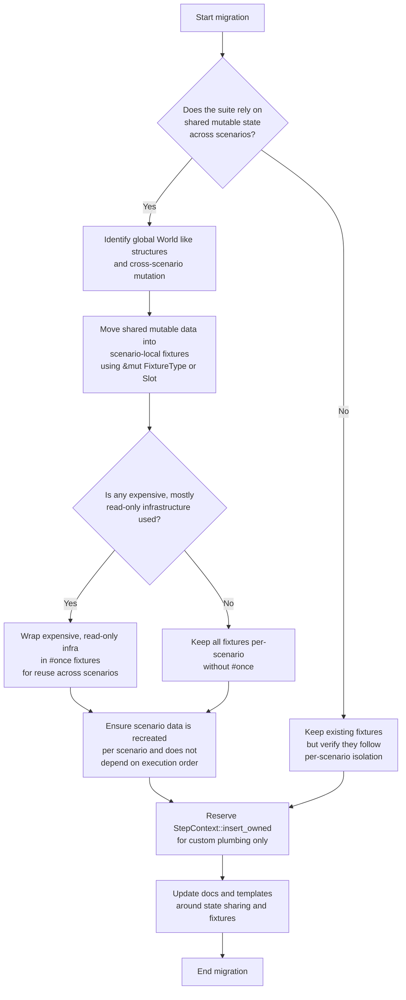

# v0.5.0 migration guide

This guide highlights the significant behaviour changes between `v0.4.0` and
`v0.5.0` that affect day-to-day usage of `rstest-bdd`.

## Summary of changes

- Step definitions may be synchronous (`fn`) or asynchronous (`async fn`).
- `#[scenario]` bodies may return `Result<(), E>` or `StepResult<(), E>`;
  non-unit payload returns are rejected at compile time.
- Scenario state isolation is explicit: fixtures are recreated per scenario by
  default, with `#[once]` as an opt-in for shared infrastructure.
- Async-only steps under synchronous scenarios use a per-step Tokio fallback;
  nested runtime execution is guarded.
- Manual async wrappers for sync steps should use
  `rstest_bdd::async_step::sync_to_async`; concise signature aliases are
  available for wrapper parameters.
- Underscore-prefixed fixture bindings are supported for intentionally unused
  fixture handles without triggering `used_underscore_binding` in generated
  scenario glue.
- File-wide lint suppressions that existed only for macro-generated unused
  fixture parameters are no longer needed for `#[scenario]` and `scenarios!`
  tests.

## Affected cases

Projects are affected if any of the following are true:

- A `#[scenario]` function returns a non-unit type (for example,
  `Result<T, E>` where `T != ()`).
- A `#[scenario]` function returns a type alias to `Result` or `StepResult`.
- Scenario bodies use `?` or propagate errors directly.
- Step definitions were constrained to sync-only patterns in `v0.4.0` and can
  now benefit from native `async fn` step handlers.
- The suite expects shared mutable state across scenarios (for example, a
  cucumber-style global `World`).
- The project maintains explicit async wrapper functions for synchronous step
  handlers.
- The suite relied on file-wide lint suppressions (for example
  `#![allow(unused_variables)]`) to keep generated scenario bindings warning
  free.
- Scenario bindings currently use non-underscore fixture names solely to avoid
  lint noise from intentionally unused handles.

## Required changes

### 1) Update scenario return types

**Before (unsupported in `v0.5.0`):**

```rust
# use rstest_bdd_macros::scenario;
#[scenario(path = "tests/features/example.feature")]
fn scenario_returns_value() -> Result<u32, &'static str> {
    Ok(42)
}
```

**After (supported):**

```rust
# use rstest_bdd_macros::scenario;
#[scenario(path = "tests/features/example.feature")]
fn scenario_returns_unit() -> Result<(), &'static str> {
    do_setup()?;
    Ok(())
}
```

Values needed by later steps should be returned from step functions and
injected via fixtures or slots.

### 2) Use explicit `Result`/`StepResult` in scenario signatures

Scenario return classification does not resolve type aliases. When using an
alias like `type MyResult<T> = Result<T, MyError>`, the scenario signature must
spell out `Result<(), MyError>` or use `rstest_bdd::StepResult<(), MyError>`.

```rust
# use rstest_bdd::StepResult;
# use rstest_bdd_macros::scenario;
#[scenario(path = "tests/features/example.feature")]
fn scenario_step_result() -> StepResult<(), &'static str> {
    Ok(())
}
```

### 3) Adopt native async step definitions where useful

`v0.5.0` supports `async fn` step handlers directly, so async work no longer
needs to be forced into fixtures or adapter traits.

```rust
# use rstest_bdd_macros::when;
#[when("the report is fetched")]
async fn fetch_report() {
    fetch_remote_report().await;
}
```

When a scenario is skipped (via `rstest_bdd::skip!`), generated fallible tests
still return `Ok(())` so signatures stay type-correct.

### 4) Align with scenario-isolated state model

Fixtures are the replacement for Cucumber's shared `World` object.

- Use ordinary fixtures plus `&mut FixtureType` and `Slot<T>` to share mutable
  state within a single scenario.
- Use `#[once]` only for expensive, effectively read-only infrastructure (for
  example, connection pools).
- Recreate scenario data per scenario; do not depend on scenario execution
  order.
- Reserve `StepContext::insert_owned` for custom step-execution plumbing, not
  normal macro-driven suites. The flow below shows a recommended decision path
  for migrating shared mutable state to fixture-based scenario isolation.



*Figure: Decision flow for migrating from shared mutable state to scenario-
isolated fixtures.*

### 5) Account for async runtime fallback rules

If an async-only step executes inside a synchronous scenario, `rstest-bdd` runs
that step via a per-step Tokio runtime fallback. Avoid creating additional
runtimes in async scenarios; nested runtimes are guarded and will fail.

### 6) Use the stable async wrapper helper path

When explicit async wrappers are required around synchronous step functions,
prefer the stable helper at `rstest_bdd::async_step::sync_to_async`. **Before:**

```rust
use rstest_bdd::sync_to_async;
```

**After:**

```rust
use rstest_bdd::async_step::sync_to_async;
```

For cleaner signatures, wrappers can use `StepCtx`, `StepTextRef`, `StepDoc`,
and `StepTable`:

```rust
use rstest_bdd::async_step::sync_to_async;
use rstest_bdd::{StepCtx, StepDoc, StepFuture, StepTable, StepTextRef};
fn my_async_wrapper<'ctx>(
    ctx: StepCtx<'ctx, '_>,
    text: StepTextRef<'ctx>,
    docstring: StepDoc<'ctx>,
    table: StepTable<'ctx>,
) -> StepFuture<'ctx> {
    sync_to_async(my_sync_step)(ctx, text, docstring, table)
}
```

This alias-based form keeps the fixture lifetime inferred in parameter position
(`StepCtx<'ctx, '_>`), so explicit `'fixtures` naming is rarely required in
end-user wrapper code.

### 7) Prefer underscore-prefixed fixture handles when intentionally unused

When a fixture exists only to make it available to steps through `StepContext`,
prefixing that parameter with an underscore now works without
`used_underscore_binding` lint violations in generated scenario glue. **Before
(often forced to avoid lint noise):**

```rust
# use rstest_bdd_macros::scenario;
# struct Harness;
#[scenario(path = "tests/features/example.feature")]
fn runs_feature(harness: Harness) {
    let _ = harness;
}
```

**After (clear intent, no dummy usage needed):**

```rust
# use rstest_bdd_macros::scenario;
# struct Harness;
#[scenario(path = "tests/features/example.feature")]
fn runs_feature(_harness: Harness) {}
```

The same convention applies to autodiscovered suites:

```rust
# use rstest_bdd_macros::scenarios;
# struct Harness;
scenarios!("tests/features", fixtures = [_harness: Harness]);
```

Use this style for fixtures that are intentionally injected for steps but not
directly consumed in the scenario body.

### 8) Remove file-wide lint suppressions used by legacy scenario glue

If a module previously relied on file-level allowances only to silence
macro-generated unused fixture parameters, remove them during migration.
`#[scenario]` and `scenarios!` generated tests now handle this case without a
module-level suppression. Prefer:

- No module-level suppression when no real warning remains.
- Narrow, item-level `#[expect(...)]` only when a specific step or helper still
  requires it for a documented reason.

## Migration checklist

- [ ] Every `#[scenario]` returns `()` or `Result<(), E>`/`StepResult<(), E>`.
- [ ] Scenario return type aliases are replaced with explicit `Result` or
  `StepResult` signatures.
- [ ] Non-unit return values are moved into steps, fixtures, or
  `ScenarioState` slots when previously returned from scenario bodies.
- [ ] Async-capable steps that previously relied on workaround patterns are
  migrated to direct `async fn` handlers where appropriate.
- [ ] Shared mutable cross-scenario state is replaced with fixture-based
  scenario isolation, with `#[once]` limited to infrastructure.
- [ ] Explicit sync-to-async wrappers import
  `rstest_bdd::async_step::sync_to_async`.
- [ ] Scenario bindings with intentionally unused fixture handles use
  underscore-prefixed names where they improve clarity.
- [ ] File-wide lint suppressions added only for historical generated-fixture
  warnings are removed.
- [ ] Documentation or internal templates describing scenario return types,
  async steps, and state sharing are updated.

## Common errors and fixes

- **Error:** `#[scenario] bodies must return () or a unit Result/StepResult`
  - **Fix:** Scenario signatures return `Result<(), E>` or `StepResult<(), E>`,
    with payload values moved into steps.
- **Error:** `no \`sync_to_async\` in the root` when importing from
  `rstest_bdd::sync_to_async`
  - **Fix:** Update imports to `rstest_bdd::async_step::sync_to_async`.
- **Error:** `used_underscore_binding` emitted for scenario fixture parameters
  that were intentionally underscore-prefixed
  - **Fix:** Use v0.5.0 macros and remove compatibility workarounds; underscore
    fixture handles are supported in generated scenario glue.
- **Error:** legacy `#![allow(unused_variables)]` or similar file-level lint
  suppressions remain in BDD scenario modules after migration
  - **Fix:** Remove file-wide suppressions and keep only narrowly scoped
    `#[expect(...)]` annotations where still justified.
For migration issues not covered here, see the
[`rstest-bdd` user's guide](rstest-bdd-users-guide.md).
