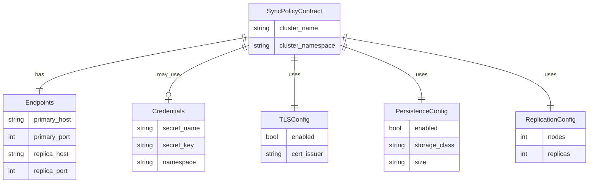
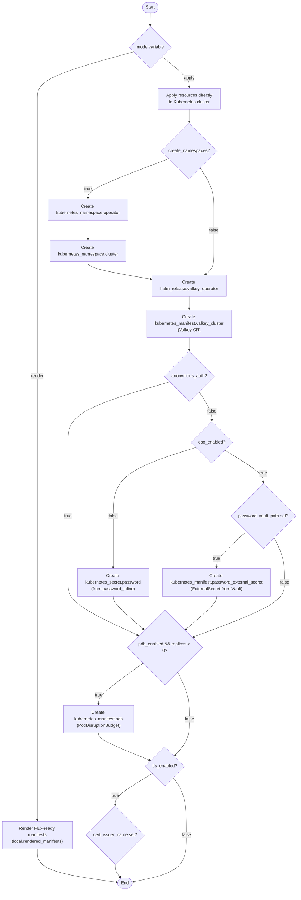

# Valkey Module Design

This document describes the architecture and design decisions for the Valkey
OpenTofu module, which provides Redis-compatible key-value storage for the
Wildside ephemeral preview infrastructure.

## Overview

The Valkey module deploys a Valkey cluster using the
[Hyperspike Valkey operator](https://github.com/hyperspike/valkey-operator).
It follows the dual-mode architecture established by other infrastructure
modules, supporting both `render` mode for GitOps workflows and `apply` mode
for direct Kubernetes deployment.

## Sync Policy Contract

The module exports a `sync_policy_contract` output that provides all the
information downstream workloads need to connect to the Valkey cluster. This
contract is the primary integration point for applications.



*Figure 1: Entity-relationship diagram of the sync policy contract structure.
The contract always includes endpoints, TLS configuration, persistence settings,
and replication topology. Credentials are optional when anonymous authentication
is enabled.*

## Resource Creation Flow

The module conditionally creates resources based on the operating mode and
configuration options. In `render` mode, it outputs Flux-ready manifests
without touching the cluster. In `apply` mode, it creates resources directly.



*Figure 2: Resource creation flow diagram showing the conditional logic for
different authentication modes (anonymous, inline password, ESO/Vault),
namespace creation, PodDisruptionBudget provisioning, and TLS configuration.*

## Key Design Decisions

### Dual-Mode Architecture

The module supports two operating modes:

- **render**: Outputs Flux-ready YAML manifests for GitOps workflows. No
  Kubernetes connection required.
- **apply**: Creates resources directly in the cluster using the Kubernetes
  and Helm providers.

### Credential Management

Three authentication strategies are supported:

1. **Anonymous auth**: No password required (`anonymous_auth = true`)
2. **Inline password**: Secret created from `password_inline` variable
3. **ESO integration**: ExternalSecret fetches credentials from Vault

### TLS Configuration

The `tls` field in the Valkey CRD expects a string value (`"true"` or
`"false"`), not a boolean. This is a constraint of the operator's CRD schema.

### Service Naming

The Valkey operator creates services following the pattern:

- Primary: `<cluster_name>-primary.<namespace>.svc.<cluster_domain>`
- Replicas: `<cluster_name>-replicas.<namespace>.svc.<cluster_domain>`

## Testing

The module includes:

- **Terratest suite**: Validates render outputs, sync policy contract, and
  configuration variants
- **OPA policies**: Conftest rules for HelmRelease and Valkey cluster manifests

Run tests with:

```bash
make valkey-test    # Terratest suite
make valkey-policy  # OPA policy checks
```
