# Vault appliance OpenTofu module design

This document captures the design decisions for the `vault_appliance` module,
which provisions a DigitalOcean-hosted Vault appliance used by the Wildside
platform for preview environment secrets management.

## Overview

The module builds a dedicated Vault footprint on DigitalOcean consisting of one
or two droplets, persistent block storage, a managed load balancer, and
hardened firewall rules. It also generates the TLS assets and recovery key
material required to bootstrap Vault in a deterministic, GitOps-friendly way.

## Design decisions

- **Deterministic naming and tagging.** All resources derive their names from a
  validated `name` prefix. The module normalizes characters, truncates to
  provider limits, and adds consistent tags (`vault` plus the base name) so
  supporting automation can discover the appliance reliably.
- **HA-aware topology.** A single toggle (`ha_enabled`) controls whether to
  create one droplet or an HA pair. Storage volumes, firewall rules, and load
  balancer attachments are rendered from the same local metadata to guarantee
  that the infrastructure scales coherently when the toggle flips.
- **Persistent storage by default.** Each droplet receives its own
  `digitalocean_volume`, mounted through `digitalocean_volume_attachment`. The
  volumes default to 50 GiB with an overridable filesystem label, ensuring
  future bootstrap automation can format and mount the disks predictably.
- **Managed TLS chain.** A private Certificate Authority (CA) and server
  certificate are generated with the TLS provider. The server keypair is
  uploaded to DigitalOcean as a custom certificate and exposed via outputs so
  the bootstrap helper can install the same bundle on the droplets. The module
  sanitises DNS names, trims whitespace, and validates IP Subject Alternative
  Names by round-tripping them through `cidrhost`, ensuring malformed IPv4 or
  IPv6 literals never reach the certificate request. The CA certificate is
  returned for callers to trust the load balancer endpoint.
- **Recovery material baked in.** Recovery keys are modelled as
  `random_password` resources. Callers can tune share count, threshold, and key
  length, and the generated shares include special characters to maximise
  entropy. This enables the bootstrap workflow to unseal Vault without manual
  intervention. The keys are emitted as sensitive outputs to encourage storage
  in a secure backend.
- **Scripted bootstrap with state capture.** The repository ships a dedicated
  Python helper (`scripts/bootstrap_vault_appliance.py`) that initializes Vault,
  records the generated recovery material in a local state file, unseals the
  appliance, enables the KV v2 secrets engine, and provisions the DOKS AppRole.
  The helper is idempotent—re-running it verifies mounts and rotates the AppRole
  secret identifier only when requested. Tests use `cmd-mox` to emulate `vault`,
  `doctl`, and `ssh` so the workflow is covered without real infrastructure.
- **Secure perimeter.** The module provisions a firewall that only accepts SSH
  from explicitly listed CIDRs and API traffic from the managed load balancer.
  Conftest policies enforce HTTPS termination, HTTP→HTTPS redirects, and forbid
  exposing SSH to the public internet by default. Additional inputs allow the
  appliance to live inside a custom VPC and project.
- **Reusable GitHub Action.** A composite action lives at
  `.github/actions/bootstrap-vault-appliance` to drive the Python helper. It
  installs `uv`, `doctl`, and the Vault command-line interface (CLI), derives
  the droplet tag as `vault-<environment>` when one is not supplied, and writes
  bootstrap state to `$RUNNER_TEMP/vault-bootstrap/<environment>/state.json`.
  Inputs accept raw or base64 JSON/PEM (Privacy-Enhanced Mail) payloads for the
  state file and certificate authority (CA) bundle, while secrets (unseal keys,
  root token, Application Role (AppRole) credentials) are masked before outputs
  are published so idempotent re-runs cannot leak credentials.

### GitHub Action control flow

```mermaid
flowchart TD
  A[Start composite action<br/>inputs received] --> B[Seed step]

  subgraph S[Seed bootstrap state]
    B --> B1[Derive DROPLET_TAG<br/>default vault-<environment>]
    B1 --> B2[Determine STATE_FILE path<br/>$RUNNER_TEMP/vault-bootstrap/<environment>/state.json]
    B2 --> B3{bootstrap_state provided?}
    B3 -- yes and STATE_FILE absent --> B4[Decode raw or base64 JSON<br/>validate and write STATE_FILE 0600]
    B3 -- no --> B5[Skip writing state file]

    B4 --> B6{ca_certificate provided?}
    B5 --> B6
    B6 -- yes --> B7[Decode raw or base64 PEM<br/>write CA_CERT_PATH 0600]
    B6 -- no --> B8[No CA_CERT_PATH]

    B7 --> B9{ssh_private_key provided?}
    B8 --> B9
    B9 -- yes --> B10[Write SSH_IDENTITY file 0600<br/>add-mask ssh_private_key]
    B9 -- no --> B11[No SSH_IDENTITY]

    B10 --> B12[Export DROPLET_TAG, STATE_FILE,<br/>CA_CERT_PATH, SSH_IDENTITY to GITHUB_ENV]
    B11 --> B12
  end

  B12 --> C[Install uv]
  C --> D[Install doctl with digitalocean_token]
  D --> E[Install Vault CLI if missing<br/>download, verify checksum, unzip to RUNNER_TEMP/bin]

  E --> F[Bootstrap Vault appliance step]

  subgraph H[Bootstrap via Python helper]
    F --> F1[Build argument list for helper<br/>vault addr, droplet tag, state file, KV/AppRole params]
    F1 --> F2{CA_CERT_PATH set?}
    F2 -- yes --> F3[Append --ca-certificate]
    F2 -- no --> F4[Skip CA certificate flag]

    F3 --> F5{SSH_IDENTITY set?}
    F4 --> F5
    F5 -- yes --> F6[Append --ssh-identity]
    F5 -- no --> F7[Skip SSH identity flag]

    F6 --> F8{approle_policy provided?}
    F7 --> F8
    F8 -- yes --> F9[Write approle-policy.hcl<br/>append --approle-policy-path]
    F8 -- no --> F10[Use default policy]

    F9 --> F11{rotate_secret_id == true?}
    F10 --> F11
    F11 -- yes --> F12[Append --rotate-secret-id]
    F11 -- no --> F13[Do not append flag]

    F12 --> F14[Run uv with scripts/bootstrap_vault_appliance.py]
    F13 --> F14
    F14 --> F15[Helper initialises or verifies Vault<br/>updates STATE_FILE]
  end

  F15 --> G[Publish outputs step]

  subgraph P[Publish and mask outputs]
    G --> G1[Read STATE_FILE JSON]
    G1 --> G2[Extract approle_role_id, approle_secret_id,<br/>root_token, unseal_keys]
    G2 --> G3[Add-mask all secrets for logs]
    G3 --> G4[Write to GITHUB_OUTPUT:<br/>vault-address, state-file,<br/>approle-role-id, approle-secret-id,<br/>ca-certificate-path]
  end

  G4 --> Z[Downstream jobs consume masked outputs]
```

- **Detailed drift checks.** Behavioural tests execute
  `tofu plan -detailed-exitcode` to verify that creating the appliance produces
  exit code 2, proving the safety rails that guard destructive operations. The
  Makefile mirrors this check for local and CI runs.
- **Terratest coverage.** The test suite validates happy and unhappy paths:
  provider authentication failures, recovery threshold validation, policy
  enforcement (including negative cases), HA topology rendering, detailed exit
  codes, and an opt-in live apply guarded by `VAULT_APPLIANCE_ACCEPT_APPLY`.
- **Project integration.** An optional `project_id` input assigns the droplet,
  volumes, and load balancer to a DigitalOcean project via
  `digitalocean_project_resources`, keeping billing and governance aligned with
  wider platform conventions.

## Future work

- Extend the module to template droplet user data for automatic volume mounts
  and Vault configuration scaffolding.
- Publish metrics (load balancer health, droplet monitoring) to a central
  observability stack once platform monitoring is formalised.
- Support BYO certificate chains for teams that integrate Vault with an
  external PKI, while retaining the default self-signed path for rapid
  bootstrap.
