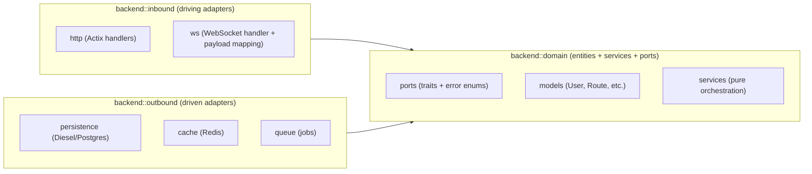
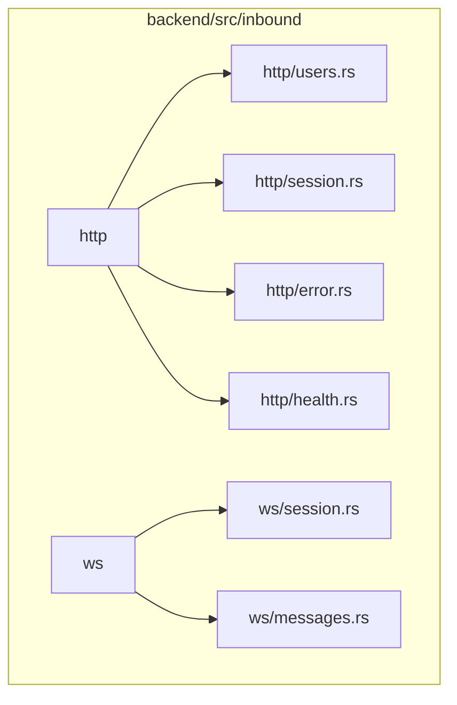
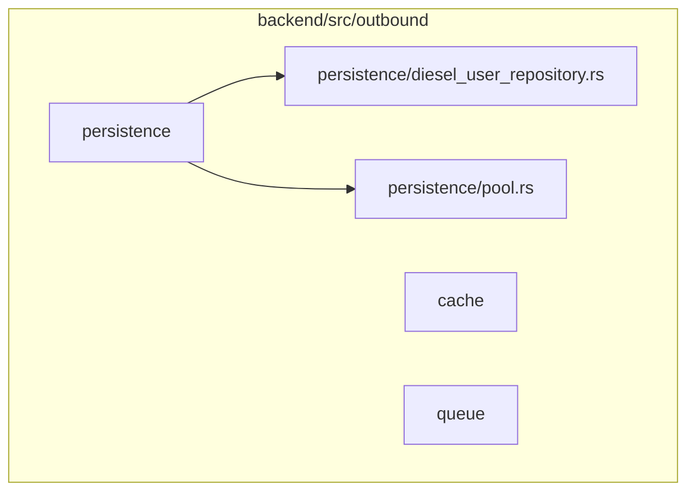
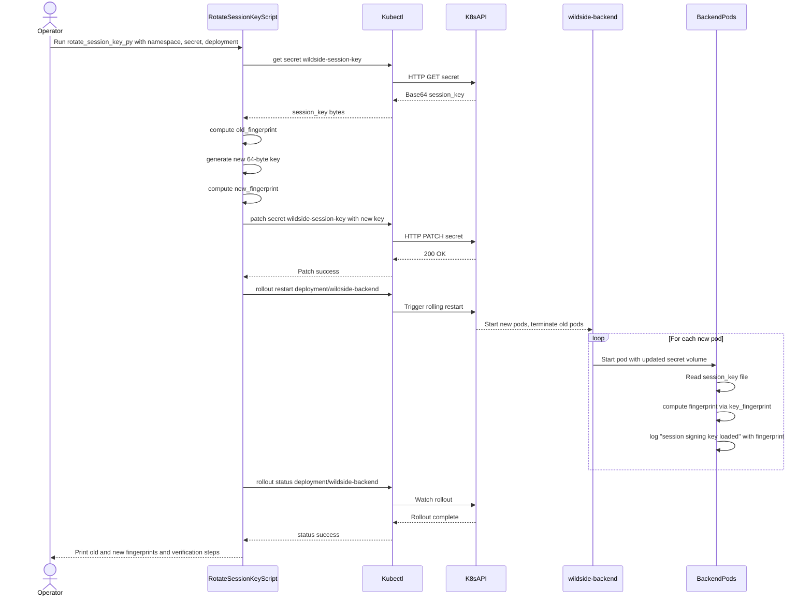
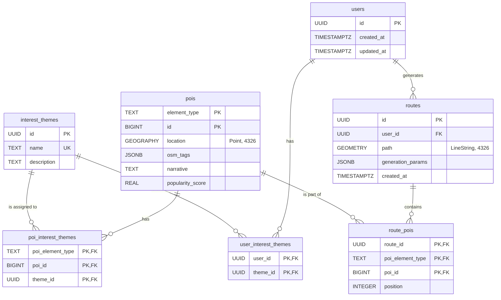
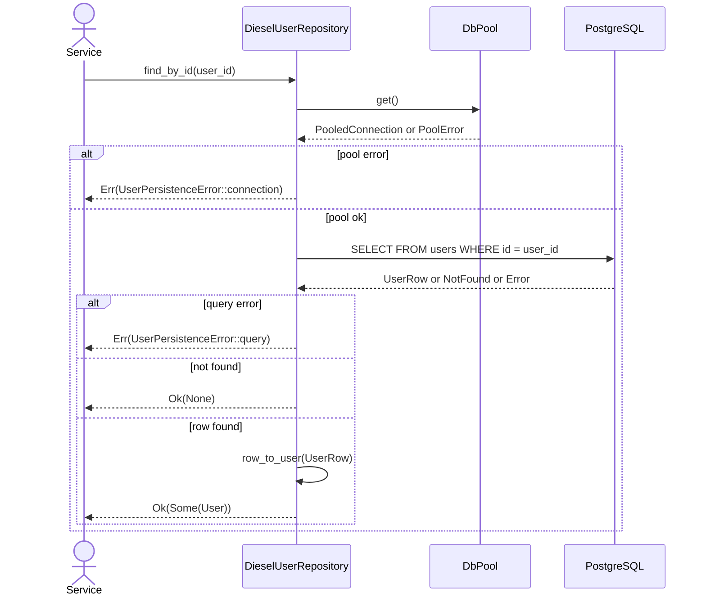

# Wildside Backend Architecture (Hexagonal Design)

## Architecture Overview (Hexagonal Modular Monolith)

Wildside’s backend is implemented as a **modular monolith** in Rust that
follows a **hexagonal architecture** (ports-and-adapters) design. All core
server functionality – including the RESTful API, WebSocket endpoints, and
business logic – runs within a single deployable binary for simplicity, but is
internally organized into decoupled
modules([1](https://github.com/leynos/wildside/blob/9aa9fcecfdec116e4b35b2fde63f11fa7f495aaa/docs/backend-design.md#L5-L13))([2](https://github.com/leynos/wildside/blob/9aa9fcecfdec116e4b35b2fde63f11fa7f495aaa/docs/repository-structure.md#L262-L265)).
 This approach accelerates early development and debugging by avoiding the
complexity of microservices while maintaining clear boundaries between domains.
In production, the backend runs as a containerized service (e.g. in Kubernetes)
and connects to external services like a Postgres database, a Redis cache, and
a tile server for map
data([3](https://github.com/leynos/wildside/blob/9aa9fcecfdec116e4b35b2fde63f11fa7f495aaa/docs/wildside-backend-design.md#L19-L27))([3](https://github.com/leynos/wildside/blob/9aa9fcecfdec116e4b35b2fde63f11fa7f495aaa/docs/wildside-backend-design.md#L40-L48)).
 A high-level system diagram (from the original design spec) illustrates these
components and interactions:

- **Actix Web API Server:** The main web service handling HTTP requests and
  WebSocket
  upgrades([3](https://github.com/leynos/wildside/blob/9aa9fcecfdec116e4b35b2fde63f11fa7f495aaa/docs/wildside-backend-design.md#L36-L44)).

- **Background Workers:** A pool of worker processes (running the same binary
  in “worker mode”) that execute long-running tasks
  asynchronously([3](https://github.com/leynos/wildside/blob/9aa9fcecfdec116e4b35b2fde63f11fa7f495aaa/docs/wildside-backend-design.md#L37-L45))([3](https://github.com/leynos/wildside/blob/9aa9fcecfdec116e4b35b2fde63f11fa7f495aaa/docs/wildside-backend-design.md#L659-L663)).

- **PostgreSQL (with PostGIS):** The primary data store for both application
  data and geospatial data.

- **Redis Cache/Queue:** An in-memory store used for caching expensive results
  and for brokering background job
  queues([3](https://github.com/leynos/wildside/blob/9aa9fcecfdec116e4b35b2fde63f11fa7f495aaa/docs/wildside-backend-design.md#L654-L662)).

- **Martin Tile Server:** A separate service (Martin) that serves map tiles
  from the same PostGIS
  database([1](https://github.com/leynos/wildside/blob/9aa9fcecfdec116e4b35b2fde63f11fa7f495aaa/docs/backend-design.md#L96-L105)).

- **External APIs:** For certain features, external services like the
  **Overpass API** are consulted (e.g. to enrich point-of-interest
  data)([3](https://github.com/leynos/wildside/blob/9aa9fcecfdec116e4b35b2fde63f11fa7f495aaa/docs/wildside-backend-design.md#L46-L49))([3](https://github.com/leynos/wildside/blob/9aa9fcecfdec116e4b35b2fde63f11fa7f495aaa/docs/wildside-backend-design.md#L632-L640)).

- **Observability Stack:** Monitoring and logging components including
  Prometheus (metrics), Loki (logs via FluentBit), Grafana (dashboards), and
  PostHog (analytics) ensure full visibility into system
  behavior([3](https://github.com/leynos/wildside/blob/9aa9fcecfdec116e4b35b2fde63f11fa7f495aaa/docs/wildside-backend-design.md#L50-L58)).

All these pieces communicate primarily through well-defined interfaces
(HTTP/HTTPS, WebSocket, or via Redis for internal job queues). The monolithic
design means the API server contains the domain logic and adapter code for
database, cache, etc., but thanks to the hexagonal structure, each concern is
isolated behind abstractions. The system can evolve into multiple services if
needed by extracting modules, since the boundaries are already enforced.

**Hexagonal architecture approach:** Within the application, code is divided
into layers corresponding to **domain**, **ports**, and **adapters**. Core
business logic lives in the **domain layer** (pure logic with no direct I/O or
framework
dependencies)([2](https://github.com/leynos/wildside/blob/9aa9fcecfdec116e4b35b2fde63f11fa7f495aaa/docs/repository-structure.md#L262-L265)).
 The domain defines abstract interfaces (ports) for external interactions like
persistence, caching, or messaging. Surrounding this, infrastructure and
framework-specific code (adapters) implement these interfaces – for example,
the database adapter uses Diesel to fulfill the persistence port, and the web
API layer (Actix Web controllers) acts as an adapter converting HTTP requests
into domain service calls. This design prevents business logic from depending
on details of Actix, Diesel, or other external tools. It also simplifies
testing – domain services can be unit-tested with mock implementations of
ports, and the real adapters can be integration-tested
separately([2](https://github.com/leynos/wildside/blob/9aa9fcecfdec116e4b35b2fde63f11fa7f495aaa/docs/repository-structure.md#L262-L266)).
The repository is structured to reflect this separation, with distinct modules
for `inbound::http` (HTTP handlers), `inbound::ws` (WebSocket handlers),
`domain` (business logic and domain models), and `outbound` (persistence,
cache, and other external adapters that implement the domain ports)
([2](https://github.com/leynos/wildside/blob/9aa9fcecfdec116e4b35b2fde63f11fa7f495aaa/docs/repository-structure.md#L56-L64)).

**Observability by design:** From the outset, Wildside’s backend includes
thorough instrumentation in each component. We use the `tracing` library for
structured logging and distributed tracing, and every incoming request or job
is tagged with a **trace ID** (UUID) that is propagated across asynchronous
calls and even into background
jobs([3](https://github.com/leynos/wildside/blob/9aa9fcecfdec116e4b35b2fde63f11fa7f495aaa/docs/wildside-backend-design.md#L712-L720)).
 Key metrics are collected and exposed via **Prometheus** endpoints or
exporters, covering HTTP request rates/latencies, active WebSocket connections,
job processing times, database performance, cache hits,
etc.([1](https://github.com/leynos/wildside/blob/9aa9fcecfdec116e4b35b2fde63f11fa7f495aaa/docs/backend-design.md#L81-L89))([3](https://github.com/leynos/wildside/blob/9aa9fcecfdec116e4b35b2fde63f11fa7f495aaa/docs/wildside-backend-design.md#L727-L735)).
 Additionally, the backend emits high-level **analytics events** to **PostHog**
to track user behavior (for example, when a route is generated or a POI is
viewed)([1](https://github.com/leynos/wildside/blob/9aa9fcecfdec116e4b35b2fde63f11fa7f495aaa/docs/backend-design.md#L88-L95)).
 This observability stack ensures that developers and operators can monitor
system health and user engagement in real time. (Details on specific metrics
and tracing follow in each component’s description.)

In summary, the Wildside backend is a single Rust application embracing a
hexagonal (ports and adapters) architecture. It leverages **Actix Web** for
high-performance async HTTP/WS handling, **Diesel** (with Postgres/PostGIS) for
persistence, **bb8** for async connection
pooling([4](https://github.com/leynos/wildside/blob/9aa9fcecfdec116e4b35b2fde63f11fa7f495aaa/docs/keyset-pagination-design.md#L34-L40)),
 **Redis** for caching and as a job queue, and **Apalis** for robust background
job execution. The design emphasizes clear domain boundaries, scalability (via
potential service extraction or horizontal scaling of the monolith and
workers), and thorough observability for both technical and product metrics.

## Core Components and Layers

### Hexagonal module boundaries (guardrails)

Wildside treats hexagonal architecture as a *module boundary*, not just an
aspiration. The repo is a single Rust crate (`backend`), so the most common
boundary regressions are **module-level imports** (for example an HTTP handler
reaching into `outbound::persistence`).

The diagrams below are intended to make the boundaries visible during day-to-
day work, and to give reviewers a quick "smell test" for new modules.

#### Top-level module dependency direction



#### Inbound adapter module map

Inbound adapters translate transport concerns into domain concerns. They may
depend on `domain` (and shared middleware), but must not depend on `outbound`.



#### Outbound adapter module map

Outbound adapters implement domain ports for specific infrastructure. They may
depend on `domain` + infrastructure crates, but must not depend on `inbound`.



#### Port usage examples

Ports are defined in the domain and implemented by outbound adapters. Inbound
adapters consume ports via injected state rather than importing outbound
modules directly.

- **Port (domain):** `backend/src/domain/ports/user_repository.rs` defines the
  `UserRepository` trait and `UserPersistenceError`.
- **Adapter (outbound):** `backend/src/outbound/persistence/diesel_user_repository.rs`
  implements `UserRepository` using Diesel and maps Diesel errors to domain
  errors.
- **Contract (tests):** `backend/tests/ports_behaviour.rs` exercises the port
  semantics against a Postgres-backed implementation using
  `pg-embed-setup-unpriv`.

The intended runtime wiring pattern is:

```rust
use std::sync::Arc;

use actix_web::{web, App, HttpServer};

use backend::domain::ports::UserRepository;
use backend::inbound::http::users;

#[derive(Clone)]
pub struct AppState {
    pub users: Arc<dyn UserRepository>,
}

pub async fn run_http_server(state: AppState) -> std::io::Result<()> {
    HttpServer::new(move || {
        App::new()
            .app_data(web::Data::new(state.clone()))
            .service(web::scope("/api/v1").service(users::login))
    })
    .bind(("127.0.0.1", 8080))?
    .run()
    .await
}
```

This keeps handlers inside the hexagon: they only ever see domain ports, never
concrete outbound implementations.

#### Checklist for introducing a new adapter

When adding a new adapter (inbound or outbound), use this checklist to keep
the boundary explicit:

- **Choose the right side:** driving adapters go in `backend/src/inbound/*`;
  driven adapters go in `backend/src/outbound/*`.
- **Define/extend the port first:** if the capability is new, add a port trait
  under `backend/src/domain/ports/*` and model errors as domain enums (via
  `define_port_error!`).
- **Keep the dependency direction:** inbound must not import `outbound`;
  outbound must not import `inbound`; domain must not import either.
- **Map errors at the edge:** translate infrastructure errors to domain port
  errors inside the adapter, not in the domain and not in the handlers.
- **Provide test doubles:** add at least one deterministic test implementation
  (in-memory or fixture-driven) for the port so domain services can be unit
  tested without I/O.
- **Add contract tests for driven adapters:** for adapters that talk to
  infrastructure (Postgres/Redis/etc.), add contract tests that validate the
  port semantics (happy + unhappy paths) using `rstest` fixtures.
- **Add behaviour coverage where it matters:** for user-visible behaviour,
  prefer `rstest-bdd` scenarios backed by `rstest` fixtures.
- **Run the gates:** `make check-fmt`, `make lint`, and `make test` must all
  pass before considering the work complete.

#### Guardrail tooling

Module boundaries are enforced by a repo-local lint that runs during `make
lint`:

- Runner: `tools/architecture-lint` (invoked as
  `cargo run -p architecture-lint`).
- Rules: `tools/architecture-lint/src/lib.rs` parses Rust syntax (via `syn`)
  and rejects forbidden imports per layer.
- Coverage: unit tests (`rstest`) and behaviour tests (`rstest-bdd`) validate
  happy and unhappy paths.

##### Design decisions

- **2025-12-14:** Use a repo-local, syntax-aware lint (`architecture-lint`) to
  enforce module boundaries. Cargo-level dependency tools are insufficient
  because the backend is a single crate, and the most common regressions are
  `use`-level imports across `domain`/`inbound`/`outbound`.
- **2025-12-15:** Introduce driving-port traits (`LoginService`, `UsersQuery`,
  `UserOnboarding`) and inject them into inbound adapters via Actix
  `web::Data`. This keeps handlers and WebSocket handlers I/O-free and allows
  integration
  guardrail tests (`backend/tests/adapter_guardrails.rs`) to exercise HTTP and
  WebSocket paths against deterministic test doubles.

### Web API and WebSocket Layer (Actix Web)

The **Actix Web** framework powers Wildside’s HTTP API layer, exposing RESTful
endpoints under a versioned path (e.g. `/api/v1/...`) and handling WebSocket
upgrades for real-time
features([2](https://github.com/leynos/wildside/blob/9aa9fcecfdec116e4b35b2fde63f11fa7f495aaa/docs/repository-structure.md#L28-L36))([2](https://github.com/leynos/wildside/blob/9aa9fcecfdec116e4b35b2fde63f11fa7f495aaa/docs/repository-structure.md#L38-L46)).
This layer is the primary **entry point** into the system, responsible for
receiving client requests, authenticating and validating them, then invoking
domain services or enqueuing jobs as needed.

**Responsibilities:** The Actix web server module handles:

- **Inbound adapter location:** HTTP adapters live in
  `backend/src/inbound/http`, keeping handlers thin (request parsing →
  domain/service call → response mapping). Session interactions are wrapped by
  a `SessionContext` helper so persistence or framework details stay out of the
  handler bodies.

- **Routing and HTTP endpoints:** Defining routes for all API functions (e.g.
  user login, fetching user profiles, initiating route generation,
  etc.)([3](https://github.com/leynos/wildside/blob/9aa9fcecfdec116e4b35b2fde63f11fa7f495aaa/docs/wildside-backend-design.md#L130-L138)).
   Each endpoint is implemented as an async handler that uses domain logic or
  interacts with the database through domain ports. The API follows RESTful
  principles and uses JSON for request/response bodies.

- **Authentication and sessions:** Enforcing authentication (e.g. Bearer tokens
  or cookies) on protected endpoints. Wildside uses stateless, signed cookies
  for session management, via `actix-session` with cookie storage. A secret key
  is loaded from a secure source (Kubernetes Secret or Vault) at startup to
  sign
  cookies([3](https://github.com/leynos/wildside/blob/9aa9fcecfdec116e4b35b2fde63f11fa7f495aaa/docs/wildside-backend-design.md#L145-L153))([3](https://github.com/leynos/wildside/blob/9aa9fcecfdec116e4b35b2fde63f11fa7f495aaa/docs/wildside-backend-design.md#L169-L177)).
   Session cookies are HTTPOnly and Secure, with SameSite policies adjustable
  by configuration for development vs
  production([3](https://github.com/leynos/wildside/blob/9aa9fcecfdec116e4b35b2fde63f11fa7f495aaa/docs/wildside-backend-design.md#L147-L155))([3](https://github.com/leynos/wildside/blob/9aa9fcecfdec116e4b35b2fde63f11fa7f495aaa/docs/wildside-backend-design.md#L169-L178)).
   This provides a lightweight way to identify users without server-side
  sessions.

- **WebSocket endpoint:** Handling upgrades to `/ws` for real-time
  client-server
  communication([2](https://github.com/leynos/wildside/blob/9aa9fcecfdec116e4b35b2fde63f11fa7f495aaa/docs/repository-structure.md#L38-L46)).
  When a client connects over WebSocket (after authenticating with a session
  token or bearer token), the server establishes a persistent connection for
  bi-directional messaging. This is used, for example, to push **route
  generation status** updates asynchronously to the client. Actix Web’s
  WebSocket support (via `actix-ws`) efficiently manages these connections. The
  server ensures security by validating the `Origin` of WebSocket upgrade
  requests against an allowlist (e.g., localhost for dev, and the official
  domain in prod) to prevent unauthorized cross-site WebSocket
  hijacking([1](https://github.com/leynos/wildside/blob/9aa9fcecfdec116e4b35b2fde63f11fa7f495aaa/docs/backend-design.md#L40-L48))([1](https://github.com/leynos/wildside/blob/9aa9fcecfdec116e4b35b2fde63f11fa7f495aaa/docs/backend-design.md#L55-L63)).
  Connections with missing or invalid origins are rejected with clear error
  codes (400/403) and logged for
  auditing([1](https://github.com/leynos/wildside/blob/9aa9fcecfdec116e4b35b2fde63f11fa7f495aaa/docs/backend-design.md#L53-L61)).
  The `/ws` entry point now lives in `backend/src/inbound/ws` as an inbound
  adapter. Incoming JSON messages are deserialised into domain commands and
  passed to `UserOnboardingService`, which emits domain events (e.g.,
  `UserCreated`, `DisplayNameRejected`). The WebSocket handler only serialises
  those events to wire payloads and maintains heartbeats, keeping transport
  concerns at the edge.

- **Delegating to domain logic:** The web handlers do minimal processing
  themselves; they parse inputs, perform light validation, then call into the
  **domain layer** (or orchestrate calls to other layers) to perform the
  business operation. For example, when a client requests a new route
  (`POST /api/v1/routes`), the Actix handler will authenticate the user,
  validate the JSON body, and then **enqueue a background job**
  (`GenerateRouteJob`) via the job queue adapter, rather than compute the route
  inline([1](https://github.com/leynos/wildside/blob/9aa9fcecfdec116e4b35b2fde63f11fa7f495aaa/docs/backend-design.md#L135-L143)).
   It immediately returns a 202 Accepted with a request ID, allowing the
  expensive work to happen
  asynchronously([1](https://github.com/leynos/wildside/blob/9aa9fcecfdec116e4b35b2fde63f11fa7f495aaa/docs/backend-design.md#L135-L143)).
   Another example: a `GET /api/v1/users` endpoint will call a domain service
  to fetch a page of users from the database (likely using the pagination
  service described later) and return the results.

- **Health and metrics endpoints:** The server exposes health check endpoints
  (e.g. `/health/ready` and `/health/live`) for Kubernetes liveness/readiness
  probes([3](https://github.com/leynos/wildside/blob/9aa9fcecfdec116e4b35b2fde63f11fa7f495aaa/docs/wildside-backend-design.md#L139-L143)).
   It also mounts a Prometheus metrics endpoint (e.g. `/metrics`) which
  publishes application metrics for
  scraping([1](https://github.com/leynos/wildside/blob/9aa9fcecfdec116e4b35b2fde63f11fa7f495aaa/docs/backend-design.md#L82-L90))([5](https://github.com/leynos/wildside/blob/9aa9fcecfdec116e4b35b2fde63f11fa7f495aaa/backend/src/main.rs#L93-L101)).
   These endpoints are lightweight and allow integration with ops tooling.

#### REST API Specification

All REST endpoints live under the `/api/v1` prefix and use JSON payloads.
Endpoints share a consistent error envelope so clients can rely on shape
stability.

| Method | Path                          | Description                                         | Authentication |
| ------ | ----------------------------- | --------------------------------------------------- | -------------- |
| `POST` | `/api/v1/login`               | Issue a session cookie from user credentials.       | None           |
| `GET`  | `/api/v1/users/me`            | Return the authenticated user profile.              | Session cookie |
| `PUT`  | `/api/v1/users/me/interests`  | Update the user’s selected interest themes.         | Session cookie |
| `GET`  | `/api/v1/interest-themes`     | List all available interest themes.                 | Optional       |
| `POST` | `/api/v1/routes`              | Request generation of a personalised walking route. | Session cookie |
| `GET`  | `/api/v1/routes/{request_id}` | Poll for completion or fetch a generated route.     | Session cookie |
| `GET`  | `/api/v1/users/me/routes`     | List routes previously generated by the user.       | Session cookie |

`POST /api/v1/routes` validates the request, hands it to the driving domain
port (`RouteService`), and allows the service to coordinate cache lookup,
idempotency tracking, queueing, and persistence. Responses follow the sequence
below:

- `202 Accepted` with `{ "request_id": "uuid" }` when a job starts. The
  handler also emits a `Location` header pointing to
  `/api/v1/routes/{request_id}` for polling.
- `409 Conflict` if the supplied `Idempotency-Key` header matches an
  existing payload with different parameters. Keys are persisted in PostgreSQL
  for 24 hours (configurable via `ROUTES_IDEMPOTENCY_TTL_HOURS`) so retries
  survive restarts.
- Standardised errors use the structure
  `{ "error": { "code": "string", "message": "string", "trace_id": "uuid" } }`
  allowing clients to correlate failures with server logs.

`GET /api/v1/routes/{request_id}` returns:

- `202 Accepted` with `Retry-After` while a job is pending.
- `200 OK` and the stored route once processing succeeds.
- `404 Not Found` when the identifier is unknown or has expired.

Request bodies must honour camelCase keys; responses use the same casing to
align with generated TypeScript clients. The example below illustrates the
minimum request envelope:

```json
{
  "startLocation": {
    "type": "Point",
    "coordinates": [-3.1883, 55.9533]
  },
  "durationMinutes": 60,
  "interestThemeIds": [
    "f47ac10b-58cc-4372-a567-0e02b2c3d479"
  ],
  "popularityBias": 0.7
}
```

#### Error handling boundary

Domain errors live in `backend/src/domain/error.rs` and stay
transport-agnostic. The inbound HTTP adapter applies the Actix
`ResponseError` mapping in `backend/src/inbound/http/error.rs`, translating
error codes to HTTP status codes, propagating the `trace-id` header when
present, and redacting `InternalError` payloads to the generic message
"Internal server error".

#### WebSocket Message Contracts

The `/ws` endpoint upgrades authenticated requests using the session cookie.
All frames are JSON objects with a `type` discriminator.

- **Server → Client `route_generation_status`:**
  - `requestId` (UUID string) links to the HTTP request.
  - `status` enumerates `queued`, `running`, `succeeded`, or `failed`.
  - `progress` reports completion percentage (0–100).
  - `routeId` appears when `status == "succeeded"`.
  - `error` is a short machine-parsable string when `status == "failed"`.
  - `timestamp` records an ISO 8601 instant for observability.
- **Client → Server `update_location` (future navigation mode):**
  - `routeId` identifies the active walk.
  - `location` supplies a GeoJSON `Point`.

Messages are rejected if they fail JSON schema validation; the server echoes
`trace_id` values in error replies so clients can report issues accurately.

#### Session Configuration and Rotation

Wildside relies on `actix-session` with `CookieSessionStore` to keep session
state entirely client-side. The production configuration must observe the
following rules:

- Load the signing key from `SESSION_KEY_FILE`; require ≥64 bytes in release
  builds and zeroise the raw bytes after deriving `Key`.
- Abort start-up unless a key is available. Development builds may fall back
  to an ephemeral key; release builds require `SESSION_ALLOW_EPHEMERAL=0` and
  fail fast if the toggle is missing or malformed.
- Default cookie attributes: `Secure=true`, `HttpOnly=true`,
  `SameSite=Strict`, path `/`, two-hour TTL via `PersistentSession`. Override
  with `SESSION_SAMESITE` and `SESSION_COOKIE_SECURE` when working with preview
  domains or identity-provider redirects. `SameSite=None` demands `Secure=true`.
- Release builds require explicit `SESSION_COOKIE_SECURE` and
  `SESSION_SAMESITE` values; missing or invalid settings abort start-up.

Sessions intentionally avoid Redis or database storage, keeping the web tier
stateless and allowing horizontal scaling without stickiness.

##### Key fingerprinting

On startup, the backend logs a truncated SHA-256 fingerprint of the active
signing key for operational visibility. The fingerprint is the first 8 bytes
of the hash encoded as 16 hexadecimal characters. Example log entry:

```json
{"level":"INFO","message":"session signing key loaded","fingerprint":"a1b2c3d4e5f67890"}
```

Operators use fingerprints to verify which key is active across replicas and to
confirm rotation completed successfully. The fingerprint module is located at
`backend/src/inbound/http/session_config/fingerprint.rs`.

##### Key rotation procedure

Rotation relies on **rolling deployment overlap** rather than in-app dual-key
validation. During rotation:

1. Publish the new key to the Kubernetes Secret.
2. Trigger a rolling deployment (`kubectl rollout restart`).
3. New pods start with the new key; old pods continue with the old key.
4. After all old pods terminate, only the new key is active.

The 2-hour session TTL means existing sessions expire naturally within the
overlap window. Users routed to new pods during rotation receive new sessions.

**Requirements for zero-downtime rotation:**

- At least 2 replicas must be running.
- The Helm chart's `sessionSecret.enabled` must be `true`.
- The deployment must use `maxUnavailable: 0` (the default).

**Automation:** Use `scripts/rotate_session_key.py` to automate the rotation
procedure. The script generates a new key, updates the secret, triggers the
rollout, and outputs fingerprints for audit logging.

**Runbook:** See `docs/runbooks/session-key-rotation.md` for the complete
rotation procedure, post-rotation verification, rollback steps, and
troubleshooting guidance.

*Figure: Session key rotation sequence showing the operator-initiated workflow
from key generation through rolling deployment and fingerprint verification.*



**Hexagonal perspective:** In hexagonal terms, Actix Web is an **outer
adapter** – it converts external inputs (HTTP requests, WebSocket messages)
into calls to the core domain. It should contain no business decision-making;
instead it delegates to application services in the domain or to other adapters
(e.g. calling the persistence port for data). The routes and handlers are kept
thin. For example, the `POST /api/v1/routes` handler simply constructs a domain
`GenerateRouteJob` request and hands it off to the **job dispatch port**, then
returns a tracking
ID([1](https://github.com/leynos/wildside/blob/9aa9fcecfdec116e4b35b2fde63f11fa7f495aaa/docs/backend-design.md#L135-L143)).
 Similarly, WebSocket message handlers (if clients can send messages) would
parse the input and invoke domain logic or respond with domain-provided data.
By following this pattern, we ensure that the web layer can be modified (or
even replaced with a different framework or a gRPC interface) without impacting
core business logic.

**OpenAPI integration:** To guarantee that the API interface is well-defined
and to enable downstream clients, Wildside uses **OpenAPI** for API
documentation. Using the `utoipa` crate, the backend automatically derives an
OpenAPI spec from endpoint definitions and data
models([1](https://github.com/leynos/wildside/blob/9aa9fcecfdec116e4b35b2fde63f11fa7f495aaa/docs/backend-design.md#L30-L38)).
 This spec can be served at runtime (e.g. via an endpoint like
`/api-docs/openapi.json`) and is used to generate TypeScript API clients via
**Orval** in the frontend build
process([2](https://github.com/leynos/wildside/blob/9aa9fcecfdec116e4b35b2fde63f11fa7f495aaa/docs/repository-structure.md#L6-L8))([2](https://github.com/leynos/wildside/blob/9aa9fcecfdec116e4b35b2fde63f11fa7f495aaa/docs/repository-structure.md#L32-L40)).
 In development mode, a Swagger UI is available at `/docs` for interactive API
exploration([5](https://github.com/leynos/wildside/blob/9aa9fcecfdec116e4b35b2fde63f11fa7f495aaa/backend/src/main.rs#L80-L88))([2](https://github.com/leynos/wildside/blob/9aa9fcecfdec116e4b35b2fde63f11fa7f495aaa/docs/repository-structure.md#L42-L46)).
 The OpenAPI documentation ensures that interface contracts remain clear and
versioned (the API is versioned under `/api/v1` prefix), and it aids in testing
and client generation.

**WebSocket AsyncAPI:** Similarly, the events and messages sent over the
WebSocket channel are documented using **AsyncAPI**
specifications([2](https://github.com/leynos/wildside/blob/9aa9fcecfdec116e4b35b2fde63f11fa7f495aaa/docs/repository-structure.md#L6-L8)).
 An AsyncAPI document (found in the `spec/asyncapi.yaml`) describes the message
schema for server-to-client events (like `UserCreated` or
`route_generation_status`) and any client-to-server messages. This serves as a
contract for real-time interactions, ensuring clients know how to handle
asynchronous messages. In practice, the server might generate or validate
against this spec for consistency. For example, when a route generation job
updates progress, the server broadcasts a message conforming to the
`route_generation_status` schema (including fields like `request_id`, `status`,
`progress` percentage,
etc.)([1](https://github.com/leynos/wildside/blob/9aa9fcecfdec116e4b35b2fde63f11fa7f495aaa/docs/backend-design.md#L200-L209))([1](https://github.com/leynos/wildside/blob/9aa9fcecfdec116e4b35b2fde63f11fa7f495aaa/docs/backend-design.md#L232-L240)).
 By maintaining the AsyncAPI spec, we can use tools or codegen for WebSocket
event handling in clients, and we guarantee that as the real-time API evolves
(new event types, etc.), it remains well-documented.

**Example – Route Generation via API & WS:** To illustrate the interplay: when
a client wants to generate a walking route, it sends an HTTP POST to
`/api/v1/routes` with parameters (start location, duration, interests). The
Actix API handler checks authentication, validates the JSON body, and
immediately enqueues a `GenerateRouteJob` to the background worker
queue([1](https://github.com/leynos/wildside/blob/9aa9fcecfdec116e4b35b2fde63f11fa7f495aaa/docs/backend-design.md#L135-L143)).
 It responds with `202 Accepted` and a JSON containing a new `request_id` (as a
UUID)([1](https://github.com/leynos/wildside/blob/9aa9fcecfdec116e4b35b2fde63f11fa7f495aaa/docs/backend-design.md#L176-L184)).
 The client can then either poll `GET /api/v1/routes/{request_id}` for the
result or, more efficiently, listen on the WebSocket for a
`route_generation_status` message. The WebSocket connection (which the client
would have opened earlier) will receive events as the job progresses – e.g.
<!-- markdownlint-disable-next-line MD013 -->
`{"type": "route_generation_status", "request_id": "...", "status": "running", "progress": 50}`
 – and ultimately a `status: "succeeded"` with `progress: 100` or a
`status: "failed"` with an error if something went
wrong([1](https://github.com/leynos/wildside/blob/9aa9fcecfdec116e4b35b2fde63f11fa7f495aaa/docs/backend-design.md#L232-L240))([1](https://github.com/leynos/wildside/blob/9aa9fcecfdec116e4b35b2fde63f11fa7f495aaa/docs/backend-design.md#L234-L239)).
 Once completed, the client can fetch or will receive the final route data (a
series of coordinates or POIs composing the path). This design decouples the
immediate request/response from the long-running process, improving
responsiveness.

**Additional API considerations:** The API layer also implements cross-cutting
concerns such as **idempotency** and **rate limiting** for certain endpoints.
For example, the route generation endpoint supports an `Idempotency-Key`
header: if a client retries a request with the same key, within a configurable
window, the server will return the originally generated `request_id` (or result
if ready) instead of duplicating
work([1](https://github.com/leynos/wildside/blob/9aa9fcecfdec116e4b35b2fde63f11fa7f495aaa/docs/backend-design.md#L153-L161)).
 If the payload differs for the same key, the server rejects it with a
`409 Conflict`, ensuring
consistency([1](https://github.com/leynos/wildside/blob/9aa9fcecfdec116e4b35b2fde63f11fa7f495aaa/docs/backend-design.md#L155-L162)).
 The key persistence (with TTL) is backed by the database to survive restarts.
Additionally, API calls are subject to rate limits per user (e.g. 60 route
requests per minute) to protect the
system([1](https://github.com/leynos/wildside/blob/9aa9fcecfdec116e4b35b2fde63f11fa7f495aaa/docs/backend-design.md#L159-L162)).
 These policies are enforced at the web layer, using middleware or simple
counters, and configuration for limits is adjustable.

**Observability (API & WS):** The Actix Web layer is instrumented with
middleware to collect **HTTP metrics** for every
request([1](https://github.com/leynos/wildside/blob/9aa9fcecfdec116e4b35b2fde63f11fa7f495aaa/docs/backend-design.md#L81-L89)).
 We use `actix-web-prom` (Prometheus middleware) to automatically count
requests and measure latency, partitioned by endpoint and status code (e.g.
counters like `http_requests_total{path,method,status}` and histograms like
`http_request_duration_seconds`
)([1](https://github.com/leynos/wildside/blob/9aa9fcecfdec116e4b35b2fde63f11fa7f495aaa/docs/backend-design.md#L81-L89)).
A global `/metrics` endpoint on the server exposes these metrics for Prometheus
scraping([1](https://github.com/leynos/wildside/blob/9aa9fcecfdec116e4b35b2fde63f11fa7f495aaa/docs/backend-design.md#L82-L90)).
 WebSocket usage is also tracked: we maintain a gauge of active WebSocket
connections and perhaps counters for messages sent/received. Each WebSocket
event type can be counted as well (e.g. number of `route_generation_status`
messages broadcast). These help ensure that real-time features are performing
as expected and to alert if, say, the number of connected clients spikes or
drops
suddenly([3](https://github.com/leynos/wildside/blob/9aa9fcecfdec116e4b35b2fde63f11fa7f495aaa/docs/wildside-backend-design.md#L736-L744)).

In addition to metrics, the API layer leverages structured **tracing logs**.
Each incoming HTTP request or WS message is associated with a unique **trace
ID** (often the same as the request ID for route jobs, or a correlation ID
header) which is logged in all messages related to that
flow([3](https://github.com/leynos/wildside/blob/9aa9fcecfdec116e4b35b2fde63f11fa7f495aaa/docs/wildside-backend-design.md#L712-L720)).
 If a request triggers a background job, the trace ID is passed along so that
logs from the worker can be correlated with the original API call. This
end-to-end tracing is crucial for debugging complex interactions across
asynchronous boundaries. For example, if a user’s route generation failed, an
operator can search logs by the request’s trace ID and see the timeline: API
received request, job queued, job started, engine logs, error occurred, job
aborted, and failure event sent via WS – all tied
together([3](https://github.com/leynos/wildside/blob/9aa9fcecfdec116e4b35b2fde63f11fa7f495aaa/docs/wildside-backend-design.md#L712-L720)).

Finally, **analytics events** are emitted from the API layer to a product
analytics service (PostHog). For significant user actions or outcomes, the
backend sends a custom event to PostHog’s API – e.g. an event `RouteGenerated`
with properties like route_length, number_of_pois, and perhaps the user’s
anonymized
ID([1](https://github.com/leynos/wildside/blob/9aa9fcecfdec116e4b35b2fde63f11fa7f495aaa/docs/backend-design.md#L260-L266)).
 Similarly, a `POIClicked` event might be recorded when a user views a point of
interest. These events feed into product metrics (funnel analysis, feature
adoption, etc.) and complement the low-level Prometheus metrics with high-level
usage
data([1](https://github.com/leynos/wildside/blob/9aa9fcecfdec116e4b35b2fde63f11fa7f495aaa/docs/backend-design.md#L88-L95)).
 The web layer has hooks or simply makes HTTP calls to PostHog asynchronously
(or the frontend sends these events; in either case the design accounts for
capturing such analytics).

### Domain Layer and Route Generation Engine

The **domain layer** encapsulates Wildside’s core business logic and rules. It
is implemented in the `backend/src/domain` module and related library crates.
This layer includes things like user domain logic (e.g. validating profile
data), route planning logic, and any other critical decision-making that is
independent of technical infrastructure. The domain layer is written in plain
Rust with no Actix, Diesel, or other framework specifics – instead it defines
**services** and **operations** as regular functions or methods, and it defines
**port** traits to abstract over external dependencies (for example, a
`RouteRepository` trait for saving/fetching routes, or a `JobQueue` trait to
enqueue jobs). In practice, those traits are implemented by adapters in the
`infra` layer (Diesel, Apalis, etc.), but the domain only depends on the trait,
not the concrete
implementation([2](https://github.com/leynos/wildside/blob/9aa9fcecfdec116e4b35b2fde63f11fa7f495aaa/docs/repository-structure.md#L262-L265)).
 This ensures the domain logic is easily testable and not tightly coupled to,
say, a SQL database or a web framework.

A key part of Wildside’s domain is the **Route Generation Engine**. This is
encapsulated in a separate Rust crate (`wildside-engine`), which the backend
uses as a
library([3](https://github.com/leynos/wildside/blob/9aa9fcecfdec116e4b35b2fde63f11fa7f495aaa/docs/wildside-backend-design.md#L60-L63)).
 The engine is responsible for computing the “most interesting” walking route
for a user given a start location, time budget, and interest preferences. Under
the hood, this engine tackles an Orienteering Problem (an NP-hard problem) by
scoring points of interest (POIs) and constructing an optimal path that
maximizes “interestingness” while fitting within the time/distance
constraints([1](https://github.com/leynos/wildside/blob/9aa9fcecfdec116e4b35b2fde63f11fa7f495aaa/docs/backend-design.md#L125-L133)).
 It uses heuristics and algorithms to evaluate which POIs to include and in
what order.

**Integration of engine:** In the backend’s architecture, the engine is a pure
function (or set of functions) that the domain layer can call to compute a
route. Because this computation is CPU-intensive and can take significant time
for non-trivial inputs, the design offloads this to a background worker rather
than running it on the main Actix thread
pool([1](https://github.com/leynos/wildside/blob/9aa9fcecfdec116e4b35b2fde63f11fa7f495aaa/docs/backend-design.md#L135-L143)).
 The domain defines a job (e.g. `GenerateRouteJob`) which essentially wraps the
input parameters for route generation. When executed by a worker, the job’s
handler function will invoke the `wildside-engine` library’s API to actually
compute the
route([3](https://github.com/leynos/wildside/blob/9aa9fcecfdec116e4b35b2fde63f11fa7f495aaa/docs/wildside-backend-design.md#L664-L671)).
 By isolating it in a job, we keep the API responsive and avoid blocking the
async runtime.

The engine relies on data about POIs and the road network. For the MVP, this
data is stored in the **PostgreSQL/PostGIS** database and accessed via Diesel.
For example, to generate a route, the engine might need to query “all POIs
within a 2km radius of the starting point that match the user’s interests
(history, nature, etc.)”. The design uses PostGIS to perform this spatial query
efficiently in the
database([1](https://github.com/leynos/wildside/blob/9aa9fcecfdec116e4b35b2fde63f11fa7f495aaa/docs/backend-design.md#L270-L278))([1](https://github.com/leynos/wildside/blob/9aa9fcecfdec116e4b35b2fde63f11fa7f495aaa/docs/backend-design.md#L274-L282)),
 possibly filtering by tags (e.g. only include POIs where
`tags->'category' = 'history'`). The POI details (like name, coordinates,
descriptions) are stored in the DB and would be fetched via Diesel models. The
engine then scores these candidate POIs (perhaps using a formula that accounts
for user preferences and popularity) and selects a subset to form a route. It
also may call external routing services or use algorithms to compute travel
times/distances between POIs. (In future, integration with a routing engine
like Valhalla or OSRM could provide travel distance matrices; currently, the
assumption is that distance between POIs can be computed from coordinates or a
precomputed graph in the DB).

The output of the engine is a sequence of waypoints (POIs) forming a tour,
possibly with additional metadata like total distance or estimated time. The
worker handling this job will take that result and save it to the database (so
it can be retrieved via API) and also trigger a WebSocket event to notify the
client that the route is ready. We store route results (temporarily) in a
`routes` table keyed by the `request_id` so that a GET request or subsequent
requests can retrieve them.

**On-demand data enrichment:** If the engine determines that there aren’t
enough POIs or data in the area to generate a good route (for example, if the
user is in a less-documented region), the design includes an **on-demand
enrichment** step. The route generation job can detect a “data sparse” scenario
– e.g., fewer than X POIs found nearby – and then enqueue a secondary job, an
`EnrichmentJob`, to fetch additional
data([3](https://github.com/leynos/wildside/blob/9aa9fcecfdec116e4b35b2fde63f11fa7f495aaa/docs/wildside-backend-design.md#L632-L640))([3](https://github.com/leynos/wildside/blob/9aa9fcecfdec116e4b35b2fde63f11fa7f495aaa/docs/wildside-backend-design.md#L664-L671)).
 This enrichment job uses the **Overpass API** (a read API for OpenStreetMap
data) to query for more points of interest (e.g. all amenities or landmarks
within the bounding box of the
area)([3](https://github.com/leynos/wildside/blob/9aa9fcecfdec116e4b35b2fde63f11fa7f495aaa/docs/wildside-backend-design.md#L666-L674)).
 The results from Overpass are then inserted into our database (into the `pois`
table) so that future route requests in this area have more data to work with.
The enrichment is done asynchronously and can be prioritized lower (in a
separate queue) so it doesn’t block primary route
requests([3](https://github.com/leynos/wildside/blob/9aa9fcecfdec116e4b35b2fde63f11fa7f495aaa/docs/wildside-backend-design.md#L654-L662)).
 This hybrid approach (seed the database with known data, then enrich
on-the-fly when needed) ensures decent coverage without upfront importing
absolutely all OSM data. It also keeps the database size manageable by only
adding data where users actually go. The system respects Overpass usage
policies – e.g., rate limiting requests, adding a proper User-Agent and Contact
info, and backing off if the service returns 429 Too Many
Requests([1](https://github.com/leynos/wildside/blob/9aa9fcecfdec116e4b35b2fde63f11fa7f495aaa/docs/backend-design.md#L380-L388)).
 We also implement caching and deduplication for Overpass queries to avoid
redundant fetches. This enrichment mechanism runs in the background and updates
the DB, and we can emit events or logs when it completes (for monitoring).

**Domain model and other modules:** Besides route generation, the domain layer
includes other modules like **user management** (creating accounts, updating
profiles), **preferences** (storing user interest tags), and any
domain-specific rules (e.g., limiting how frequently a user can request routes,
or business rules about POI selection). These domain rules are kept in the
domain layer, while any database schema or web-specific code is kept out.
Data now flows exclusively through types defined in `backend::domain`,
replacing the previous `models` module. Each type exposes constructor
functions (e.g. `User::try_from_strings`) that validate invariants such as
UUID formats or non-empty display names, ensuring adapters cannot introduce
invalid state. The domain may add lighter convenience wrappers (for example
`User::from_strings`) when the inputs are compile-time constants, but runtime
code is expected to call the fallible constructors and propagate the domain
errors. These invariants mirror the validation rules captured in the AsyncAPI
spec we maintain for events (e.g., the display name regex and length
documented in the
spec)([6](https://github.com/leynos/wildside/blob/9aa9fcecfdec116e4b35b2fde63f11fa7f495aaa/spec/asyncapi.yaml#L190-L198)).

> **Design decision (2025-10-30):** Establish a `backend::domain` module that
> owns all primitives previously exposed from `backend::models`. Domain types
> now enforce invariants in their constructors (`try_from_strings`/
> `try_with_*`) and
> expose read-only accessors instead of public fields. Adapters interact with
> these types via the validated constructors, keeping state immutable once
> created. HTTP error envelopes use the same pattern, guaranteeing that blank
> messages or trace identifiers never enter the system. This decision underpins
> future port introductions by ensuring every domain primitive is immutable and
> validated at the boundary.
>
> **Design decision (2025-11-09):** Establish `backend::domain::ports` as the
> canonical home for outbound port traits and their error enums. The module now
> exposes `RouteRepository`, `RouteCache`, `RouteQueue`, `RouteMetrics`, and
> `UserRepository`, each guarded by strongly typed errors such as
> `RoutePersistenceError` and `UserPersistenceError`. Introducing
> `RouteCacheKey` keeps cache identifiers validated inside the domain so caches
> cannot rely on ad hoc string keys. Driven adapters must map their backend
> failures into these enums, eliminating the previous `anyhow::Result` usage
> that obscured root causes and complicated retries. Contract tests exercise
> the new ports against ephemeral PostgreSQL instances provided by
> `pg-embed-setup-unpriv` (imported as `pg_embedded_setup_unpriv` in Rust). A
> lightweight `pg_worker` binary now ships with
> the backend crate so root test environments can drop privileges safely when
> spinning up embedded clusters.

#### Domain Models and Invariants

Every inbound adapter converts wire-friendly DTOs into validated domain types
before invoking a port. Canonical examples include:

- `RouteRequest` — wraps the raw JSON payload, enforces coordinate range
  validation, duration bounds, and non-empty interest selections.
- `InterestThemeId` and `UserId` — newtypes around UUIDs guaranteeing correct
  namespace usage and enabling compile-time distinction between identifiers.
- `CacheKey` — encapsulates the canonical hash input for caching so that the
  service, rather than the handler, is responsible for namespacing and TTL
  rules.
- `LoginCredentials` — trims usernames, zeroizes passwords via the `zeroize`
  crate, and exposes `LoginCredentials::try_from_parts` so
  `POST /api/v1/login` handlers never poke at DTO fields directly.

> **Design decision (2025-11-17):** The login endpoint now converts inbound
> payloads into `LoginCredentials` using the domain factory
> `LoginCredentials::try_from_parts`. This keeps username/password
> validation (trimming whitespace, rejecting blank inputs, zeroizing the secret
> when dropped) inside the domain and prevents adapter code from constructing
> domain structs by hand. The change also unblocks future work that will swap
> the hard-coded credential check for a real `UserRepository` because the
> adapter already deals with a validated domain object.
>
> **Design decision (2025-12-10):** Introduce `backend::outbound` as the home
> for driven adapter implementations. The module contains three sub-modules:
> `persistence` (Diesel/PostgreSQL), `cache` (Redis stub), and `queue` (Apalis
> stub). The persistence adapter provides `DieselUserRepository` implementing
> `UserRepository` with async support via `diesel-async` and `bb8` connection
> pooling. Internal Diesel models (`UserRow`, `NewUserRow`) remain private to
> the adapter; only domain types cross the boundary. Stub adapters for cache
> and queue implement their respective port traits with no-op behaviour,
> allowing the application to compile and run without Redis or job queue
> infrastructure. Migrations reside in `backend/migrations/` and define the
> PostgreSQL schema including audit timestamps and auto-update triggers.
>
> **Design decision (2025-12-19):** Introduce driving ports
> `UserProfileQuery` and `UserInterestsCommand` plus domain types
> `InterestThemeId` and `UserInterests` to support session-authenticated
> profile and interest updates. HTTP handlers for
> `/api/v1/users/me` and `/api/v1/users/me/interests` now require the session
> helper and delegate to these ports, keeping stateful behaviour behind the
> domain boundary while still emitting trace identifiers through the Trace
> middleware.

Adapters may not call domain services until a `Result<DomainType, DomainError>`
has been handled. This keeps invariants inside the hexagon and prevents
transport-specific representations (JSON strings, query params) from leaking
into the core. Outbound adapters perform the inverse mapping, translating
domain models and error enums into SQL records, Redis payloads, or HTTP bodies.

**Observability (Domain & Engine):** We measure the performance and outcomes of
the core route generation logic closely. The system records a **histogram
metric** for route computation duration (e.g.
`wildside_engine_route_duration_seconds`) to understand how long the engine
takes for various
requests([1](https://github.com/leynos/wildside/blob/9aa9fcecfdec116e4b35b2fde63f11fa7f495aaa/docs/backend-design.md#L254-L262)).
 We also count successes vs failures of route jobs
(`jobs_total{type="GenerateRoute",status="success|failure"}`
)([3](https://github.com/leynos/wildside/blob/9aa9fcecfdec116e4b35b2fde63f11fa7f495aaa/docs/wildside-backend-design.md#L729-L737)).
If an external routing API or service is used within the engine, calls to it
are timed and failures counted as well. The engine has a built-in timeout
safeguard – if a route computation exceeds a certain threshold (say 30
seconds), it will be aborted to free
resources([1](https://github.com/leynos/wildside/blob/9aa9fcecfdec116e4b35b2fde63f11fa7f495aaa/docs/backend-design.md#L258-L265)).
 When such a timeout occurs, the event is logged and the user is notified (via
the WS status message showing `failed` with reason
"timeout")([1](https://github.com/leynos/wildside/blob/9aa9fcecfdec116e4b35b2fde63f11fa7f495aaa/docs/backend-design.md#L234-L240)).
 These incidents could trigger alerts if frequent.

From a product standpoint, we also track the results of the route generation.
For example, when a route is successfully created, the system (or client) could
send a PostHog event “RouteGenerated” with properties like the number of POIs
in the route, the total distance, the categories of POIs included,
etc.([1](https://github.com/leynos/wildside/blob/9aa9fcecfdec116e4b35b2fde63f11fa7f495aaa/docs/backend-design.md#L260-L265)).
 This helps the team analyze what kinds of routes are popular and adjust the
engine’s heuristics over time.

In logs, because the engine runs inside a job which is traced, we include the
trace ID in any warnings/errors from the engine. If the engine crate is
developed by us, we can instrument it with `tracing` spans so that, for
example, we see sub-span timings for “fetch POIs from DB”, “compute optimal
path”, etc., in a structured way.

### Data Persistence Layer (PostgreSQL with Diesel & PostGIS)

Wildside stores both transactional and geospatial data in PostgreSQL with the
PostGIS extension enabled. A single database keeps the system coherent while
allowing spatial queries, JSONB enrichment, and transactional guarantees for
user data, routes, and enrichment provenance.

#### Schema Overview

The diagram below summarises the core entities and relationships. PostGIS types
are annotated using Mermaid-friendly labels; the actual schema uses the
canonical `GEOGRAPHY` and `GEOMETRY` column declarations.



#### Core Tables and Constraints

- `users` — UUID primary key with `gen_random_uuid()`, `created_at`, and
  `updated_at` timestamps. Additional profile columns live alongside these
  basics.
- `interest_themes` — catalogue of selectable themes. `name` is unique, and
  descriptions remain optional so copy can evolve without schema churn.
- `user_interest_themes` — join table enforcing one row per `(user_id,
  theme_id)` pair via a composite primary key.
- `pois` — mirror of OpenStreetMap entities. Composite primary key
  `(element_type, id)` stops duplicates. `location` is `GEOGRAPHY(Point, 4326)`
  with a GiST index; `osm_tags` uses JSONB with a GIN index where filter
  performance matters. `narrative` and `popularity_score` support enrichment.
- `poi_interest_themes` — associates POIs with themes through a composite
  primary key and foreign key back to `pois`.
- `routes` — stores generated walks. Includes optional `user_id`, a
  `GEOMETRY(LineString, 4326)` `path`, JSONB `generation_params`, and
  `created_at`. Clean-up jobs delete expired rows (default 24 hours).
- `route_pois` — ordered list of POIs per route. Enforces uniqueness on
  `(route_id, position)` to maintain deterministic ordering.

Refer to the Diesel migrations for authoritative column definitions and
indices. All migrations are idempotent and ship with down scripts to enable
reproducible preview environments.

#### Migration and Async Access Strategy

`diesel` with `diesel_async` provides compile-time query safety while allowing
non-blocking handlers. Connections are pooled via `bb8` with a configurable
maximum (default 20). Each request borrows a connection, executes its queries,
and returns it immediately; domain services must never hold pooled connections
across `await` points.

Migrations run automatically in CI and on application start (guarded by an
`ALLOW_AUTOMIGRATE` toggle). Production deployments apply migrations via the
GitOps pipeline before new pods roll out, ensuring the binary always sees the
expected schema. Spatial indices (GiST on `location`, GIN on `osm_tags`) are
created after bulk imports to avoid slowdown during ingestion.

#### Data Seeding and Enrichment Workflow

Wildside uses a three-layer data strategy to keep POI coverage fresh:

1. **Foundational seeding:** A Rust CLI (`ingest-osm`) loads curated `.osm.pbf`
   extracts into `pois`. The tool converts polygon POIs to point-on-surface
   representations, batches `UPSERT` operations by `(element_type, id)`, and
   defers index creation until after the bulk load. Provenance metadata (source
   URL, timestamp, bounding box) is captured for every import.
2. **On-demand enrichment:** When the routing domain detects sparse POI
   coverage for a request, it enqueues an `EnrichmentJob`. The worker queries
   Overpass with a descriptive `User-Agent` and `Contact` header, enforces the
   published quotas (≤10 000 requests/day, ≤1 GiB transfer, default 180 s
   timeout), and serialises access via a semaphore (default two concurrent
   calls). Retries use jittered exponential backoff, and a circuit breaker
   pauses requests after repeated failures. Responses merge into `pois` through
   the same `UPSERT` path.
3. **Route caching:** Completed routes persist in PostgreSQL and are cached in
   Redis using canonicalised keys. The canonical form sorts interest IDs,
   rounds coordinates to five decimal places, serialises JSON with stable key
   ordering, and hashes the payload with SHA-256. Cache keys follow
   `route:v1:<sha256>`; anonymous routes expire after 24 hours with ±10 %
   jitter while saved routes remove the TTL. Rotate the namespace (`v2`, `v3`,
   …) whenever schema or engine changes invalidate cached content.

This workflow ensures first-run requests succeed quickly while the dataset
improves automatically for subsequent users.

### Map Tile Service (Martin)

Wildside serves first-party vector tiles through a dedicated Martin service so
the map experience is consistent with backend data and independent of external
providers.

#### Deployment Model

- Deploy Martin as a separate Kubernetes `Deployment` and `Service`, reusing
  the same Postgres cluster but connecting with a read-only role restricted to
  the schemas and views it needs.
- Expose tiles via a Traefik `IngressRoute` on either a subdomain
  (e.g. `tiles.wildside.app`) or a `/tiles` path prefix. Enable TLS and Brotli
  or gzip compression.
- Configure Martin with a managed `config.yaml` (mounted via `ConfigMap`)
  that defines connection settings, pool size, cache behaviour, and the tile
  sources listed below.

#### Tile Sources

- **`pois` table source:** Serves curated POIs through
  `/tiles/pois/{z}/{x}/{y}.pbf`. Select only the columns needed for on-map
  display (e.g. `element_type`, `id`, `name`, `popularity_score`) to keep tile
  payloads small. The frontend fetches detailed POI data via REST when a user
  interacts with a feature.
- **`routes` function source:** Exposes per-route tiles at
  `/tiles/routes/{route_id}/{z}/{x}/{y}.pbf`. Martin invokes a PostGIS function
  such as `get_route_tile(route_id UUID, z INT, x INT, y INT)` that fetches the
  route geometry and renders it via `ST_AsMVTGeom`. Requests must include a
  short-lived JWT whose claims (`route_id`, `aud`, `iss`) are validated via
  `pgjwt`.
- **Optional base network:** Future iterations may add tables or functions for
  road and land-use layers to provide a fully first-party basemap.

#### Security and Operations

- Lock Martin’s database credentials to read-only access and enforce SRID
  consistency (`default_srid` set to 4326 or 3857 as appropriate).
- Validate Web origins and configure CORS to prevent abuse. Apply rate limits
  or edge caching (e.g. Cloudflare) if tile traffic spikes.
- Publish Martin’s `/metrics` endpoint via the Prometheus Operator so tile
  request latency, cache hit rate, and error counts feed dashboards and alerts.

#### Implementation Tasks

- [ ] Build or customise a Martin container image bundling `config.yaml`.
- [ ] Add Kubernetes manifests for the Deployment, Service, and IngressRoute.
- [ ] Provision the read-only Postgres role and rotate credentials via
      Secrets.
- [ ] Implement and test the `get_route_tile` PostGIS function inside a Diesel
      migration.
- [ ] Configure observability (Prometheus scrape, Grafana dashboard) and
      document operational runbooks.

### Background Job Execution (Apalis Workers)

Wildside uses a background job processing system to handle tasks that are too
slow or heavy to perform inline with an HTTP request. We chose **Apalis** – a
Rust background job framework – to manage this. The **background workers** run
as a separate process (or separate set of processes) from the main Actix Web
server, though they share the same codebase. We achieve this by running the
same binary in a different **mode**: if an environment variable or CLI flag
(for instance, `WILDSIDE_MODE=worker`) is set, the `main` function will start
the application in **worker mode** instead of starting the HTTP
server([3](https://github.com/leynos/wildside/blob/9aa9fcecfdec116e4b35b2fde63f11fa7f495aaa/docs/wildside-backend-design.md#L659-L663)).
 In worker mode, the application initializes the Apalis runtime, connects to
the job queue (Redis or Postgres), and begins polling for jobs to execute. This
design allows us to ship one container image but deploy it in two roles: one
Deployment for the API server, and another Deployment (with perhaps multiple
replicas) for the
workers([3](https://github.com/leynos/wildside/blob/9aa9fcecfdec116e4b35b2fde63f11fa7f495aaa/docs/wildside-backend-design.md#L671-L673)).

**Job queue and Apalis config:** Apalis supports multiple backends for queues;
we plan to use **Redis** as the job broker (leveraging our existing Redis
instance)([3](https://github.com/leynos/wildside/blob/9aa9fcecfdec116e4b35b2fde63f11fa7f495aaa/docs/wildside-backend-design.md#L655-L662)).
 Each job type can have its own queue; for example, we define a high-priority
queue for route generation jobs and a lower-priority queue for enrichment
jobs([3](https://github.com/leynos/wildside/blob/9aa9fcecfdec116e4b35b2fde63f11fa7f495aaa/docs/wildside-backend-design.md#L655-L662)).
 The Apalis configuration in our code will register our job types and their
handlers, and set up consumers for each queue. We also configure retry
policies: if a job fails, Apalis will retry it a limited number of times with
exponential backoff
delays([3](https://github.com/leynos/wildside/blob/9aa9fcecfdec116e4b35b2fde63f11fa7f495aaa/docs/wildside-backend-design.md#L657-L660)).
 If a job continues to fail (e.g., bad data or a persistent issue), it will be
moved to a **dead-letter queue** after max retries, so that we can inspect or
manually requeue it once the issue is
resolved([3](https://github.com/leynos/wildside/blob/9aa9fcecfdec116e4b35b2fde63f11fa7f495aaa/docs/wildside-backend-design.md#L657-L661)).
 Each job will also have a **timeout** – for instance, we might enforce that
`GenerateRouteJob` must complete within 30 seconds, otherwise it is considered
failed (to avoid stuck
threads)([1](https://github.com/leynos/wildside/blob/9aa9fcecfdec116e4b35b2fde63f11fa7f495aaa/docs/backend-design.md#L254-L262)).
 Apalis allows setting such time limits per job or globally.

**Job definitions:** We have two primary job types in the system (with the
possibility of more as the project grows):

- **GenerateRouteJob:** Contains the parameters needed to generate a route
  (user id or context, start location, duration, interest tags, and the
  request_id to correlate). Its handler will load necessary data (using the
  domain logic and repositories), call the route engine to compute the path,
  and then handle the result. On success, it will store the resulting route in
  the database (so it can be retrieved via API) and trigger a WebSocket
  notification to the
  user([3](https://github.com/leynos/wildside/blob/9aa9fcecfdec116e4b35b2fde63f11fa7f495aaa/docs/wildside-backend-design.md#L67-L74))([3](https://github.com/leynos/wildside/blob/9aa9fcecfdec116e4b35b2fde63f11fa7f495aaa/docs/wildside-backend-design.md#L76-L78)).
   On failure or timeout, it will similarly notify (via WS or mark the status
  in DB) that the route failed. As part of its logic, if it detects not enough
  POIs (data sparse), it will enqueue an **EnrichmentJob** before
  finishing([3](https://github.com/leynos/wildside/blob/9aa9fcecfdec116e4b35b2fde63f11fa7f495aaa/docs/wildside-backend-design.md#L632-L640))([3](https://github.com/leynos/wildside/blob/9aa9fcecfdec116e4b35b2fde63f11fa7f495aaa/docs/wildside-backend-design.md#L664-L671))
   (this can be done by pushing a new job to the enrichment queue).

- **EnrichmentJob:** Contains parameters like a geographical bounding box or
  area ID and perhaps a category of POIs to fetch. Its handler will call the
  Overpass API (via HTTP) to get additional POIs in that
  area([3](https://github.com/leynos/wildside/blob/9aa9fcecfdec116e4b35b2fde63f11fa7f495aaa/docs/wildside-backend-design.md#L666-L674)).
   It parses the Overpass response, and for each new POI, inserts or updates
  the `pois` table in our
  database([3](https://github.com/leynos/wildside/blob/9aa9fcecfdec116e4b35b2fde63f11fa7f495aaa/docs/wildside-backend-design.md#L668-L670)).
   This job essentially expands our local dataset. It might not directly notify
  the user (the user’s original request is handled by the GenerateRouteJob
  which will re-run the route or was waiting), but it will emit metrics (like
  count of POIs added) and possibly log an event for
  monitoring([1](https://github.com/leynos/wildside/blob/9aa9fcecfdec116e4b35b2fde63f11fa7f495aaa/docs/backend-design.md#L371-L378)).
   If a route job was waiting on enrichment (depending on implementation, we
  might either have the original job block pending enrichment or more likely
  the first job returns what it can and enrichment will affect future
  requests), in a future iteration we could have the GenerateRouteJob await the
  completion of the spawned EnrichmentJob (with some overall timeout).

We omit detailed implementation of these jobs in this design document (see code
for specifics), but the key point is the separation: the **API enqueues a
GenerateRouteJob** and returns immediately, the **worker processes it and may
enqueue further jobs or produce output**.

**Communication between workers and API:** The workers operate asynchronously
from the API, so how does the API know to send WebSocket updates to the right
client? We implement a mechanism for the worker to notify the API server when a
job has progress or is done. One approach is for the worker to publish messages
to a Redis pub/sub channel or a side channel that the API server subscribes to.
For example, as the worker’s job runs, it could periodically publish a JSON
message like `{"request_id": X, "status": "running", "progress": 50}` to Redis.
The API server, which is subscribed (perhaps via a small background task in
Actix) to these channels, will then forward that to the appropriate WebSocket
client (we track which user/socket is waiting on that request_id).
Alternatively, since Apalis is backed by Redis, it might support status
callbacks. If direct pub/sub is too complex, we could opt for a simpler
approach: the client relies on polling the GET route status endpoint for now
(which reads from DB), and only final completion is pushed via WS. However, the
design intent is to have real-time updates, so a pub/sub or direct push is
preferable([3](https://github.com/leynos/wildside/blob/9aa9fcecfdec116e4b35b2fde63f11fa7f495aaa/docs/wildside-backend-design.md#L69-L77))([3](https://github.com/leynos/wildside/blob/9aa9fcecfdec116e4b35b2fde63f11fa7f495aaa/docs/wildside-backend-design.md#L72-L78)).
 Ensuring thread-safe communication between the worker process and the Actix
server is crucial – using Redis as an intermediary decouples them nicely.

Because the API and worker share a database, another mechanism is possible: the
worker updates a `route_requests` table row with a status and progress, and the
Actix server could periodically query for changes. But this is less real-time
and adds load to DB. So, we lean towards the Redis channel approach for
immediate WS notifications.

**Scaling and mode switching:** With this design, we can scale the backend
horizontally. We could run, say, 2 replicas of the API server (behind the
ingress load balancer) to handle more concurrent users, and 4 replicas of the
worker to process jobs in parallel. The workers compete for jobs from the Redis
queue, and Apalis will ensure each job is only taken by one worker. If load
increases (lots of route requests), we can increase the number of worker pods
independently of the API pods, which is a nice scalability feature enabled by
our decoupling. In local development, we can even run the server in one
terminal and a worker in another. The `WILDSIDE_MODE` environment or a
command-line flag triggers the mode: by default (or `mode=server`) it runs
Actix HTTP server; with `mode=worker` it runs Apalis
workers([3](https://github.com/leynos/wildside/blob/9aa9fcecfdec116e4b35b2fde63f11fa7f495aaa/docs/wildside-backend-design.md#L659-L663)).
 This is explicitly implemented in `main.rs` such that if `mode=worker`, we do
not start `HttpServer`, but instead configure Apalis and run `Monitor::run()`
or similar to start consuming the queue.

**Observability (Jobs):** The job execution system is instrumented with metrics
and tracing as well. We count all jobs executed and their outcomes using
Prometheus counters: e.g., `jobs_total{type="GenerateRoute", status="success"}`
increments when a route job
succeeds([3](https://github.com/leynos/wildside/blob/9aa9fcecfdec116e4b35b2fde63f11fa7f495aaa/docs/wildside-backend-design.md#L729-L737)),
 and similarly with status="failed" for exceptions. The histogram for route
duration (mentioned earlier) specifically measures how long the route
computation took inside the job
handler([1](https://github.com/leynos/wildside/blob/9aa9fcecfdec116e4b35b2fde63f11fa7f495aaa/docs/backend-design.md#L254-L262)).
 We could also measure end-to-end time from request to completion, though that
might be inferred. For the enrichment jobs, we have a separate counter
`enrichment_jobs_total` broken down by
success/failure([3](https://github.com/leynos/wildside/blob/9aa9fcecfdec116e4b35b2fde63f11fa7f495aaa/docs/wildside-backend-design.md#L738-L741)).
 If needed, a gauge for active jobs could be maintained (though Apalis can
likely report if workers are busy).

Apalis integrates with the `tracing` crate, so each job run can emit tracing
spans. We make sure to propagate the trace ID from the enqueuing context: one
method is to include the originating trace ID in the job payload (or in
metadata) so that when the worker picks it up, it can attach that ID to its
logging
context([3](https://github.com/leynos/wildside/blob/9aa9fcecfdec116e4b35b2fde63f11fa7f495aaa/docs/wildside-backend-design.md#L712-L720)).
 In practice, we might log an event like “GenerateRouteJob started
(request_id=…, trace=X)” and use `tracing::info_span!(..., trace_id = X)`
around the job execution. This way, if a user request triggered multiple jobs,
all of them carry the same trace_id in logs.

We also monitor the queue depth and worker health. Redis can be queried for the
length of each queue; we can export that as a metric (e.g.,
`job_queue_length{queue="route_generation"}`) via a custom Prometheus metric or
use Apalis’ metrics if available. If queue length grows, it indicates workers
are falling behind. We may set alerts if jobs start to time out or if the
dead-letter queue has new entries (meaning repeated failures).

Finally, any exceptions in job processing (like if the engine panics or an API
call fails) are caught by Apalis and can be logged. We ensure that those errors
are logged with context (job type, parameters, maybe a snippet of the error).
For example, if Overpass is down and enrichment jobs keep failing, we’d see
error logs and the failure count metric rising, which would alert us to disable
or adjust that feature.

### Caching Layer (Redis)

Wildside’s backend uses **Redis** as an in-memory caching layer to improve
response times and reduce load on the database for frequently accessed or
computationally heavy data. The Redis service is a single instance or managed
service that the backend connects to, separate from the Postgres database.

**Use cases for caching:**

- **Route result caching:** After the expensive process of generating a route,
  the result can be cached in Redis for a short period (e.g. 24
  hours)([1](https://github.com/leynos/wildside/blob/9aa9fcecfdec116e4b35b2fde63f11fa7f495aaa/docs/backend-design.md#L342-L350)).
   We compute a cache key derived from the route request parameters –
  essentially a hash of the JSON input (start location, duration, preferences).
  A stable, canonical representation of the request is used (sorted keys,
  rounded coordinates to some precision, etc.) to ensure that semantically
  identical requests yield the same
  key([1](https://github.com/leynos/wildside/blob/9aa9fcecfdec116e4b35b2fde63f11fa7f495aaa/docs/backend-design.md#L393-L400)).
   Before enqueuing a new route job, the API handler will first check Redis: if
  a result for that exact request parameters is already cached, it returns it
  immediately, avoiding duplicate
  computation([1](https://github.com/leynos/wildside/blob/9aa9fcecfdec116e4b35b2fde63f11fa7f495aaa/docs/backend-design.md#L359-L367)).
   If not, it proceeds to enqueue the job and, when the job finishes, the
  worker writes the result to the cache for future
  hits([1](https://github.com/leynos/wildside/blob/9aa9fcecfdec116e4b35b2fde63f11fa7f495aaa/docs/backend-design.md#L359-L367)).
   This is particularly useful if multiple users ask for popular routes (e.g.,
  a famous tour route) or if a user repeats a request.

- **POI and static data caching:** Although the database is quite capable, we
  may cache certain read-heavy queries. For instance, if the home screen loads
  a list of “top 10 POIs in your area” or some summary statistics, those could
  be cached. Or if we have relatively static reference data (like lists of
  categories or translations), caching avoids hitting the DB. The design notes
  mention caching “frequently accessed, slow-changing data (e.g., popular
  POIs)”([3](https://github.com/leynos/wildside/blob/9aa9fcecfdec116e4b35b2fde63f11fa7f495aaa/docs/wildside-backend-design.md#L681-L688)).

- **Session caching (if needed):** We are using signed cookies for sessions, so
  we don’t store session state in Redis. If we had chosen server-side sessions,
  Redis could have been used for that, but here it’s not needed aside from
  maybe storing a token blacklist or similar, which hasn’t been specified.

- **Job queue backend:** As noted, the same Redis instance is also used as the
  Apalis job broker (list queues). While logically separate, it’s using the
  same technology. We configure separate Redis databases or key prefixes for
  cache vs jobs to avoid collisions. For example, cache keys might be prefixed
  with `cache:` and Apalis might use its own namespace for queue data.

**Implementation:** The backend will use a Redis client library (e.g.
`redis-rs` or `bb8-redis` for pooling). We initialize a Redis connection pool
(likely via bb8 too, for consistency) during
startup([3](https://github.com/leynos/wildside/blob/9aa9fcecfdec116e4b35b2fde63f11fa7f495aaa/docs/wildside-backend-design.md#L686-L694)).
 This pool is made available to parts of the application that need it (e.g. via
Actix application state or passed into domain services that require cache). For
route caching, a simple get/set API is used: the worker writes
`SET cache:<hash> <route_json> EX 86400` (for a 24h
expiry)([1](https://github.com/leynos/wildside/blob/9aa9fcecfdec116e4b35b2fde63f11fa7f495aaa/docs/backend-design.md#L343-L350)),
 and the API on a new request does `GET cache:<hash>` to check. The JSON stored
is the same that would be returned to the client, so the API can just forward
it if found.

We carefully design the key hashing to avoid both collisions and unnecessary
differences. As mentioned, we create a stable JSON string of the route request
input with sorted keys and trimmed numeric precision, then hash (SHA-256
truncated or base64) to get a fixed-length
key([1](https://github.com/leynos/wildside/blob/9aa9fcecfdec116e4b35b2fde63f11fa7f495aaa/docs/backend-design.md#L393-L400)).
 We use that as the Redis key. This ensures that minor numerical differences
(like a coordinate that differs only in the 7th decimal place) don’t prevent
cache hits, while different requests (different preferences or location)
reliably yield different keys. The cache TTL is set to balance between reusing
results and not serving stale data if the underlying map updates – 24 hours is
a reasonable default for
MVP([1](https://github.com/leynos/wildside/blob/9aa9fcecfdec116e4b35b2fde63f11fa7f495aaa/docs/backend-design.md#L146-L149)).

**Cache invalidation:** In this MVP design, we assume data doesn’t change
frequently (POIs don’t vanish or change often in a day), so caching route
results for a day is fine. If we ever needed to invalidate (say a POI was
closed and we want to avoid routes using it), we might flush related keys or
use versioning in keys. For now, the simple TTL suffices.

**Observability (Cache):** We deploy a **Redis exporter** for Prometheus which
provides metrics like `redis_up`, `redis_memory_used_bytes`, `redis_keys`, as
well as operation
counts([3](https://github.com/leynos/wildside/blob/9aa9fcecfdec116e4b35b2fde63f11fa7f495aaa/docs/wildside-backend-design.md#L771-L778)).
 Particularly useful are `redis_keyspace_hits_total` and
`redis_keyspace_misses_total` to calculate the cache hit
ratio([3](https://github.com/leynos/wildside/blob/9aa9fcecfdec116e4b35b2fde63f11fa7f495aaa/docs/wildside-backend-design.md#L780-L788)).
 We will monitor that our cache hit rate is healthy for route requests – a low
hit rate might mean most requests are unique or our caching isn’t effective.
Also, `redis_evicted_keys_total` indicates if keys are being evicted due to
memory pressure, which would signal to increase the cache size or adjust
TTLs([3](https://github.com/leynos/wildside/blob/9aa9fcecfdec116e4b35b2fde63f11fa7f495aaa/docs/wildside-backend-design.md#L780-L788)).
 The backend application can also log cache events at debug level (like “route
cache hit for key X”).

We include cache metrics in our Grafana dashboards, and set an alert if, for
example, Redis memory usage goes near the configured max memory, or if any
errors connecting to Redis occur. The application should handle Redis failures
gracefully (if Redis is down, the app can still function by just not caching –
returning misses and computing fresh results).

Finally, because Redis is also our job queue, if Redis goes down, that affects
background processing. We might want alerts on that too (e.g., if we cannot
ping Redis or `redis_up` is 0). In such a scenario, the API would still accept
requests but jobs wouldn’t be processed, so we’d see a growing queue. Thus,
ensuring Redis availability is part of our reliability strategy.

### Observability and Telemetry

*(Note: Many observability aspects have been noted alongside each component
above. This section summarizes and ensures coverage of all mechanisms.)*

Wildside’s backend has been designed with observability as a first-class
concern. We implement **structured logging, metrics, tracing, and analytics**
to gain insight into every part of the system in both development and
production.

**Logging and Tracing:** We use the `tracing` crate for structured logging.
Every service start initializes a `tracing_subscriber` with JSON output and an
environment-based filter (to control log
level)([5](https://github.com/leynos/wildside/blob/9aa9fcecfdec116e4b35b2fde63f11fa7f495aaa/backend/src/main.rs#L29-L33)).
 Each incoming HTTP request is wrapped in a tracing span that attaches a unique
`traceId` (UUID) to that request’s
context([3](https://github.com/leynos/wildside/blob/9aa9fcecfdec116e4b35b2fde63f11fa7f495aaa/docs/wildside-backend-design.md#L712-L720)).
 This trace ID is included in all log entries produced during the handling of
the request, and it’s propagated to any spawned tasks or background jobs. For
propagation, when enqueuing an Apalis job, the code will include the trace ID
(e.g., in the job metadata or context) so that when the job runs in a worker,
the first thing it does is join a tracing span with that same
ID([3](https://github.com/leynos/wildside/blob/9aa9fcecfdec116e4b35b2fde63f11fa7f495aaa/docs/wildside-backend-design.md#L712-L720)).
 This way, if one searches logs for a particular trace ID, one can see the
entire flow: e.g. “HTTP POST /routes” → “Enqueued GenerateRouteJob [id=abc]” →
“Worker picked up job [abc]” → “Route computation logs…” → “Job completed” →
“WebSocket event sent to user”. We also log important events with structured
fields. For example, if route generation fails due to a specific error, we log
an error with fields like `error.kind = "NoPOIsFound"`, `request_id = ...`,
`user_id = ...`. This structured approach makes it easier to filter and analyze
logs in **Loki** (our log aggregation system, fed via
FluentBit)([3](https://github.com/leynos/wildside/blob/9aa9fcecfdec116e4b35b2fde63f11fa7f495aaa/docs/wildside-backend-design.md#L50-L58)).
 Logs are kept relatively concise but with enough context to diagnose issues.
In production, sensitive data is omitted or sanitized in logs.

**Metrics (Prometheus):** We have a mix of **automated** and **custom metrics**
exposed via Prometheus. On the automated side, the Actix Web Prometheus
middleware gives us standard HTTP metrics without much
code([1](https://github.com/leynos/wildside/blob/9aa9fcecfdec116e4b35b2fde63f11fa7f495aaa/docs/backend-design.md#L82-L90)).
 We also run exporters:

- *Postgres exporter* to gather DB metrics (transaction rate, cache hits,
  connections,
  etc.)([1](https://github.com/leynos/wildside/blob/9aa9fcecfdec116e4b35b2fde63f11fa7f495aaa/docs/backend-design.md#L303-L311)).

- *Redis exporter* for cache and queue metrics (memory, ops,
  hits/misses)([3](https://github.com/leynos/wildside/blob/9aa9fcecfdec116e4b35b2fde63f11fa7f495aaa/docs/wildside-backend-design.md#L771-L779)).

- (Additionally, if using Kubernetes, we leverage the Prometheus Operator’s
  ServiceMonitor to scrape these on a 15s interval with proper
  labels([3](https://github.com/leynos/wildside/blob/9aa9fcecfdec116e4b35b2fde63f11fa7f495aaa/docs/wildside-backend-design.md#L720-L728)).)

We define **custom application metrics** for domain-specific
monitoring([3](https://github.com/leynos/wildside/blob/9aa9fcecfdec116e4b35b2fde63f11fa7f495aaa/docs/wildside-backend-design.md#L727-L735)):

- **Job Durations:** Histogram `route_generation_duration_seconds` for route
  computation
  time([3](https://github.com/leynos/wildside/blob/9aa9fcecfdec116e4b35b2fde63f11fa7f495aaa/docs/wildside-backend-design.md#L729-L737)).

- **Job Counts:** Counter `jobs_total{type, status}` covering each job type
  (GenerateRoute, Enrichment) and whether it succeeded, failed, or timed
  out([3](https://github.com/leynos/wildside/blob/9aa9fcecfdec116e4b35b2fde63f11fa7f495aaa/docs/wildside-backend-design.md#L730-L738)).
   This helps to alert on excessive failures.

- **WebSocket Connections:** Gauge `websocket_connections_active` for number of
  currently connected
  clients([3](https://github.com/leynos/wildside/blob/9aa9fcecfdec116e4b35b2fde63f11fa7f495aaa/docs/wildside-backend-design.md#L736-L743)).

- **Enrichment outcomes:** Counter `enrichment_jobs_total{status}` for
  enrichment jobs
  success/fail([3](https://github.com/leynos/wildside/blob/9aa9fcecfdec116e4b35b2fde63f11fa7f495aaa/docs/wildside-backend-design.md#L738-L741)).

- **POI Count:** Gauge `pois_total` to track how many POIs are in our
  database([3](https://github.com/leynos/wildside/blob/9aa9fcecfdec116e4b35b2fde63f11fa7f495aaa/docs/wildside-backend-design.md#L741-L744)),
   indicating data growth (this can be updated after each enrichment job or
  during nightly metrics collection).

These metrics are updated in code via the `prometheus` crate or similar, and
the metrics endpoint aggregates them. We implement alerting rules based on
these. For instance, if `jobs_total{status="failed"}` increases rapidly for
GenerateRoute, it could trigger an alert that something is wrong with route
computation. Or if `websocket_connections_active` drops to 0 unexpectedly
(during a time we expect users), that might indicate an outage in WS.

**Analytics (PostHog):** Separately from Prometheus, we integrate **PostHog**
for product analytics. Throughout the code, on certain user actions or system
events, we fire PostHog events. For example, after successfully creating a user
account, we might send a `UserSignedUp` event. After a route is generated, a
`RouteGenerated` event with properties (route length, POI count, etc.) is
sent([1](https://github.com/leynos/wildside/blob/9aa9fcecfdec116e4b35b2fde63f11fa7f495aaa/docs/backend-design.md#L260-L265)).
 PostHog captures these events for analysis of user behavior. We ensure not to
send personally identifiable information without consent – events are either
anonymous or use a user ID that PostHog can map (depending on our privacy
approach). The integration is done either by backend sending an HTTP request to
PostHog’s collection API or by collecting events on the frontend. In our
design, we consider backend-sent events for server-side actions that the
frontend might not know about. We might batch these or send them asynchronously
so as not to block main logic.

**Dashboard and Alerts:** We expect to have **Grafana** dashboards combining
data from Prometheus (technical metrics) and possibly PostHog (via its API for
high-level metrics). Key graphs: request rates, error rates (e.g. 5xx count),
latency distributions, active users, average route gen time, DB CPU and
connections, cache hit ratio, etc. Alerts might include:

- API latency or error rate spikes (could indicate a regression or external
  dependency issue).

- No jobs being processed (could mean the workers are down) or job failures
  surge.

- Database connection saturation or slow queries (maybe alert if any single
  query exceeds e.g. 5 seconds consistently).

- High memory usage on Redis (to pre-empt eviction).

- WebSocket disconnect storm (if many disconnects happen might indicate network
  issues).

**Tracing (future):** While we use trace IDs internally, we could integrate a
distributed tracing system (like Jaeger or OpenTelemetry) in the future. This
would allow us to see spans for each part of a request across services. For
now, with a monolith, the need is less (since everything is in one process and
we have structured logs), but as we scale or add external calls, adding an
OpenTelemetry collector could be considered. The code is structured in a way
that adding such spans would be straightforward around major operations.

**Profiling and Testing:** In non-prod environments, we might enable extra
observability like Actix’s performance counters or Diesel’s trace feature to
fine-tune queries. We also have extensive tests (unit tests for domain with
mocked ports, integration tests hitting the API and checking DB state) to
ensure correctness. These are part of the pipeline but also serve as an
executable spec of the system’s behavior.

In conclusion, each component of Wildside’s backend is built to be observable:
from an HTTP request down to a DB query, we can trace what happened, measure
how long it took, and see its effect on system state and user experience. This
holistic observability will aid in both debugging issues and iterating on the
product with data-driven insights.

## Deployment and Operations (Kubernetes + GitOps)

Wildside ships as container images orchestrated on Kubernetes with GitOps
workflows ensuring declarative, reproducible environments.

### Workloads and Scaling

- Build a single backend image that can run in `server` or `worker` mode via
  `WILDSIDE_MODE`. Deploy two `Deployment` objects so API replicas and Apalis
  workers scale independently.
- Configure resource requests/limits and horizontal pod autoscalers based on
  CPU and queue depth metrics. Keep at least two API replicas for high
  availability.
- Mount configuration via `ConfigMap`s and secrets via `Secret` volumes or
  Vault. Secrets include database DSNs, Redis URLs, session keys, and Martin
  credentials.

### Networking and Ingress

- Use Traefik (per existing manifests) as the ingress controller. Terminate TLS
  with cert-manager and Let’s Encrypt. Route `/api` and `/ws` to the API
  service, `/tiles` to Martin, and static assets to the frontend hosting
  solution (CDN or object storage).
- Expose `/health/live` and `/health/ready` endpoints for liveness and
  readiness probes. Keep timeouts conservative to avoid restarting pods during
  normal start-up.
- Enforce network policies limiting backend pods to required services (Postgres,
  Redis, Martin).

### Data Services

- Prefer managed PostgreSQL with PostGIS for MVP to reduce operational toil.
  When self-hosting, use CloudNativePG to manage primary/replica sets, backups,
  and failover.
- Run Redis as a managed service or stateful in-cluster deployment with AOF
  enabled for job durability.
- Document migration procedures and ensure GitOps pipelines apply database
  migrations before new pods roll out.

### GitOps and Environments

- Manage all manifests in the `deploy/` repository folder and reconcile via
  FluxCD. Changes land through pull requests, enabling audit trails and easy
  rollbacks.
- Provision ephemeral preview environments per feature branch using FluxCD’s
  Kustomize overlays. Each preview stack includes isolated namespaces,
  temporary databases (schema clones or separate instances), and environment-
  scoped secrets.
- Automate teardown of preview environments after merges or inactivity to
  minimise cost.

### Platform Observability

- Install the Prometheus Operator, Grafana, and Loki via GitOps. Define
  `ServiceMonitor`s for the API, workers, Redis, Postgres exporter, and Martin.
- Configure Alertmanager to notify on latency spikes, job failure rates, queue
  backlogs, or infrastructure saturation. Rehearse incident response with
  runbooks that link directly to Grafana dashboards.
- Capture release provenance by annotating deployments with the Git commit,
  container digest, and change request URL.

## Testing Strategy

The reference materials require every port to have at least two adapters: one
real and one used in tests. Wildside follows this rule through three layers of
tests:

- **Domain unit tests:** Pure Rust tests exercise services with in-memory
  doubles implementing outbound ports (`RouteRepository`, `RouteCache`,
  `RouteQueue`, `RouteMetrics`). Builders live beside the port traits so each
  test can inject deterministic behaviour.
- **Adapter contract tests:** Each driven adapter (Diesel repository, Redis
  cache, Apalis dispatcher, Martin client) ships a contract suite ensuring it
  obeys the port semantics, including error mapping. These tests run against
  ephemeral containers spun up via `docker compose` or `cargo nextest run
  --features integration`.
- **End-to-end smoke tests:** Using the same bootstrapping code as production,
  we spin up the Actix server plus workers, inject the test adapters, and hit
  the HTTP/WebSocket APIs to verify routing, session handling, and telemetry
  wiring.

CI must run all three layers. Pull requests that add new ports must also add
matching doubles and update `tests/README.md` with usage notes. When adapters
gain new behaviour (e.g. caching policies), extend the contract suite first to
reflect the desired semantics, then adjust implementations until the suite
passes. The active delivery roadmap is maintained separately in
`docs/roadmap.md`.

## Hexagonal refactor guide

The backend already follows ports-and-adapters concepts, but the refactor plan
below keeps the transition deliberate and testable.

### Target Structure

- `backend/src/domain/` — pure business logic, entities, and port traits.
- `backend/src/inbound/` — driving adapters (HTTP, WebSocket).
- `backend/src/outbound/` — driven adapters (persistence, cache, messaging).
- `backend/src/app.rs` — composition root wiring ports to adapters.

### Refactor Steps

1. **Carve out the domain core**
   - Move business entities (e.g. `User`, `RoutePlan`) into `domain`.
   - Define driving ports (`RouteService`, `UserService`) and driven ports
     (`RouteRepository`, `JobDispatcher`, `Clock`).
   - Provide thin domain services that depend on trait objects, not concrete
     adapters.
2. **Introduce adapter modules**
   - Relocate Actix handlers into `inbound::http` with state injection of
     `Arc<dyn RouteService>`.
   - Wrap WebSocket flows in `inbound::ws`, translating AsyncAPI payloads into
     domain commands.
   - Implement repositories in `outbound::persistence` (Diesel) and caches in
     `outbound::redis`, returning domain types only.
3. **Create the composition root**
   - Add a builder that constructs adapters, wraps them in `Arc`, and exposes
     the application context to Actix and worker binaries.
   - Keep configuration parsing here so domain modules remain framework free.
   - Hide third-party types (Actix, Diesel pools, Redis clients) behind
     Wildside-owned structs so integration tests and binaries share the same
     construction path.
4. **Backfill tests**
   - Unit-test domain services with stubbed ports (e.g. in-memory repositories).
   - Integration-test adapters against fixtures (e.g. Diesel with test
     databases, Actix endpoints with TestServer).

```rust
// backend/src/app.rs
pub struct Application {
    http: actix_web::App<ServiceFactory>,
    worker: WorkerRuntime,
}

impl Application {
    pub async fn build(config: &Config) -> anyhow::Result<Self> {
        let repo = Arc::new(diesel_repository(config).await?);
        let cache = Arc::new(redis_cache(config).await?);
        let queue = Arc::new(apalis_dispatcher(config).await?);
        let metrics = Arc::new(prometheus_metrics(config)?);

        let route_service = Arc::new(RouteServiceImpl::new(
            Arc::clone(&repo),
            Arc::clone(&cache),
            Arc::clone(&queue),
            Arc::clone(&metrics),
        ));

        let http = http_server(route_service.clone(), config)?;
        let worker = worker_runtime(route_service, config)?;
        Ok(Self { http, worker })
    }
}
```

`main` simply loads configuration, calls `Application::build`, and runs the
returned runtimes. Tests can call the same builder, replacing adapters with
test doubles when needed, keeping bootstrapping logic in one place.

### Sample Ports, Errors, and Adapters

```rust
// backend/src/domain/ports.rs
use async_trait::async_trait;
use std::sync::Arc;
use thiserror::Error;

use crate::domain::route::{RoutePlan, RouteRequest, RouteRequestError};

#[derive(Debug, Error)]
pub enum RoutePersistenceError {
    #[error("database error: {0}")]
    Db(String),
}

#[derive(Debug, Error)]
pub enum RouteCacheError {
    #[error("redis error: {0}")]
    Backend(String),
}

#[derive(Debug, Error)]
pub enum JobDispatchError {
    #[error("queue unavailable: {0}")]
    Unavailable(String),
}

#[derive(Debug, Error)]
pub enum RouteServiceError {
    #[error(transparent)]
    Invalid(#[from] RouteRequestError),
    #[error(transparent)]
    Persistence(#[from] RoutePersistenceError),
    #[error(transparent)]
    Cache(#[from] RouteCacheError),
    #[error(transparent)]
    Queue(#[from] JobDispatchError),
}

#[async_trait]
pub trait RouteRepository: Send + Sync {
    async fn save(&self, plan: &RoutePlan) -> Result<(), RoutePersistenceError>;
    async fn find(
        &self,
        request_id: &str,
    ) -> Result<Option<RoutePlan>, RoutePersistenceError>;
}

#[async_trait]
pub trait RouteCache: Send + Sync {
    async fn get(&self, key: &CacheKey) -> Result<Option<RoutePlan>, RouteCacheError>;
    async fn put(&self, key: &CacheKey, plan: &RoutePlan) -> Result<(), RouteCacheError>;
}

#[async_trait]
pub trait RouteQueue: Send + Sync {
    async fn enqueue(&self, plan: &RoutePlan) -> Result<(), JobDispatchError>;
}

#[async_trait]
pub trait RouteMetrics: Send + Sync {
    async fn record_hit(&self);
    async fn record_miss(&self);
}

#[async_trait]
pub trait RouteService: Send + Sync {
    async fn request_route(
        &self,
        request: RouteRequest,
    ) -> Result<RoutePlan, RouteServiceError>;
}

pub struct RouteServiceImpl<R, C, Q, M>
where
    R: RouteRepository,
    C: RouteCache,
    Q: RouteQueue,
    M: RouteMetrics,
{
    repo: Arc<R>,
    cache: Arc<C>,
    queue: Arc<Q>,
    metrics: Arc<M>,
}

impl<R, C, Q, M> RouteServiceImpl<R, C, Q, M>
where
    R: RouteRepository,
    C: RouteCache,
    Q: RouteQueue,
    M: RouteMetrics,
{
    pub fn new(repo: Arc<R>, cache: Arc<C>, queue: Arc<Q>, metrics: Arc<M>) -> Self {
        Self { repo, cache, queue, metrics }
    }
}

#[async_trait]
impl<R, C, Q, M> RouteService for RouteServiceImpl<R, C, Q, M>
where
    R: RouteRepository,
    C: RouteCache,
    Q: RouteQueue,
    M: RouteMetrics,
{
    async fn request_route(
        &self,
        request: RouteRequest,
    ) -> Result<RoutePlan, RouteServiceError> {
        let key = CacheKey::from(&request);
        if let Some(plan) = self.cache.get(&key).await? {
            self.metrics.record_hit().await;
            return Ok(plan);
        }

        let plan = RoutePlan::from_request(request)?;
        self.repo.save(&plan).await?;
        self.cache.put(&key, &plan).await?;
        self.queue.enqueue(&plan).await?;
        self.metrics.record_miss().await;
        Ok(plan)
    }
}
```

```rust
// backend/src/inbound/http/routes.rs
use actix_web::{post, web, HttpResponse};
use std::sync::Arc;

use crate::domain::{ports::RouteService, route::RouteRequest};

#[post("/routes")]
pub async fn create_route(
    service: web::Data<Arc<dyn RouteService>>,
    payload: web::Json<RouteRequest>,
) -> actix_web::Result<HttpResponse> {
    let request = payload.into_inner();
    match service.request_route(request).await {
        Ok(plan) => Ok(HttpResponse::Accepted().json(plan)),
        Err(error) => {
            // convert RouteServiceError into transport error response
            Err(map_domain_error(error))
        }
    }
}
```

Adapters remain thin translators and the domain owns all behaviour. Command
handlers call only `RouteService`; the service then coordinates every outbound
port, ensuring cache, persistence, job dispatch, metrics, and error conversion
stay inside the hexagon. Follow the same pattern for user management, tile
preparation, and analytics ports to complete the migration.

### Outbound Adapter Class Diagram

The following diagram shows the relationship between domain ports (interfaces),
domain types, and their concrete outbound adapter implementations:

```mermaid
classDiagram
    %% Domain ports (interfaces)
    class UserRepository {
        <<interface>>
        +async upsert(user User) Result~(), UserPersistenceError~
        +async find_by_id(id UserId) Result~Option~User~~, UserPersistenceError~
    }

    class RouteCache {
        <<interface>>
        +Plan
        +async get(key RouteCacheKey) Result~Option~Plan~~, RouteCacheError~
        +async put(key RouteCacheKey, plan Plan) Result~(), RouteCacheError~
    }

    class RouteQueue {
        <<interface>>
        +Plan
        +async enqueue(plan Plan) Result~(), JobDispatchError~
    }

    %% Domain types used at the boundary
    class User {
        +UserId id
        +DisplayName display_name
        +new(id UserId, display_name DisplayName) User
        +id() UserId
        +display_name() DisplayName
    }

    class UserId {
        +new(raw String) Result~UserId, DomainError~
        +as_uuid() Uuid
    }

    class DisplayName {
        +new(raw String) Result~DisplayName, DomainError~
        +as_ref() String
    }

    class RouteCacheKey {
        +new(raw String) Result~RouteCacheKey, DomainError~
    }

    %% Outbound persistence adapter
    class DieselUserRepository {
        +DbPool pool
        +new(pool DbPool) DieselUserRepository
        +async upsert(user User) Result~(), UserPersistenceError~
        +async find_by_id(id UserId) Result~Option~User~~, UserPersistenceError~
    }

    class DbPool {
        -Pool_AsyncPgConnection_ inner
        +async new(config PoolConfig) Result~DbPool, PoolError~
        +async get() Result~PooledConnection_AsyncPgConnection_, PoolError~
    }

    class PoolConfig {
        -String database_url
        -u32 max_size
        -Option~u32~ min_idle
        -Duration connection_timeout
        +new(database_url String) PoolConfig
        +with_max_size(max_size u32) PoolConfig
        +with_min_idle(min_idle Option~u32~) PoolConfig
        +with_connection_timeout(timeout Duration) PoolConfig
        +database_url() String
    }

    class PoolError {
        <<enum>>
        Checkout
        Build
        +checkout(message String) PoolError
        +build(message String) PoolError
    }

    class UserRow {
        +Uuid id
        +String display_name
        +DateTime created_at
        +DateTime updated_at
    }

    class NewUserRow {
        +Uuid id
        +String display_name
    }

    %% Outbound cache stub
    class StubRouteCache {
        +new() StubRouteCache
        +async get(key RouteCacheKey) Result~Option~StubPlan~~, RouteCacheError~
        +async put(key RouteCacheKey, plan StubPlan) Result~(), RouteCacheError~
    }

    class StubPlan {
    }

    %% Outbound queue stub
    class StubRouteQueue {
        +new() StubRouteQueue
        +async enqueue(plan StubPlan) Result~(), JobDispatchError~
    }

    %% Relationships
    UserRepository <|.. DieselUserRepository
    RouteCache <|.. StubRouteCache
    RouteQueue <|.. StubRouteQueue

    DieselUserRepository o-- DbPool
    DbPool --> PoolConfig
    DbPool --> PoolError

    DieselUserRepository --> UserRow
    DieselUserRepository --> NewUserRow
    DieselUserRepository --> User
    DieselUserRepository --> UserId
    DieselUserRepository --> DisplayName

    StubRouteCache --> RouteCacheKey
    StubRouteCache --> StubPlan
    StubRouteQueue --> StubPlan
```



### User Repository Sequence Diagram

The following sequence diagram illustrates the flow when a service queries the
`DieselUserRepository` for a user by ID, showing connection pool checkout,
database interaction, and error handling paths:


