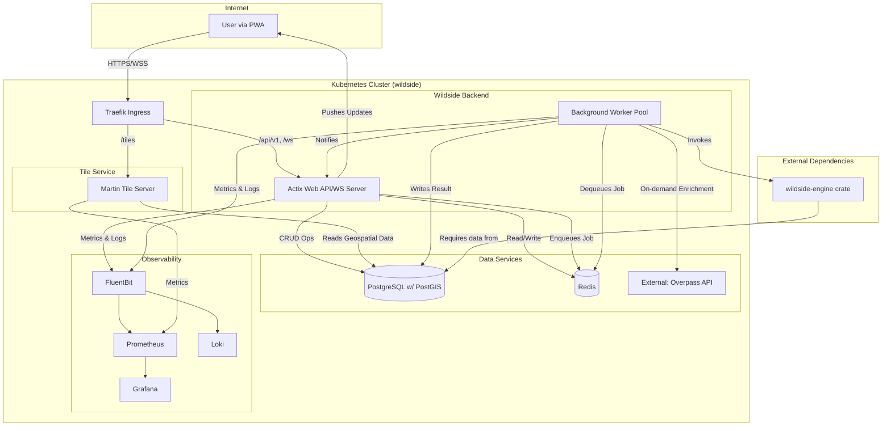
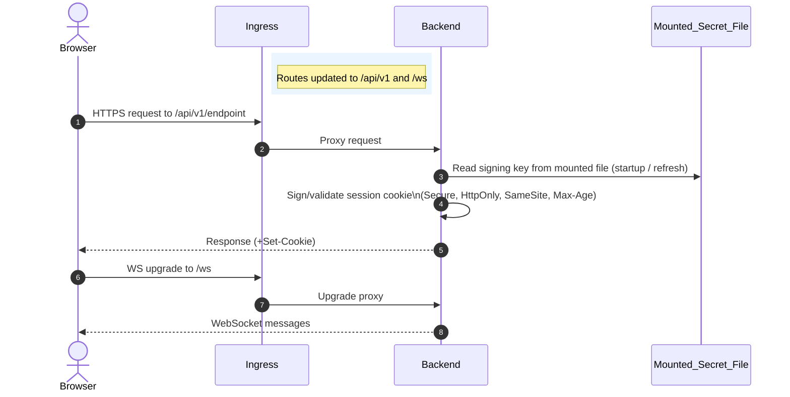
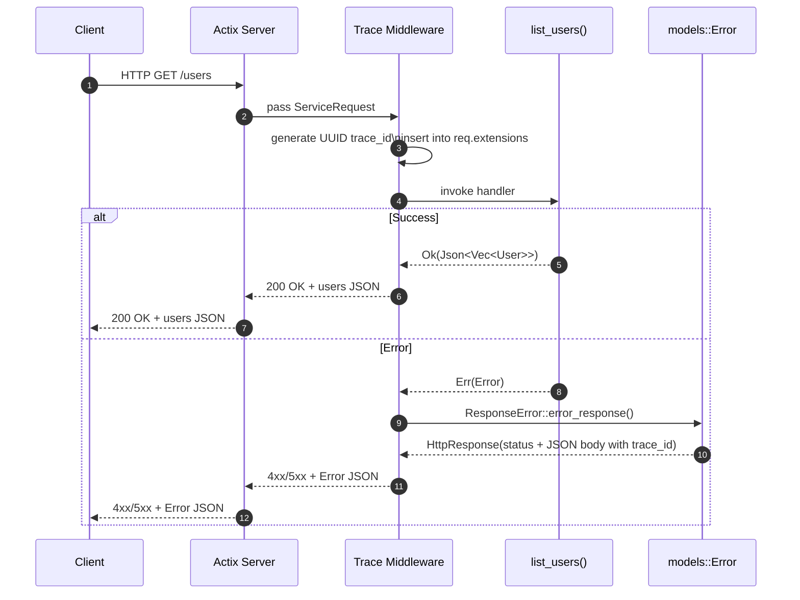
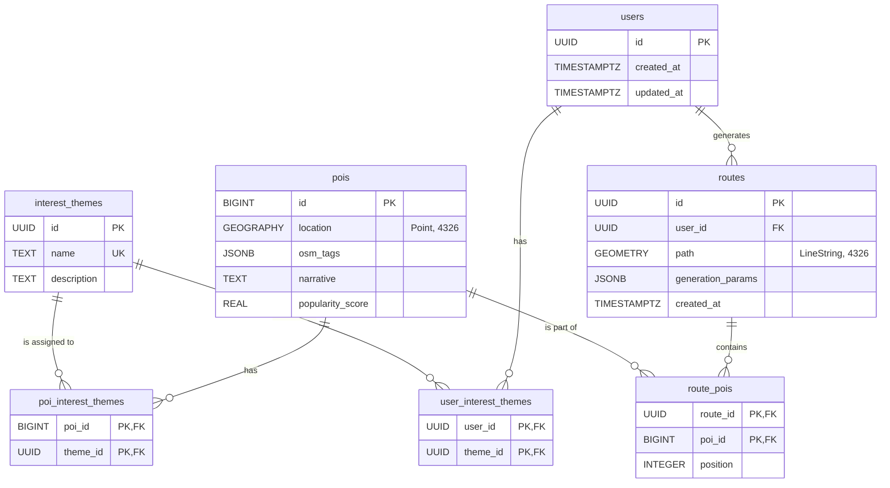
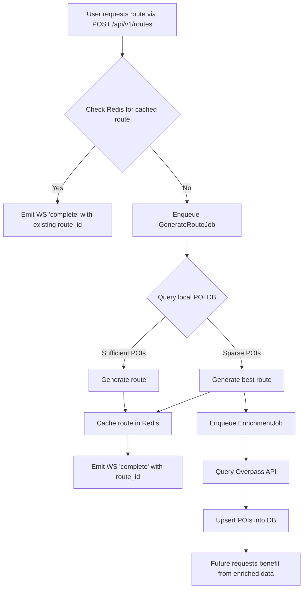

# Wildside Backend: Functional Design Specification

## 1. Introduction

This document provides a functional design and implementation plan for the
Wildside backend service. It is intended for the engineering team responsible
for building, deploying, and maintaining the application. The document details
the system's architecture, the responsibilities of each component, and a series
of actionable tasks to guide development from the current state to the complete
MVP.

The backend is a monolithic Rust application built with Actix Web, designed to
be deployed as a containerized service on Kubernetes. It provides a RESTful API
and a WebSocket interface for real-time communication, with computationally
intensive tasks offloaded to a separate pool of background workers.

## 2. System Architecture

The system is composed of a primary API server, a set of background workers, a
PostgreSQL database with a dedicated tile server, a Redis cache, and an
observability stack. All components are designed to run within a Kubernetes
cluster and be managed via a GitOps workflow.

For screen readers: This diagram shows the backend components and their
interactions.



For screen readers: This sequence diagram traces a request from browser to
backend, including how the service reads its signing key and manages session
cookies.



## 3. Core Components & Implementation Plan

This section details each functional component of the backend, its current
implementation status, and the required work to complete the MVP.

### 3.1. Web Application Server

The primary application entry point, responsible for handling all synchronous
API and WebSocket traffic.

- **Technology:** Actix Web, Actix WS

- **Current Status:** A foundational Actix Web server exists in
  `backend/src/main.rs`. It is configured with basic logging (`tracing`),
  OpenAPI documentation (`utoipa`), and a working WebSocket endpoint (`/ws`).

- **Key Responsibilities:**

  - Expose a RESTful API for all application functionality (user management,
    route requests, etc.).

  - Manage WebSocket connections for real-time client communication.

  - Handle user authentication and session management.

  - Enqueue jobs for the background workers to process.

  - Serve a `/metrics` endpoint for Prometheus and a `/healthz` endpoint for
    Kubernetes probes.

- **Implementation Tasks:**

  - [ ] **Session Management:** Implement stateless, signed-cookie sessions.
    Use the `actix-session` crate with a cookie-based backend. Load the signing
    key from a secret store (for example, a Kubernetes Secret or Vault) and
    mount or inject it for the service at runtime. Name the cookie `session`
    and configure it with `Secure=true`, `HttpOnly=true`, and `SameSite=Lax`
    (or `Strict`). Startup must abort in production if the key file cannot be
    read; a temporary key is permitted only in development when
    `SESSION_ALLOW_EPHEMERAL=1`.

    ```rust
    use actix_session::{storage::CookieSessionStore, SessionMiddleware};
    use actix_web::cookie::{time::Duration, Key, SameSite};
    use actix_web::web;
    use std::env;
    use std::io;
    use tracing::warn;

    let key_path = env::var("SESSION_KEY_FILE")
        .unwrap_or_else(|_| "/var/run/secrets/session_key".into());
    let key = match std::fs::read(&key_path) {
        Ok(bytes) => Key::from(&bytes),
        Err(e) => {
            let allow_dev = env::var("SESSION_ALLOW_EPHEMERAL").ok().as_deref() == Some("1");
            if cfg!(debug_assertions) || allow_dev {
                warn!(path = %key_path, error = %e, "using temporary session key (dev only)");
                Key::generate()
            } else {
                return Err(io::Error::other(format!(
                    "failed to read session key at {key_path}: {e}"
                )));
            }
        }
    };

    let cookie_secure = env::var("SESSION_COOKIE_SECURE")
        .map(|v| v != "0")
        .unwrap_or(true);
    let session_middleware = SessionMiddleware::builder(
        CookieSessionStore::default(),
        key,
    )
    .cookie_name("session")
    .cookie_path("/")
    .cookie_secure(cookie_secure)
    .cookie_http_only(true)
    .cookie_same_site(SameSite::Lax)
    // Set at deploy time if required:
    //.cookie_domain(Some("example.com".into()))
    .cookie_max_age(Duration::hours(2))
    .build();

    let api = web::scope("/api/v1")
        .wrap(session_middleware)
        .service(list_users);
    ```

    `CookieSessionStore` keeps session state entirely in the cookie, avoiding an
    external store such as Redis. Browsers cap individual cookies at roughly 4
    KB, so session payloads must remain well under this limit.

    Set `SESSION_COOKIE_SECURE=0` during local development to allow cookies over
    plain HTTP; production deployments should leave this unset to enforce HTTPS.

    Deployment manifests in `deploy/k8s/` should mount the secret read-only and
    expose its path to the service (for instance, via a `SESSION_KEY_FILE`
    environment variable). Use high-entropy (≥64-byte) keys and rotate them by
    deploying new secrets and reloading the service, so the fresh key takes
    effect while the previous key remains available for validating existing
    sessions during the rollout. For seamless rotation, run at least two
    replicas and perform a rolling update, so pods with the prior key continue
    to validate existing cookies until expiry. Scope the middleware to routes
    that require authentication. Developers can opt into an ephemeral session
    key by setting `SESSION_ALLOW_EPHEMERAL=1`; production should leave this
    unset so startup fails if the key file is unreadable.

  - [x] **Login endpoint:** Add `POST /api/v1/login` to validate credentials
        and initialise sessions.

  - [ ] **Observability:**

    - Integrate the `actix-web-prom` crate as middleware to expose default
      Prometheus metrics on a `/metrics` endpoint.

    - Implement a `/healthz` endpoint that returns a `200 OK` response.

    - Ensure all request handlers have `tracing` spans with a unique
      `request_id`, propagating it via a `Trace-Id` response header for
      client correlation.

  - [ ] **API Endpoints:**

    - Implement the full suite of user management endpoints (create, read,
      update) under `/api/v1/users`.

    - Create a `/api/v1/routes` endpoint to accept route generation requests.
      This endpoint should validate the input and enqueue a `GenerateRouteJob`
      (see § 3.4).

The flow for request handling and trace propagation is shown below:



### 3.2. Route Generation Engine Integration

The core logic for calculating walking routes is encapsulated in the
`wildside-engine` library. The backend is responsible for invoking this library
and managing its execution.

- **Technology:** `wildside-engine` (Rust crate)

- **Current Status:** The `wildside-engine` crate exists as a separate
  repository. The `wildside` backend does not yet include it as a dependency.

- **Key Responsibilities:**

  - The backend must provide the engine with the necessary inputs: user
    preferences, geographical boundaries, and time constraints.

  - The backend must handle the output from the engine (a structured route)
    and persist it to the database.

  - Execution of the engine must not block the main server threads.

- **Implementation Tasks:**

  - [ ] **Dependency:** Add `wildside-engine` to `backend/Cargo.toml` as a
    local path dependency for development, to be replaced by a Git dependency
    in CI.

  - [ ] **Execution:** The `GenerateRouteJob` handled by the background
    worker (see § 3.4) will be the primary point of integration. The worker
    will call the main `wildside_engine::generate_route()` function.

  - [ ] **Data Access:** The engine requires access to POI data. The worker
    will pass a database connection or a pre-fetched dataset to the engine as
    required by its interface.

### 3.3. Data Persistence

All persistent application data is stored in a PostgreSQL database. For the
MVP, the strategy for populating and maintaining this data is a hybrid model,
combining a pre-seeded baseline with on-demand enrichment to ensure both high
performance and data relevance.

- **Technology:** PostgreSQL with PostGIS extension, Diesel ORM, `r2d2` for
  connection pooling.

- **Current Status:** Diesel is integrated, and a `users` model exists. A
  `r2d2`-based connection pool is configured in `main.rs`.

- **Key Responsibilities:**

  - Store user data, including preferences and saved routes.

  - Store a performant, locally cached mirror of geospatial data (Points of
    Interest, road networks) for the routing engine.

  - Evolve the local dataset over time by enriching it with new data based on
    user requests.

  - Utilize the PostGIS extension for efficient spatial queries.

  - Store OSM tags and other flexible data in `JSONB` columns.

#### 3.3.1. Entity-Relationship Diagram

For screen readers: This diagram illustrates the relationships between the core
data entities.

The ER diagram encodes PostGIS types as display labels to satisfy Mermaid
parsing rules (for example, GEOGRAPHY location "Point, 4326" and GEOMETRY path
"LineString, 4326"). The schema tables below use the canonical PostGIS types
(for example, `GEOGRAPHY(Point, 4326)` and `GEOMETRY(LineString, 4326)`).



`location` stores a `Point` in SRID 4326, and `path` stores a `LineString` in
SRID 4326.

#### 3.3.2. Detailed Schema Design

Abbreviations used: Primary Key (PK), Foreign Key (FK), Unique Key (UK), Not
Null (NN), and Generalized Search Tree (GiST).

**`users`**: Stores user account information.

| Column | Type | Constraints | Description |
| ------------ | ------------- | ------------------------------------------ | --------------------------- |
| `id` | `UUID` | `PRIMARY KEY`, `DEFAULT gen_random_uuid()` | Unique user identifier. |
| `created_at` | `TIMESTAMPTZ` | `NOT NULL`, `DEFAULT NOW()` | Timestamp of user creation. |
| `updated_at` | `TIMESTAMPTZ` | `NOT NULL`, `DEFAULT NOW()` | Timestamp of last update. |

**`interest_themes`**: A lookup table for available interest themes.

| Column | Type | Notes |
| ------------- | ------ | --------------------------------------------- |
| `id` | `UUID` | PK; default `gen_random_uuid()` |
| `name` | `TEXT` | NN; unique; display name (e.g., "Street Art") |
| `description` | `TEXT` | Optional short description |

**`user_interest_themes`**: A join table linking users to their selected themes.

| Column | Type | Constraints | Description |
| ---------- | ------ | ------------------------------------------------- | ------------------------------------------- |
| `user_id` | `UUID` | `PRIMARY KEY`, `FOREIGN KEY (users.id)` | Foreign key to the `users` table. |
| `theme_id` | `UUID` | `PRIMARY KEY`, `FOREIGN KEY (interest_themes.id)` | Foreign key to the `interest_themes` table. |

**`pois`**: Stores all Points of Interest.

| Column | Type | Notes |
| ------------------ | ------------------------ | ------------------------------------------- |
| `id` | `BIGINT` | PK; OSM element ID |
| `location` | `GEOGRAPHY(Point, 4326)` | NN; GIST index |
| `osm_tags` | `JSONB` | OSM tags; GIN index |
| `narrative` | `TEXT` | Optional engaging description |
| `popularity_score` | `REAL` | Default 0.5; 0.0 hidden gem – 1.0 hotspot |

**`poi_interest_themes`**: A join table linking POIs to relevant themes.

| Column | Type | Constraints | Description |
| ---------- | -------- | ------------------------------------------------- | ------------------------------------------- |
| `poi_id` | `BIGINT` | `PRIMARY KEY`, `FOREIGN KEY (pois.id)` | Foreign key to the `pois` table. |
| `theme_id` | `UUID` | `PRIMARY KEY`, `FOREIGN KEY (interest_themes.id)` | Foreign key to the `interest_themes` table. |

**`routes`**: Stores generated walks.

| Column | Type | Notes |
| ------------------- | ---------------------------- | ------------------------------------- |
| `id` | `UUID` | PK; default `gen_random_uuid()` |
| `user_id` | `UUID` | FK `users.id`; nullable |
| `path` | `GEOMETRY(LineString, 4326)` | Full path; GIST index |
| `generation_params` | `JSONB` | Parameters used to generate the route |
| `created_at` | `TIMESTAMPTZ` | NN; default `NOW()` |

**`route_pois`**: A join table to store the ordered sequence of POIs for a
specific route.

| Column | Type | Constraints | Description |
| ---------- | --------- | --------------------------------------------- | -------------------------------------------- |
| `route_id` | `UUID` | `PK (with poi_id)`, `FOREIGN KEY (routes.id)` | Foreign key to the `routes` table. |
| `poi_id` | `BIGINT` | `PK (with route_id)`, `FOREIGN KEY (pois.id)` | Foreign key to the `pois` table. |
| `position` | `INTEGER` | `NOT NULL`, `UNIQUE (route_id, position)` | Sequential position of this POI in the walk. |

#### 3.3.3. MVP Data Strategy: Hybrid Ingestion and Caching

To balance the need for performance with the challenges of data volume,
freshness, and relevance, the backend adopts a three-layered hybrid strategy
for the MVP.

For screen readers: This flowchart shows how route requests are fulfilled and
how enrichment improves future results.



- **Layer 1: Foundational Pre-Seeding (The "Hot Cache").** The core
  `wildside-engine` requires a fast, local data source for its intensive
  queries. For the MVP, a **one-time, geographically scoped data ingestion**
  will be performed.

  - **Scope:** A defined polygon covering the initial launch area (e.g., the
    City of Edinburgh).

  - **Process:** A script will download a regional OSM extract (e.g., from
    Geofabrik), filter for a comprehensive baseline of common POI tags
    (`amenity`, `historic`, `tourism`, `leisure`, `natural`), and ingest this
    data into the PostGIS `pois` table.

  - **Purpose:** This guarantees that the vast majority of route requests
    have a rich, local dataset to draw from, ensuring the "time to first walk"
    is consistently fast.

- **Layer 2: On-Demand Enrichment (The "Warm Cache").** This layer addresses
  the "cold start" problem for niche interests and ensures the dataset evolves
  based on user demand rather than initial assumptions.

  - **Trigger:** When the `GenerateRouteJob` queries the local database and
    finds a sparse set of results for a user's chosen theme in a given area
    (e.g., fewer than a threshold of `N` POIs), it triggers this process.

  - **Process:** The worker proceeds to generate the best route it can with
    the limited local data. Crucially, it also enqueues a _separate,
    low-priority `EnrichmentJob`_. This new job will perform a targeted query
    against an external source (like the Overpass API) for the missing POI
    types in that geographic bounding box. The results are then inserted or
    updated (`UPSERT`) into the `pois` table.

  - **Purpose:** This enriches the local dataset precisely where it was found
    lacking. The first user interested in "brutalist architecture" gets a
    reasonable walk immediately, but in doing so, they trigger a process that
    ensures the next user gets a fantastic one. This solves the problems of
    data sparseness and making incorrect assumptions about user taste.

- **Layer 3: Route Output Caching.** This concerns the _results_ of the
  computation, not the source data.

  - **Process:** When a route is successfully generated, its full definition
    is cached in Redis. The cache key will be a hash of the precise request
    parameters (location, duration, themes, etc.). Saved routes will have their
    cache TTL removed, effectively pinning them.

  - **Purpose:** This prevents re-computation for identical requests,
    providing an instantaneous response for popular or repeated queries.

#### 3.3.4. Implementation Tasks

- [ ] **Initial Data Seeding:** Create a standalone data ingestion script
  (e.g., using Python with `osmium`) that performs the one-time pre-seeding of
  the database for a defined geographic area (Edinburgh).

- [ ] **Implement On-Demand Enrichment Logic:** In the `GenerateRouteJob`
  handler, add logic to detect when the local POI query returns a sparse result
  set. If triggered, this logic should enqueue a follow-up `EnrichmentJob` with
  the relevant parameters (bounding box, interest themes).

- [ ] **Implement Schema Migrations:** Create the database schema using Diesel
  migration files.

### 3.4. Background Task Workers

Asynchronous and long-running tasks are executed by a separate pool of worker
processes to avoid blocking the main API server.

- **Technology:** Apalis (with a Redis or Postgres backend).

- **Current Status:** This component is purely at the design stage. No
  implementation exists.

- **Key Responsibilities:**

  - Execute computationally intensive jobs (`GenerateRouteJob`).

  - Perform data enrichment tasks (`EnrichmentJob`).

  - Perform periodic maintenance tasks (e.g., refreshing data from external
    sources).

- **Implementation Tasks:**

  - [ ] **Integration:**

    - Add `apalis` to `backend/Cargo.toml`.

    - Configure Apalis to use Redis as the job queue broker, with separate
      queues for high-priority (e.g., `route_generation`) and low-priority
      (`enrichment`) tasks.

    - Enforce bounded retries with exponential backoff and per-job timeouts,
      sending exhausted jobs to a dead-letter queue.

  - [ ] **Worker Binary:** Modify `main.rs` to launch in "worker" mode based
    on a CLI flag or environment variable (`WILDSIDE_MODE=worker`). In this
    mode, it should start the Apalis worker pool.

  - [ ] **Job Definitions:**

    - Define and implement the `GenerateRouteJob` as previously described.
      It should now include the logic to trigger the `EnrichmentJob`.

    - Define and implement the `EnrichmentJob`. This job's handler will
      construct and execute a query against the Overpass API with an HTTP
      client that enforces network timeouts. It will use Diesel to `UPSERT` the
      results into the `pois` table.

  - [ ] **Deployment:** Create a second Kubernetes `Deployment` for the
    workers.

### 3.5. Caching Layer

An in-memory cache is used to improve performance and reduce database load.

- **Technology:** Redis

- **Current Status:** This component is purely at the design stage.

- **Key Responsibilities:**

  - Cache the results of expensive, deterministic operations, such as route
    generation for common parameters.

  - Cache frequently accessed, slow-changing data from the database (e.g.,
    popular POIs).

- **Implementation Tasks:**

  - [ ] **Integration:** Add the `redis` crate and configure a Redis
    connection pool available to the Actix application state.

  - [ ] **Route Caching:**

    - Before enqueuing a `GenerateRouteJob`, the API handler must first
      check Redis for a cached result. The cache key should be a hash of the
      route request parameters.

    - On successful route generation, the background worker must write the
      result to the cache with a reasonable TTL (e.g., 24 hours).

### 3.6. Observability

The system must be fully instrumented to provide insight into its performance,
reliability, and user behaviour.

- **Technology:** Prometheus, Grafana, Loki, PostHog, `tracing` crate,
  [`postgres_exporter`](https://github.com/prometheus-community/postgres_exporter),
  [`redis_exporter`](https://github.com/oliver006/redis_exporter).

- **Current Status:** `tracing` is integrated for basic logging. The Kubernetes
  manifests are configured to support the Prometheus Operator.

- **Key Responsibilities:**

  - **Metrics (Prometheus):** Expose key operational metrics for monitoring
    and alerting.

  - **Logging (Loki):** Output structured, correlated logs for debugging.
  Each request is wrapped by tracing middleware that assigns a UUID
  `trace_id`, propagated to logs and error responses.

  - **Analytics (PostHog):** Send events to track user engagement and product
    funnels.

- **Scrape configuration:** Use Prometheus Operator ServiceMonitors to
  scrape exporters every 15 seconds with consistent `job` and `instance`
  labels.

- **Implementation Tasks:**

  - [ ] **Metrics:** In addition to the `actix-web-prom` metrics, implement
    the following custom application metrics:

    - A histogram (`route_generation_duration_seconds`) to track the
      execution time of the `GenerateRouteJob`.

    - A counter (`jobs_total{type,status}`) to track the number of
      background jobs processed (e.g., type=`GenerateRoute`,
      status=`success|failure`).

    - A gauge (`websocket_connections_active`) for the number of connected
      WebSocket clients.

    - A counter (`enrichment_jobs_total{status}`) to track the
      success/failure of data enrichment jobs.

    - A gauge (`pois_total`) for the total number of POIs in the local
      database, to observe growth over time.

  - [ ] **Database metrics:** Deploy `postgres_exporter` and scrape
    `pg_up`, `pg_database_size_bytes`, `pg_stat_database_xact_commit`,
    `pg_stat_activity_count`, and `pg_stat_statements_total_time` to monitor
    write throughput, connection usage, and slow queries. ServiceMonitors
    should scrape every 15 seconds with consistent `job` and `instance`
    labels.

    ```yaml
    # prometheus-rule.yaml (postgres)
    groups:
    - name: postgres.rules
      rules:
      - record: pg:db_write_tps:rate5m
        expr: sum by (datname) (rate(pg_stat_database_xact_commit[5m]))
      - record: pg:db_total_size_bytes
        expr: sum(pg_database_size_bytes)
      - alert: PostgresReplicationLagHigh
        expr: max(pg_replication_lag_bytes) > 134217728
        for: 10m
        labels: {severity: warning}
        annotations:
          summary: "PostgreSQL replication lag high"
          description: "Replica is {{ $value }} bytes behind."
    ```

  - [ ] **Cache metrics:** Deploy `redis_exporter` and track
    `redis_keyspace_hits_total`, `redis_keyspace_misses_total`,
    `redis_evicted_keys_total`, `redis_memory_used_bytes`, and
    `redis_command_duration_seconds` to surface cache efficiency, pressure,
    and latency.

    ```yaml
    # prometheus-rule.yaml (redis)
    groups:
    - name: redis.rules
      rules:
      - record: redis:cache_hit_ratio:rate5m
        expr: |
          sum(rate(redis_keyspace_hits_total[5m])) /
          (sum(rate(redis_keyspace_hits_total[5m])) +
           sum(rate(redis_keyspace_misses_total[5m])))
      - alert: RedisEvictionsOccurring
        expr: rate(redis_evicted_keys_total[5m]) > 0
        for: 10m
        labels: {severity: warning}
        annotations:
          summary: "Redis evictions occurring"
          description: "Evictions indicate memory pressure or suboptimal TTLs."
    ```

  - [ ] **Logging:** Ensure all logs are emitted as structured JSON and
    include the `trace_id` propagated from the initial API request, even into
    the background jobs.

  - [ ] **Analytics:**

    - Integrate the PostHog Rust client.

    - Send a `RouteComputed` event from the background worker upon
      successful route generation, including properties like
      `route_duration_minutes` and `poi_count`.

    - Send `UserSignup` and `UserLogin` events from the relevant API
      endpoints.

## 4. API and WebSocket Specification

This section defines the API contracts for client-server communication.

### 4.1. REST API (v1)

All REST endpoints are prefixed with `/api/v1`.

#### User & Session Management

| Method | Path | Description | Authentication |
| ------ | ---------------------------- | ----------------------------------------------------- | -------------- |
| `POST` | `/api/v1/login` | Establishes a user session from credentials. | None |
| `GET` | `/api/v1/users/me` | Retrieves the current user's profile and preferences. | Session Cookie |
| `PUT` | `/api/v1/users/me/interests` | Updates the current user's selected interest themes. | Session Cookie |

#### Content

| Method | Path | Description | Authentication |
| ------ | ------------------------- | ---------------------------------------------------- | -------------- |
| `GET` | `/api/v1/interest-themes` | Retrieves the list of all available interest themes. | None |

#### Routes

| Method | Path | Description | Authentication |
| ------ | --------------------------- | --------------------------------------------------------- | -------------- |
| `POST` | `/api/v1/routes` | Submits a request to generate a new walking route. | Session Cookie |
| `GET` | `/api/v1/routes/{route_id}` | Retrieves a previously generated route by its ID. | Session Cookie |
| `GET` | `/api/v1/users/me/routes` | Retrieves a list of routes generated by the current user. | Session Cookie |

**`POST /api/v1/routes` Request Body:**

```json
{
  "start_location": {
    "type": "Point",
    "coordinates": [-3.1883, 55.9533]
  },
  "duration_minutes": 60,
  "interest_theme_ids": [
    "f47ac10b-58cc-4372-a567-0e02b2c3d479"
  ],
  "popularity_bias": 0.7,
  "accessibility": {
    "avoid_stairs": true,
    "prefer_well_lit": false
  }
}
```

On success, this endpoint returns a `202 Accepted` with a body containing a
`request_id` and a `status_url` for polling the job (for example,
`/api/v1/routes/status/{request_id}`). The `route_id` is not available until
the WebSocket `complete` event supplies it.

### 4.2. WebSocket API

The WebSocket is available at `/ws`. After connection, the client is implicitly
subscribed to notifications for their user ID, which is identified via the
session cookie provided during the handshake.

#### Server-to-Client Messages

**`route_generation_status`**

Pushed to the client to provide real-time updates on a route generation job.

- **`type`**: `"route_generation_status"`

- **Payload**:

  - `request_id` (string): Correlates with the ID returned from
    `POST /api/v1/routes`.

  - `status` (string): One of `pending`, `in_progress`, `complete`, `failed`.

  - `route_id` (string, optional): The ID of the final route, present when
    status is `complete`.

  - `error` (string, optional): An error message, present when status is
    `failed`.

#### Client-to-Server Messages

**`update_location`** (For future "In-Walk Navigation" features)

Sent periodically by the client to update the server with their current
location during an active walk.

- **`type`**: `"update_location"`

- **Payload**:

  - `route_id` (string): The ID of the route being navigated.

  - `location` (GeoJSON Point): The user's current coordinates.

## 5. Tile Serving Architecture

To deliver a rich, interactive, and highly performant map experience, the
application will not rely on external third-party map providers for dynamic
data. Instead, the application will serve first-party vector tiles directly
from the PostGIS database. This provides full control over map styling, data
representation, and performance.

- **Technology:** [Martin](https://martin.maplibre.org/), a
  high-performance vector tile server written in Rust.

- **Strategy:** Martin will be deployed as a separate, stateless service within
  the Kubernetes cluster. It will connect directly to the primary PostGIS
  database (ideally with a read-only user) and expose tile endpoints that can
  be consumed by the frontend PWA (using a library like MapLibre GL JS).

### 5.1. Architectural Integration

The tile server is a distinct service, separate from the main Wildside backend
monolith. This separation of concerns is crucial: the backend handles business
logic, authentication, and orchestration, while Martin's sole responsibility is
the efficient generation and serving of map tiles.

For screen readers: The flowchart outlines how the tile server interacts with
the frontend and database.

```mermaid
flowchart TD
    subgraph "Frontend PWA"
        A[MapLibre GL JS Client]
    end

    subgraph "Kubernetes Cluster"
        B[Ingress<br>/tiles/&#123;source&#125;/&#123;z&#125;/&#123;x&#125;/&#123;y&#125;] --> C[Martin Service];
        C -- SQL / Function Call --> D[(PostGIS Database)];
        D -- Tables, Views, Functions --> C;
        C -- Vector Tile (PBF) --> B;
        
        E[Wildside Backend API] --> D;
    end
    
    A -- Requests Tiles --> B;
```



### 5.2. MVP Tile Sources

For the MVP, Martin will be configured to serve the following dynamic tile
sources. These sources will be defined in Martin's configuration file
(`config.yaml`).

#### 5.2.1. Points of Interest (`pois`)

This layer will expose curated and enriched POIs, allowing the frontend to
display them dynamically based on zoom level and user context.

- **Source Type:** Table

- **Table Name:** `public.pois`

- **Endpoint:** `/tiles/pois/{z}/{x}/{y}.pbf`

- **Implementation:** Martin can serve this directly. The configuration will
  determine which columns from the `pois` table are included as properties in
  the tile features (e.g., `id`, `popularity_score`) to keep the tile size
  minimal. Full POI details are fetched from the main REST API when a user
  interacts with a point.

#### 5.2.2. Generated Routes (`routes`)

This layer will display a specific, user-generated route on the map. Requests
hit the cluster Ingress at `/tiles/...`, which forwards them directly to
Martin. As routes are user-specific and generated on demand, the system cannot
simply serve the entire `routes` table. A PostGIS function is the ideal
solution.

- **Source Type:** Function

- **Endpoint:** `/tiles/routes/{route_id}/{z}/{x}/{y}.pbf`

- **Authentication:** Requests must include a short-lived JWT that encodes the
  `route_id` along with `aud` and `iss` claims. Martin validates the token with
  `pgjwt`, permits minimal clock skew, and rejects tokens that exceed the
  expiry or whose claims do not match the request.

- **Implementation:**

  1. Create a PostGIS function, e.g.,
     `get_route_tile(route_id UUID, z integer, x integer, y integer)`.

  2. This function will take the `route_id` from the URL path as a parameter.

  3. It will query the `routes` table for the matching `path` geometry.

  4. It will use PostGIS functions like `ST_AsMVTGeom` and `ST_AsMVT` to
     generate the vector tile for the requested `z/x/y` coordinate, containing
     only the relevant segment of that specific route's linestring.

  5. Martin will be configured to call this function, passing in the
     parameters from the request URL.

#### 5.2.3. Base Network (Optional Post-MVP)

For greater control over styling and to reduce reliance on external providers
entirely, the system could serve a first-party base layer of roads, paths, and
land use polygons. This would involve ingesting more comprehensive OSM data
(e.g., from `planet_osm_line`, `planet_osm_polygon`) and creating table or
function sources for them. This is not required for the MVP, but is a logical
next step.

### 5.3. Implementation Tasks

- [ ] **Create Martin Docker Image:** Although a pre-built image exists, a
  custom image may be built to bundle the specific `config.yaml`.

- [ ] **Kubernetes Deployment:** Create a new `Deployment` and `Service`
  manifest for the Martin tile server in the Kubernetes configuration.

- [ ] **Ingress Configuration:** Add a new rule to the Traefik `IngressRoute`
  to direct traffic from a subdomain (e.g., `tiles.wildside.app`) or a path
  prefix (e.g., `/tiles`) to the Martin service.

- [ ] **Martin Configuration:** Create a `config.yaml` file for Martin. This
  file will define the database connection string and specify the tile sources
  for `pois` and `routes` as detailed above. This config should be mounted into
  the Martin pod via a `ConfigMap`.

- [ ] **Create PostGIS Function:** Implement and test the `get_route_tile` SQL
  function in a new Diesel migration file. Ensure it is performant and returns
  correctly formatted vector tile data.

- [ ] **Observability:** Configure the Prometheus Operator to scrape the
  `/metrics` endpoint that Martin exposes by default, and create a new Grafana
  dashboard to monitor tile serving performance (e.g., request latency, cache
  hit rates, error rates).
