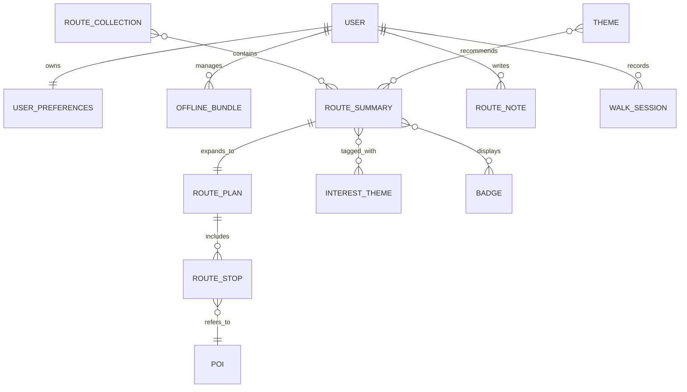

# Wildside PWA data model (mockup-derived, backend-compatible)

Last updated: 14 December 2025

## Purpose

Wildside’s UI was proven out in a fixture-driven mockup, but the UI components
must be able to migrate to backend data without rewrites.

This document defines a **backend-compatible data model** for the Wildside PWA
that supports:

- Fixture-driven development in the PWA, with a clean upgrade path to “real
  data”.
- A hexagonal backend design (ports-and-adapters) where domain types are valid
  without framework dependencies.
- Local-first behaviour: fast reads, offline mutation queueing, and offline map
  bundles.

This is a design document, not an implementation plan.

## Scope and non-goals

In scope:

- Entity and value-object schemas that cover the PWA’s core flows:
  Explore, Discover, Customise, Map, Safety, Offline downloads, and Walk
  completion.
- How those entities map onto the backend’s hexagonal architecture (domain
  modules, ports, and inbound/outbound adapters).
- A persistence-oriented view:
  PostgreSQL/PostGIS on the backend; IndexedDB persistence on the frontend,
  with Dexie and/or Cache Storage for heavy assets and the outbox.

Out of scope:

- Full route-generation engine design (scoring, optimisation, enrichment).
- Exact PostGIS table layouts for tiles beyond what the PWA needs.
- CRDTs. The model remains compatible with later upgrades, but does not require
  them for MVP.

## Constraints (carried over from existing docs)

- **Hexagonal backend:** adapters translate at boundaries and do not invent
  domain state.
- **Local-first React:** render from the local copy first and treat the network
  as optional.
- **Offline-first assets:** offline bundles are first-class entities, but tile
  bytes are stored outside React state (Cache Storage or Dexie keyed by bundle
  metadata).
- **Dexie’s role:** Dexie is a durable storage engine for heavy/binary assets
  and an outbox, not a synchronisation worldview.

## Model layering

To keep both the backend and the client predictable, the model is separated
into four layers:

1. **Descriptors (small, stable registries):** bounded vocabularies such as
   difficulties, safety toggles, and tags.
2. **Catalogue (public, read-mostly):** Explore’s categories, themes,
   collections, and curated routes.
3. **Generated routes (per request):** route plans produced by the route
   engine (geometry + ordered stops).
4. **User state (write-heavy):** interests, saved routes, notes, walk progress,
   offline bundles, and completion summaries.

The UI renders cards from projections over these layers.

## Shared primitives (backend and frontend)

### Identifiers

Use UUIDs for entities that can be created on the client while offline:

- Notes, favourites, offline bundles, and walk sessions use client-generated
  UUIDs (prefer UUIDv7) so they can be created offline without coordination.
- Server-generated identifiers (route requests, internal jobs) are also UUIDs.

Where humans benefit from stable, readable references, include an optional
`slug` or `code` field alongside the UUID:

- `id` is the stable primary key.
- `slug` is a stable, unique-per-type string for deep links, analytics labels,
  and debugging. It must never be used as an integrity key.

### Time and versions

All timestamps are ISO 8601 UTC on the wire.

For user-authored content, include an integer `revision` (or `etag`) for
optimistic concurrency. The PWA can ignore this initially, but it provides a
clean upgrade path for multi-device consistency.

### Units

Store numeric quantities in SI base units in all persisted models:

- Distances in metres.
- Durations in seconds.
- Bounding boxes in WGS84 coordinates.
- Byte sizes as integers.

### Localization

Use an entity-localisation map keyed by locale code:

```ts
type LocaleCode = string;

type LocalizedStringSet = {
  readonly name: string;
  readonly shortLabel?: string;
  readonly description?: string;
};

type EntityLocalizations = Record<LocaleCode, LocalizedStringSet>;
```

Backend persistence can store this as `jsonb` per entity or as a translation
table. The on-wire shape remains stable either way.

### Media

Use a small, explicit media object rather than raw strings:

```ts
type ImageAsset = {
  readonly url: string;
  readonly alt: string;
};
```

## Descriptors

Descriptors are small vocabularies that the UI uses everywhere. They should be
available offline and versioned slowly.

### Difficulty

Difficulty is a bounded set and can remain a string code in the domain:

```ts
type DifficultyCode = "easy" | "moderate" | "challenging";
```

### Badge, tag, and interest theme

Interests, tags, and badges are better modelled as catalogue entities because
they grow and must be localized.

```ts
type InterestTheme = {
  readonly id: string; // UUID
  readonly slug: string;
  readonly localizations: EntityLocalizations;
  readonly iconKey: string;
};

type Tag = {
  readonly id: string; // UUID
  readonly slug: string;
  readonly localizations: EntityLocalizations;
};

type Badge = {
  readonly id: string; // UUID
  readonly slug: string;
  readonly localizations: EntityLocalizations;
};
```

`iconKey` is a semantic identifier (for example `category:nature`) that the
client maps to its design tokens. The backend must not store Tailwind class
strings.

### Safety toggles and presets

Safety toggles behave like a descriptor registry plus user selections:

```ts
type SafetyToggle = {
  readonly id: string; // UUID
  readonly slug: string;
  readonly localizations: EntityLocalizations;
  readonly iconKey: string;
  readonly defaultEnabled: boolean;
};

type SafetyPreset = {
  readonly id: string; // UUID
  readonly slug: string;
  readonly localizations: EntityLocalizations;
  readonly iconKey: string;
  readonly appliedToggleIds: readonly string[];
};
```

## Catalogue (Explore and Discover)

The Explore screen uses catalogue entities that are:

- Public (can be fetched without a session).
- Read-mostly (updated by ingestion/curation jobs rather than by users).
- Cacheable (ideal for long-lived client-side caches and offline usage).

### Route summary (card-level projection)

Explore cards only need a lightweight projection of a route, not the full plan:

```ts
type RouteSummary = {
  readonly id: string; // UUID
  readonly slug?: string;
  readonly localizations: EntityLocalizations;
  readonly heroImage: ImageAsset;
  readonly distanceMetres: number;
  readonly durationSeconds: number;
  readonly rating: number;
  readonly badgeIds: readonly string[];
  readonly difficulty: DifficultyCode;
  readonly interestThemeIds: readonly string[];
};
```

### Route category, theme, and collection

Categories and themes are “ways to browse” routes.

```ts
type RouteCategory = {
  readonly id: string; // UUID
  readonly slug: string;
  readonly localizations: EntityLocalizations;
  readonly routeCount: number;
  readonly iconKey: string;
};

type Theme = {
  readonly id: string; // UUID
  readonly slug: string;
  readonly localizations: EntityLocalizations;
  readonly image: ImageAsset;
  readonly walkCount: number;
  readonly distanceRangeMetres: readonly [number, number];
  readonly rating: number;
};

type RouteCollection = {
  readonly id: string; // UUID
  readonly slug: string;
  readonly localizations: EntityLocalizations;
  readonly leadImage: ImageAsset;
  readonly mapPreview: ImageAsset;
  readonly distanceRangeMetres: readonly [number, number];
  readonly durationRangeSeconds: readonly [number, number];
  readonly difficulty: DifficultyCode;
  readonly routeIds: readonly string[];
};
```

### Trending and community picks

These are catalogue “curation overlays” rather than properties of a route:

```ts
type TrendingRouteHighlight = {
  readonly routeId: string; // RouteSummary.id
  readonly trendDelta: string;
  readonly subtitleLocalizations: EntityLocalizations;
};

type CommunityPick = {
  readonly id: string; // UUID
  readonly localizations: EntityLocalizations;
  readonly curator: {
    readonly displayName: string;
    readonly avatar: ImageAsset;
  };
  readonly rating: number;
  readonly distanceMetres: number;
  readonly durationSeconds: number;
  readonly saves: number;
  readonly routeId?: string;
};
```

`routeId` allows a community pick to resolve to a real route when available,
while keeping the UI functional when the pick is editorial content.

### Catalogue snapshot API

Expose a single “Explore snapshot” endpoint returning all catalogue entities
needed for the screen:

```ts
type ExploreCatalogueSnapshot = {
  readonly generatedAt: string; // ISO 8601
  readonly categories: readonly RouteCategory[];
  readonly routes: readonly RouteSummary[];
  readonly themes: readonly Theme[];
  readonly collections: readonly RouteCollection[];
  readonly trending: readonly TrendingRouteHighlight[];
  readonly communityPick: CommunityPick | null;
};
```

The client can persist this response and hydrate Explore without further calls.

## Generated routes (Map and Wizard)

Route generation produces a route plan heavier than a route card.

To support Map and Walk completion, the final route object needs:

- A stable `routeId`.
- Geometry suitable for map rendering.
- An ordered list of stops referring to POIs.

```ts
type GeoPoint = {
  readonly type: "Point";
  readonly coordinates: readonly [number, number];
};

type GeoLineString = {
  readonly type: "LineString";
  readonly coordinates: readonly [number, number][];
};

type PointOfInterest = {
  readonly id: string; // UUID (or "osm:<type>:<id>" if keeping source IDs)
  readonly localizations: EntityLocalizations;
  readonly categoryTagId: string;
  readonly tagIds: readonly string[];
  readonly rating?: number;
  readonly image?: ImageAsset;
  readonly openHours?: { readonly opensAt: string; readonly closesAt: string };
  readonly location: GeoPoint;
};

type RouteStop = {
  readonly id: string; // UUID
  readonly position: number; // 0-based ordering
  readonly poiId: string;
  readonly note?: string;
};

type RoutePlan = {
  readonly id: string; // UUID
  readonly summary: RouteSummary;
  readonly geometry: GeoLineString;
  readonly stops: readonly RouteStop[];
  readonly pois: readonly PointOfInterest[]; // included for offline friendliness
  readonly createdAt: string;
};
```

Including referenced POIs inline makes offline usage substantially simpler.

## User state (local-first and syncable)

User state is writable offline and should be modelled as syncable aggregates.

### User profile and preferences

```ts
type UserPreferences = {
  readonly userId: string;
  readonly interestThemeIds: readonly string[];
  readonly safetyToggleIds: readonly string[];
  readonly unitSystem: "metric" | "imperial";
  readonly revision: number;
  readonly updatedAt: string;
};
```

### Notes and progress

```ts
type RouteNote = {
  readonly id: string; // UUID (client-generated)
  readonly routeId: string;
  readonly poiId?: string;
  readonly body: string;
  readonly createdAt: string;
  readonly updatedAt: string;
  readonly revision: number;
};

type RouteProgress = {
  readonly routeId: string;
  readonly visitedStopIds: readonly string[];
  readonly updatedAt: string;
  readonly revision: number;
};
```

### Walk session and completion

Walk completion is derived from a persisted walk session:

```ts
type WalkSession = {
  readonly id: string; // UUID (client-generated)
  readonly routeId: string;
  readonly startedAt: string;
  readonly endedAt?: string;
  readonly primaryStats: ReadonlyArray<{
    readonly kind: "distance" | "duration";
    readonly value: number;
  }>;
  readonly secondaryStats: ReadonlyArray<{
    readonly kind: "energy" | "count";
    readonly value: number;
    readonly unit?: string;
  }>;
  readonly highlightedPoiIds: readonly string[];
};
```

## Offline bundles

Offline bundles bridge “catalogue JSON” and “tile bytes”.

### Offline bundle manifest

The app persists a bundle manifest as normal data, while storing bytes
elsewhere (Cache Storage or Dexie blobs).

```ts
type BoundingBox = readonly [number, number, number, number]; // [minLng, minLat, maxLng, maxLat]

type OfflineBundle = {
  readonly id: string; // UUID (client-generated)
  readonly ownerUserId?: string;
  readonly kind: "region" | "route";
  readonly routeId?: string;
  readonly regionId?: string;
  readonly bounds: BoundingBox;
  readonly zoomRange: readonly [number, number];
  readonly estimatedSizeBytes: number;
  readonly createdAt: string;
  readonly updatedAt: string;
  readonly status: "queued" | "downloading" | "complete" | "failed";
  readonly progress: number; // 0..1
};
```

### Tile storage

Two storage strategies remain compatible with this model:

- **Service Worker + Cache Storage:** cache tile URLs under their request URLs;
  `OfflineBundle` stores bounds/zoom needed to reconstruct URL sets.
- **Dexie tile table:** store tile blobs by compound key `{bundleId, z, x, y}`,
  allowing explicit eviction and accounting.

### Outbox (offline mutations)

To synchronise offline writes, store an explicit outbox table in Dexie:

```ts
type OutboxItem = {
  readonly id: string; // UUID (client-generated)
  readonly type: string;
  readonly aggregateId: string;
  readonly payload: unknown;
  readonly createdAt: string;
  readonly lastAttemptAt?: string;
  readonly status: "pending" | "inFlight" | "failed";
};
```

Outbound HTTP writes include `Idempotency-Key = OutboxItem.id` so the backend
can deduplicate retries safely.

## Backend hexagon mapping (domain modules and ports)

Suggested domain modules:

- `domain::catalogue`: route summaries, categories, collections, themes,
  descriptors (interests, tags, badges).
- `domain::routing`: route requests, route plans, stops, POI projections.
- `domain::user`: user profile and preferences.
- `domain::annotations`: notes, favourites, and progress.
- `domain::offline`: offline bundle manifests (not tile bytes).

Suggested driven ports (repositories/services):

- `CatalogueRepository` (read): Explore snapshots and descriptor sets.
- `RouteRepository` (read/write): store/load generated routes and statuses.
- `PoiRepository` (read): load POIs for route plans and tiles.
- `UserRepository` (read/write): user profile and session ownership.
- `UserPreferencesRepository` (read/write): interests and safety settings with
  optimistic concurrency.
- `RouteAnnotationRepository` (read/write): notes, favourites, progress.
- `OfflineBundleRepository` (read/write): bundle manifests per user/device.

## Suggested inbound endpoints (minimum set)

The following endpoint set is sufficient to back the PWA’s initial screens:

- `GET /api/v1/catalogue/explore` → `ExploreCatalogueSnapshot`
- `GET /api/v1/interest-themes` → `InterestTheme[]`
- `PUT /api/v1/users/me/preferences` → `UserPreferences`
- `POST /api/v1/routes` → `{ requestId }`
- `GET /api/v1/routes/{requestId}` → `{ status, routeId?, routePlan? }`
- `GET /api/v1/routes/{routeId}` → `RoutePlan`
- `GET /api/v1/routes/{routeId}/annotations` → notes + progress
- `POST /api/v1/routes/{routeId}/notes` → create/update note (idempotent)
- `PUT /api/v1/routes/{routeId}/progress` → progress (idempotent)
- `GET /api/v1/offline/bundles` → `OfflineBundle[]`
- `POST /api/v1/offline/bundles` → create bundle (idempotent)
- `DELETE /api/v1/offline/bundles/{bundleId}` → delete bundle

## Frontend persistence (TanStack Query + Dexie)

The client-side storage strategy implied by this model is:

- Persist the TanStack Query cache (catalogue snapshots, routes, POIs, notes)
  into IndexedDB.
- Use Dexie (or Cache Storage) for heavy tile bytes and the explicit outbox.

A minimal Dexie schema needs:

```ts
db.version(1).stores({
  outbox: "id,type,aggregateId,status,createdAt",
  offlineBundles: "id,kind,status,updatedAt,routeId,regionId",
  tiles: "[bundleId+z+x+y],bundleId,z,x,y",
});
```

## Relationship sketch



## Cross-document links

- PWA architecture overview and implementation plan:
  `docs/wildside-pwa-design.md`.
- Backend contract philosophy (ports-and-adapters):
  `docs/wildside-backend-architecture.md`.
- Local-first client-state guidance:
  `docs/local-first-react.md`.
