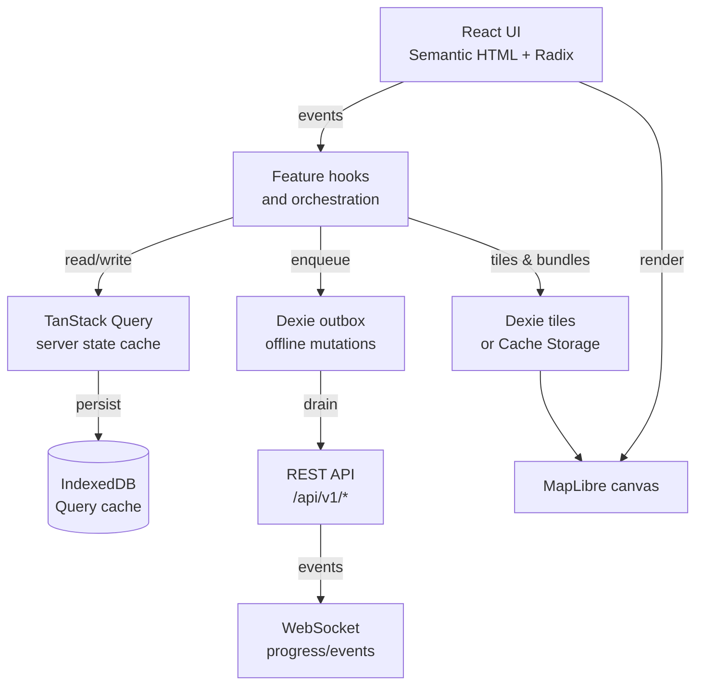

# Wildside Progressive Web App (PWA) design (mockup-derived)

Last updated: 14 December 2025

## Purpose

This document defines the intended design for the Wildside Progressive Web App
(PWA), based on the proved-out architecture and data model in
`wildside-mockup/`.

It exists to make the Wildside repository self-contained: the mockup directory
is not expected to be committed into the main project repository, so any
decisions and contracts that the codebase relies upon must be recorded here.

This document is the single source of truth for Wildside PWA runtime behaviour
(offline-first UX, persistence semantics, caching strategy, and testing gates).
The data shapes that support those behaviours are defined in
`wildside-pwa-data-model.md`.

## Scope

In scope:

- The Wildside PWA architecture: routing, state boundaries, persistence,
  offline-first behaviour, and integration points with the backend.
- The UI composition approach: semantic HTML first, Radix behaviour, DaisyUI +
  Tailwind styling, token-driven theming.
- Localizability strategy: i18next as the runtime, Fluent message resources,
  plus a localizable domain data model.
- Accessibility-first testing strategy and quality gates.

Out of scope:

- Backend route-generation algorithm details (scoring, optimisation).
- Backend infrastructure and deployment specifics beyond client-facing
  contracts.
- Extract–Transform–Load (ETL) details for ingestion pipelines.
- Conflict-free Replicated Data Types (CRDTs) style multi-writer conflict
  resolution. The design remains compatible with later upgrades, but does not
  require CRDTs for the Minimum Viable Product (MVP).

## Plan

This plan describes the intended implementation sequence and also doubles as a
review checklist.

1. **Foundations**
   - Establish the app shell, providers, and routing skeleton.
   - Wire design tokens into Tailwind and DaisyUI.
   - Add baseline i18n runtime and a minimal translation bundle.
2. **Data contracts**
   - Adopt the mockup-derived, backend-compatible data model (see
     `wildside-pwa-data-model.md`).
   - Introduce schema validation for network boundaries (Zod) at the fetch
     boundary.
3. **Local-first data layer**
   - TanStack Query is the primary server-state cache and synchronisation
     engine.
   - Query cache persistence to IndexedDB is enabled and treated as a normal
     part of runtime (not a dev-only feature).
   - Dexie is introduced for:
     - The explicit offline outbox (queued mutations).
     - Offline bundle manifests and tile bytes (or, where appropriate, Cache
       Storage via a Service Worker).
4. **Feature flows**
   - Implement the core mockup flows as feature modules:
     Explore/Discover → Customise → Map → Wizard → Completion → Offline/Safety.
   - Each feature is UI-driven by the data model; fixtures are replaced by
     backend responses without reworking components.
5. **PWA hardening**
   - Ship a manifest and a service worker.
   - Define explicit caching policies (static assets, API reads, tiles,
     offline bundles).
   - Add offline UX states, retry patterns, and “queued action” affordances.
6. **Accessibility and localization gates**
   - Accessibility-first unit/component tests (Testing Library + axe-core).
   - End-to-end checks (Playwright) for keyboard flows and accessibility tree
     stability.
   - Localization regression tests for at least one non-default locale.

## Architectural overview

Wildside’s frontend follows “local-first” principles:

- The UI renders from local state first.
- The network is treated as optional and unreliable.
- Synchronisation is explicit and observable (not “magic”).

At a high level:

### Core boundary: “client state” vs “server state”

Wildside intentionally avoids a single global state manager.

- **Server state** (domain data from the backend):
  - Managed by TanStack Query.
  - Persisted locally.
  - Revalidated opportunistically.
- **Client/UI state** (ephemeral UI concerns):
  - Kept in component state, small dedicated stores, or finite state machines
    for complex flows.
  - Not duplicated from server state.

This follows the guidance in
[Architecting resilient local-first applications in React](local-first-react.md).

## Frontend module layout

The mockup proved out a “feature-first” layout. Wildside should mirror that,
with a narrow set of shared primitives and intentionally small feature
modules.

Proposed `frontend-pwa/src` shape:

- `src/app/providers/`
  - `query-client.tsx`: QueryClient creation, persistence wiring, devtools.
  - `theme-provider.tsx`: theme selection and `data-theme` toggling.
  - `i18n-provider.tsx`: i18next initialisation and language switching.
- `src/app/layout/`
  - `mobile-shell.tsx`: safe-area padding, skip link, shared header/footer.
  - `app-header.tsx`: shared top bar with navigation and contextual actions.
- `src/app/routes/`
  - Route-level components and loaders (TanStack Router), code split per route.
- `src/app/features/`
  - `explore/`, `discover/`, `customise/`, `map/`, `wizard/`, `offline/`,
    `safety/`, `auth/`.
  - Each feature owns its view components, hooks, fixtures, and tests.
- `src/app/lib/`
  - Cross-cutting utilities: localization runtime, unit formatting, URL
    helpers, feature flags.
- `src/app/data/`
  - Local fixtures and registries that are designed to be replaced with API
    data without changing UI components.

This layout is intended to keep modules cohesive and prevent “shared” from
becoming an unbounded dumping ground.

## Map architecture (MapLibre)

The map is central to Wildside and needs a few explicit architectural rules to
stay performant and accessible.

### Keep the MapLibre canvas stable

React re-renders must not repeatedly tear down and recreate the map canvas.

- Create exactly one MapLibre instance per `/map/*` route view and keep it in a
  ref.
- Treat MapLibre as an imperative subsystem and drive it with minimal, stable
  inputs (style URL, initial viewport, tile source configuration).
- Avoid passing large GeoJSON blobs through React props on every render; stream
  changes into the map instance via imperative calls.

### Map state provider (viewport and overlays)

The mockup’s “map state persistence plan” translates to:

- Provide a `MapStateProvider` at the route root for `/map/*`.
- The provider exposes a small imperative surface:
  - `setViewport(...)`
  - `highlightPois(...)`
  - `toggleLayer(...)`
- UI overlays (tabs, cards, notes, sheets) read/write the provider rather than
  attempting to “own” the map state through React props.

This keeps overlay churn from invalidating the canvas.

## Styling, theming, and tokens

Wildside’s styling approach is intentionally layered:

1. **Semantic HTML** provides the accessibility foundation.
2. **Radix primitives** supply accessible behaviour and `data-*` state.
3. **DaisyUI** supplies component-level structure (`btn`, `card`, `menu`, …)
   and theme roles.
4. **Tailwind utilities** refine per-instance layout and responsive behaviour.
5. **Project tokens** define the design system once and are referenced
   everywhere.

This design has two explicit constraints:

- The backend must not ship CSS classes.
- The data model must use semantic identifiers (for example `iconKey`) that the
  client maps to token-driven presentation.

### Version alignment (Tailwind and DaisyUI)

The mockup architecture is written for Tailwind v4 and DaisyUI v5. The current
`frontend-pwa/` workspace uses Tailwind v3 and DaisyUI v4 (see
`frontend-pwa/package.json`).

This design document describes the **target architecture** (Tailwind v4 +
DaisyUI v5). Until the workspace upgrade is complete:

- Treat v4/v5-only conventions as migration work, not one-off hacks.
- Avoid relying on Tailwind v4 `@theme` directives; keep tokens exposed as CSS
  custom properties and consumed via the existing Tailwind configuration.
- Prefer semantic stability (HTML structure and Radix state attributes) and
  allow only the styling plumbing to change during the upgrade.

The upgrade is tracked as a repository work item in
`tailwind-and-daisyui-upgrade.md`.

### Token pipeline

The token build pipeline already exists in `packages/tokens/`. The PWA should
consume it as the single source of truth for:

- Colour roles (DaisyUI theme variables).
- Spacing scales.
- Radius and typography primitives.

The mockup-derived practice is:

- Keep generated token artefacts out of version control.
- Build tokens as part of `dev`, `build`, and CI pipelines.

## Internationalization (i18n), localization, and units

Wildside uses i18next as the runtime localization framework, with Fluent
translation resources.

Two important rules keep localization stable and scalable:

1. **UI chrome lives in translation files** (page titles, button labels,
   headings, “copy”).
2. **Domain options live in the data model** and carry localization metadata
   (for example `EntityLocalizations`, or Fluent key references), so UI
   components remain data-driven.

### Localizable data model

The PWA adopts a backend-compatible localization shape for entities, defined in
`wildside-pwa-data-model.md`.

In practice:

- Catalogue entities (themes, collections, interest themes, tags, badges)
  include localization maps per locale.
- UI registries (where appropriate) store stable IDs and Fluent keys rather
  than hard-coded strings.

### Locale normalisation and RTL

The PWA should treat locale tags as user input:

- Normalise language tags to a supported `LocaleCode` set.
- Default to `en-GB` when an unsupported tag is supplied.
- Prefer CSS logical properties (`margin-inline`, `padding-inline`, etc.) so
  RTL does not require duplicated markup.

For map labels and place names, MapLibre’s RTL text plugin should be registered
when RTL locales are active so bidirectional text remains legible.

### Units

Persisted models store values in SI base units:

- Distances in metres.
- Durations in seconds.

Formatting and conversion happen at the presentation boundary, driven by:

- Locale detection (default).
- User preference (override).

## Data access and API integration

### REST for durable state; WebSockets for progress

The backend architecture documents a split:

- REST endpoints (`/api/v1/*`) are used for fetching and mutating durable
  state.
- WebSockets (`/ws`) are used for asynchronous progress/events (for example,
  route generation status).

The PWA design leans into that:

- TanStack Query is used for REST reads and writes.
- WebSocket events invalidate or patch Query caches (never mutate UI state
  directly).

### Schema validation boundary

All network responses are validated at the fetch boundary using Zod schemas.
This keeps corruption and backwards-incompatible API changes from leaking into
feature logic.

## Offline-first and local-first persistence

Wildside has two classes of offline data:

1. **Normal domain data** (catalogue snapshots, routes, POIs, notes, user
   preferences):
   - Stored in the Query cache.
   - Persisted to IndexedDB via TanStack Query persistence.
2. **Heavy assets and mutation queues** (tiles, offline bundles, outbox):
   - Stored in Dexie (or Cache Storage, where it is operationally simpler).

### Outbox (offline mutations)

Wildside uses an explicit outbox table for offline writes:

- User actions that would normally be HTTP mutations are recorded as outbox
  items with stable IDs.
- When online, a background drain loop attempts delivery.
- Each outbound write carries `Idempotency-Key = outboxItem.id`, allowing safe
  retries.

This design keeps the UI responsive offline and keeps synchronisation
observable and testable.

### Offline bundles and tiles

Offline bundles are treated as first-class entities (manifest + status +
progress). The tiles themselves are stored as bytes outside React state.

Two storage strategies are intentionally compatible:

- **Cache Storage** (service worker): cache tiles by URL.
- **Dexie tiles table**: store tiles by `{bundleId, z, x, y}` for explicit
  eviction and accounting.

The data model keeps both strategies possible so implementation can choose
based on operational trade-offs.

### Service worker, manifest, and caching strategy

Wildside is an installable PWA with an explicit service worker caching policy.

Minimum requirements:

- A Web App Manifest with:
  - Name, short name, icons, `start_url`, and theme colours.
  - `display: standalone` (or `minimal-ui`) for an app-like installation.
- A service worker that:
  - Precaches the app shell (built assets).
  - Provides a navigation fallback to the app shell for client-side routes.
  - Uses explicit runtime caching strategies per resource type.

Caching policies should be simple and explainable:

- **App shell:** cache-first (precache), update on new deployment.
- **Catalogue snapshot reads:** network-first with cached fallback.
  - The UX should show “stale but available” results when offline.
- **Route generation status:** network-only (or network-first) plus WebSocket
  events where available.
- **Tiles:**
  - Default browsing can use cache-first (Cache Storage).
  - Offline bundles should use an explicit bundle-aware store (Dexie or
    carefully partitioned caches) so eviction and progress tracking are
    accurate.

Update strategy should prefer correctness over “instant updates”:

- Default to waiting for the next navigation before activating a new service
  worker.
- Only use `skipWaiting()`/`clients.claim()` when there is a tested, user-visible
  update UX.

Background sync is an optional enhancement (not a hard dependency):

- If supported, the service worker can attempt to drain the outbox when the
  browser regains connectivity.
- If not supported, the app drains the outbox on app resume and on a retry
  cadence.

## Accessibility-first implementation

Wildside targets WCAG 2.2 Level AA, with an explicit preference for:

- Semantic HTML for structure and interaction.
- Radix primitives for complex components (dialogs, tabs, accordions, sliders).
- Focus visibility and focus-not-obscured guarantees (especially with sticky
  headers and bottom navigation).

### Accessible client-side routing

Client-side routing must provide:

- A skip link (`Skip to content`) that targets the main landmark.
- Programmatic focus management on navigation (focus the main heading or main
  landmark).
- A route-change announcement via an ARIA live region.

## Testing strategy

The PWA adopts “accessibility-first testing” as a default habit:

- Component tests use Testing Library queries by role/label.
- A11y tests run axe-core audits on rendered components.
- Playwright runs keyboard flows and captures accessibility tree snapshots
  for regression detection.

In practice, this means:

- Prefer dedicated `*.a11y.test.tsx` suites so accessibility checks are easy to
  discover and run in isolation.
- Treat “no `data-testid` in tests” as a default lint/CI rule, with narrowly
  scoped exceptions when semantics are genuinely absent.
- Ensure at least one locale-switching regression test exists for each major
  registry-driven surface (for example, Discover, Customise, Wizard).

For concrete patterns and harness guidance, use:

- [High-velocity, accessibility-first component testing](high-velocity-accessibility-first-component-testing.md)
- [Pure, accessible, and localizable React components](pure-accessible-and-localizable-react-components.md)

## Migration notes (from the mockup)

The mockup implementation notes translate cleanly into a staged delivery plan:

- Stage 0: tokens + providers + layout shell.
- Stage 1: discover/explore/customise (catalogue-driven screens).
- Stage 2: map experiences (MapLibre + overlays, stable map instance).
- Stage 3: wizard flow (multi-step orchestration).
- Stage 4: completion + offline downloads + safety.
- Stage 5: auth and account handling.

Each stage should ship with:

- Accessibility tests covering the interactive surface.
- At least one localization regression test (non-default locale).
- Offline state validation (either automated or scripted manual checklist).

## Cross-document links

- Mockup-derived, backend-compatible data model:
  `wildside-pwa-data-model.md`.
- Product vision and frontend stack rationale:
  `wildside-high-level-design.md`.
- Backend API and WebSocket contract shape:
  `wildside-backend-architecture.md`.
- Local-first React state boundaries:
  `local-first-react.md`.
- Accessibility-first testing practices:
  `high-velocity-accessibility-first-component-testing.md`.
